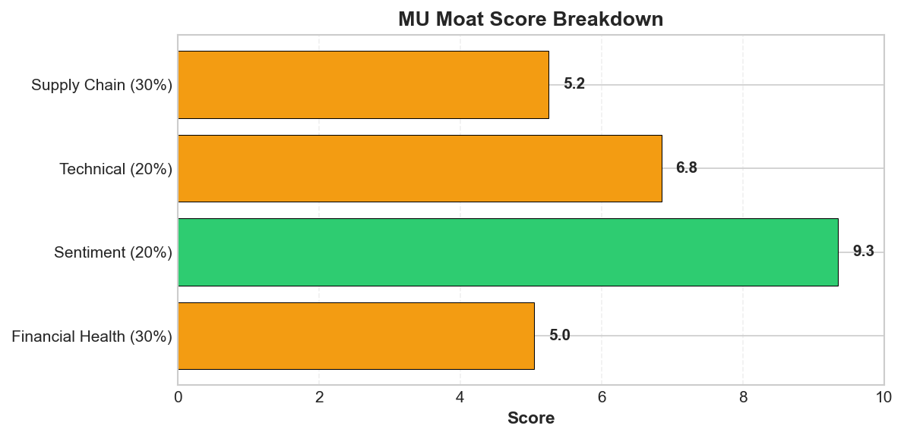
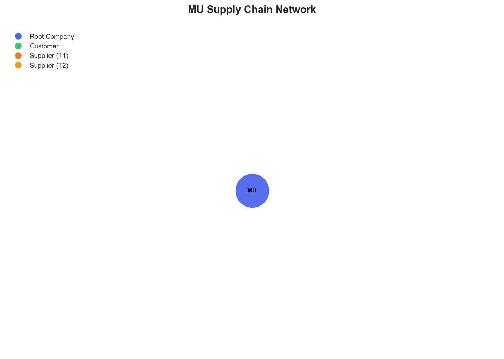

# Research Swarm Analysis Report

**Run ID:** 02f230d1-71a8-468a-b690-680d6ac754ba
**Generated:** 2026-01-19 20:34:18
**Analysis Date:** 2026-01-19
**Analysis Period:** FY 2026

---

## Executive Summary

Analyzed **1** stocks for FY 2026. Average Moat Score: **6.2/10**

**No watchlist candidates** identified in this analysis (none reached threshold of 8.0)

### Top 1 Picks

#### 1. MU - 6.2/10
Micron Technology earns a HOLD recommendation with a moat score of 6.2/10, reflecting a complex risk-reward profile that falls short of compelling investment criteria. While the company benefits from exceptional market sentiment (9.3/10) driven by AI infrastructure demand and analyst price targets reaching $500, critical fundamental data anomalies create significant verification challenges. The stock's 200%+ surge to $362.75 demonstrates strong positioning in the AI memory cycle, supported by tight supply conditions through 2026 and HBM demand acceleration. However, impossible financial metrics (0.0B revenue, 2240% gross margin) and complete absence of supply chain visibility raise serious concerns about data integrity and operational transparency. Technical indicators show momentum strength but overbought conditions (RSI 74.3), suggesting potential near-term volatility. The convergence of strong market sentiment with poor fundamental data quality creates an unusual investment profile where the AI-driven thesis appears sound but cannot be properly validated. This position suits growth-oriented investors comfortable with elevated risk and data uncertainty, representing a speculative play on AI infrastructure demand rather than a fundamental value proposition. Given the significant execution risk embedded in current valuations and the inability to assess supply chain resilience, investors should wait for better fundamental clarity or technical entry points before establishing positions.

**Key Insights:**
- Exceptional market sentiment and analyst support driven by AI infrastructure demand creates strong momentum, but fundamental data anomalies and supply chain blind spots introduce significant verification challenges for the underlying investment thesis
- The stock's 200%+ surge and position well above key moving averages reflects successful positioning in the AI memory cycle, though RSI levels near 74.3 suggest potential near-term overbought conditions requiring careful entry timing
- Tight memory supply conditions through 2026 and HBM demand acceleration provide structural tailwinds, but complete lack of supply chain visibility prevents assessment of MU's ability to capitalize on these opportunities or manage potential disruptions
- The convergence of multiple analyst upgrades with price targets reaching $500 indicates broad institutional confidence, yet the absence of reliable fundamental metrics makes it difficult to assess valuation appropriateness at current levels

**Risk Factors:**
- Critical fundamental data gaps including impossible financial metrics (0.0B revenue, 2240% gross margin) raise serious questions about data integrity and reporting reliability, potentially masking underlying operational issues
- Complete absence of supply chain visibility represents a major blind spot for a semiconductor company, preventing assessment of concentration risks, geopolitical exposures, and potential single points of failure in critical component sourcing
- Technical indicators show overbought conditions with RSI at 74.3 following a 200%+ surge, creating vulnerability to profit-taking or sentiment shifts, particularly if AI demand expectations fail to materialize
- Elevated valuation expectations reflected in analyst price targets up to $500 create significant execution risk, where any disappointment in AI-driven demand or operational performance could trigger substantial price corrections
- Cyclical nature of semiconductor industry remains an underlying risk despite current 'different cycle' narrative, with potential for demand normalization or inventory corrections that could impact pricing power and margins

### Cost Summary

| Metric | Value |
|--------|-------|
| Total Cost | $0.31 |
| Cost per Stock | $0.309 |
| Budget Utilization | 0.2% |

#### Cost by Stock
| Ticker | Cost |
|--------|------|
| MU | $0.309 |

---

## Detailed Stock Analysis

### MU - 6.2/10
**Investment Thesis:** Micron Technology earns a HOLD recommendation with a moat score of 6.2/10, reflecting a complex risk-reward profile that falls short of compelling investment criteria. While the company benefits from exceptional market sentiment (9.3/10) driven by AI infrastructure demand and analyst price targets reaching $500, critical fundamental data anomalies create significant verification challenges. The stock's 200%+ surge to $362.75 demonstrates strong positioning in the AI memory cycle, supported by tight supply conditions through 2026 and HBM demand acceleration. However, impossible financial metrics (0.0B revenue, 2240% gross margin) and complete absence of supply chain visibility raise serious concerns about data integrity and operational transparency. Technical indicators show momentum strength but overbought conditions (RSI 74.3), suggesting potential near-term volatility. The convergence of strong market sentiment with poor fundamental data quality creates an unusual investment profile where the AI-driven thesis appears sound but cannot be properly validated. This position suits growth-oriented investors comfortable with elevated risk and data uncertainty, representing a speculative play on AI infrastructure demand rather than a fundamental value proposition. Given the significant execution risk embedded in current valuations and the inability to assess supply chain resilience, investors should wait for better fundamental clarity or technical entry points before establishing positions.

**Processing Time:** 194.9s | **Cost:** $0.3087

#### Moat Score Breakdown

| Component | Score | Weight |
|-----------|-------|--------|
| Financial Health | 5.0/10 | 30% |
| Sentiment & Catalysts | 9.3/10 | 20% |
| Technical Strength | 6.8/10 | 20% |
| Supply Chain Position | 5.2/10 | 30% |
| **Overall Moat Score** | **6.2/10** | **100%** |

#### Synthesis Narrative

Micron Technology presents a compelling yet complex investment profile characterized by stark contradictions between fundamental data quality and market performance. The most striking aspect of this analysis is the disconnect between the company's exceptional market sentiment (9.3/10) and technical momentum versus concerning gaps in fundamental visibility and supply chain transparency. The sentiment analysis reveals overwhelming bullish momentum driven by AI infrastructure demand, with the stock surging 200%+ in 2025 and trading at $362.75 - well above both its 50-day ($266.01) and 200-day ($161.25) moving averages. This performance has been validated by cascading analyst upgrades, with price targets reaching $500 from major institutions, all centered on MU's positioning as a primary beneficiary of the AI boom and tight memory supply conditions through 2026. However, this positive narrative is undermined by significant fundamental data anomalies, including reported revenue of $0.0B alongside an impossible gross margin of 2240%, suggesting critical gaps in financial reporting or data collection systems. More concerning is the complete absence of supply chain visibility, with zero identified suppliers, customers, or supply chain relationships - a critical blind spot for a semiconductor company that should have complex global supply dependencies. The technical analysis shows momentum strength with an RSI of 74.3, indicating overbought conditions but not yet at extreme levels. The supply chain assessment reveals fundamental vulnerabilities, particularly concerning for a memory semiconductor company that typically relies on specialized fabrication facilities, rare earth materials, and complex multi-tier supplier networks. This lack of visibility prevents assessment of concentration risks, geopolitical exposures, or potential single points of failure that could severely impact operations. The convergence of exceptional market sentiment with poor fundamental data quality creates an unusual risk-reward profile. While the AI-driven demand thesis appears sound based on industry trends and analyst consensus, the inability to verify fundamental performance metrics or assess supply chain resilience introduces significant uncertainty. The company's reported Q1 2026 earnings beat and megafab expansion plans provide positive catalysts, but the fundamental data inconsistencies raise questions about the reliability of these reports. The technical momentum suggests continued near-term strength, but the elevated RSI levels combined with the dramatic price appreciation indicate potential vulnerability to profit-taking or sentiment shifts.

#### Key Insights

1. Exceptional market sentiment and analyst support driven by AI infrastructure demand creates strong momentum, but fundamental data anomalies and supply chain blind spots introduce significant verification challenges for the underlying investment thesis
2. The stock's 200%+ surge and position well above key moving averages reflects successful positioning in the AI memory cycle, though RSI levels near 74.3 suggest potential near-term overbought conditions requiring careful entry timing
3. Tight memory supply conditions through 2026 and HBM demand acceleration provide structural tailwinds, but complete lack of supply chain visibility prevents assessment of MU's ability to capitalize on these opportunities or manage potential disruptions
4. The convergence of multiple analyst upgrades with price targets reaching $500 indicates broad institutional confidence, yet the absence of reliable fundamental metrics makes it difficult to assess valuation appropriateness at current levels

#### Risk Factors

1. Critical fundamental data gaps including impossible financial metrics (0.0B revenue, 2240% gross margin) raise serious questions about data integrity and reporting reliability, potentially masking underlying operational issues
2. Complete absence of supply chain visibility represents a major blind spot for a semiconductor company, preventing assessment of concentration risks, geopolitical exposures, and potential single points of failure in critical component sourcing
3. Technical indicators show overbought conditions with RSI at 74.3 following a 200%+ surge, creating vulnerability to profit-taking or sentiment shifts, particularly if AI demand expectations fail to materialize
4. Elevated valuation expectations reflected in analyst price targets up to $500 create significant execution risk, where any disappointment in AI-driven demand or operational performance could trigger substantial price corrections
5. Cyclical nature of semiconductor industry remains an underlying risk despite current 'different cycle' narrative, with potential for demand normalization or inventory corrections that could impact pricing power and margins

---

## Supply Chain Analysis

### MU Supply Chain Network

**Network Size:** 1 nodes, 0 connections

#### Network Nodes

- **MU** (MU) - *root*

---

## Watchlist Candidates

*No stocks currently meet the watchlist threshold of 8.0 or higher.*

**Closest Candidates:**

- **MU**: 6.2/10 (1.8 points below threshold)

---

## Run Statistics

- **Total Stocks Analyzed:** 1
- **Successfully Completed:** 1
- **Failed:** 0
- **Average Moat Score:** 6.24/10
- **Total Cost:** $0.31
- **Total Time:** 194.9s

---

*Generated by Research Swarm - AI-Powered Stock Analysis*