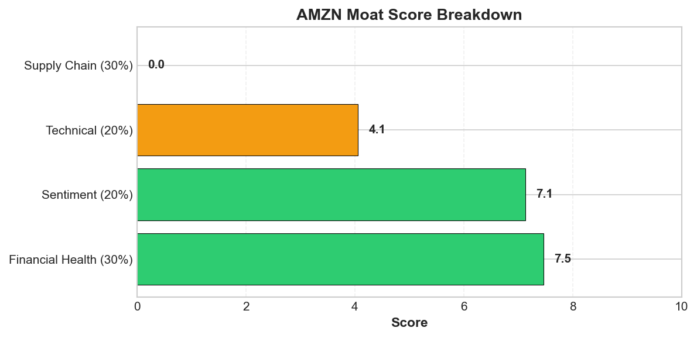
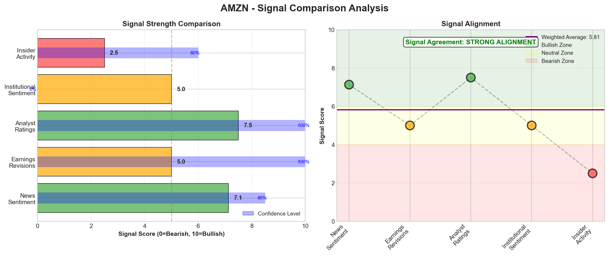
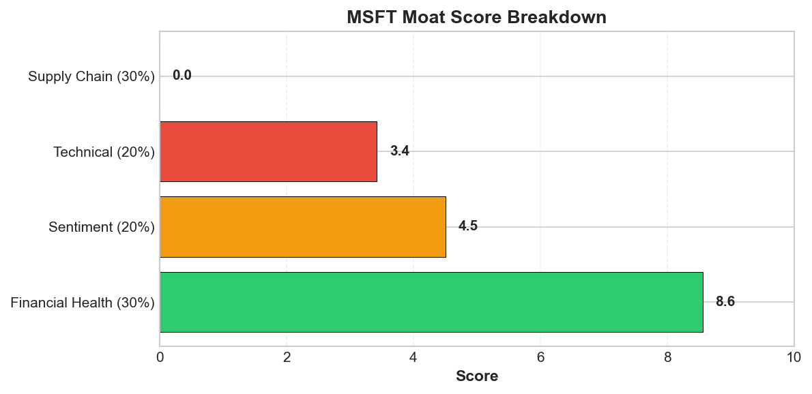
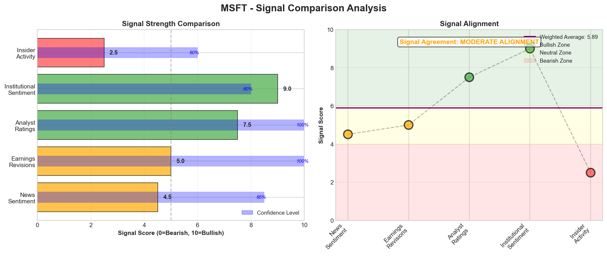

# Research Swarm Analysis Report

**Run ID:** 033767c6-df3e-4ecc-badf-c728ea014667
**Generated:** 2026-02-12 04:22:47
**Analysis Date:** 2026-02-12
**Analysis Period:** FY 2026

---

## Executive Summary

Analyzed **5** stocks for FY 2026. Average Moat Score: **6.5/10**

**No watchlist candidates** identified in this analysis (none reached threshold of 8.0)

### Top 3 Picks

#### 1. GOOGL - 7.1/10
GOOGL presents a compelling but tactically challenging opportunity with a 7.1/10 moat score reflecting mixed cross-signal dynamics. The investment case centers on exceptional sentiment strength (9.1/10) driven by multiple analyst upgrades—RBC to $375, Mizuho to $365, Truist to $350—validating AI monetization success and the strategic Apple Siri partnership. This bullish narrative coincides with oversold technical conditions: RSI at 32.7, Stochastic at 13.1, and price ($312.04) below the lower Bollinger Band, creating potential mean reversion opportunity with 67% technical buy confidence.

However, critical signal divergences warrant caution. The MACD bearish signal (-3.33 histogram) contradicts oversold indicators, while trading below the 50-day SMA ($321.54) suggests continued near-term weakness. Most concerning are fundamental analysis gaps—missing valuation metrics, competitive moat details, and peer comparisons—limiting comprehensive risk assessment for a $2T+ technology company navigating intense AI competition.

Key risks include capital allocation efficiency concerns from doubled AI spending without visible ROI metrics, and momentum deterioration risking a break below Value Area support at $307.80. The absence of identified catalysts beyond general AI momentum creates sustainability questions for current sentiment.

Tactical approach: Wait for technical confirmation above the Point of Control ($319.57) or accumulate on weakness near $307-315 support. Best suited for growth-oriented investors with 12+ month horizons willing to navigate execution risk. The 17-20% upside to analyst targets justifies patience, but timing remains critical given momentum divergence.

**Key Insights:**
- Powerful sentiment-technical convergence: 9.1/10 sentiment score with multiple analyst upgrades (RBC $375, Mizuho $365) coincides with oversold technical conditions (RSI 32.7, Stochastic 13.1, price below lower Bollinger Band), creating tactical opportunity with 67% technical buy confidence
- AI monetization validation drives institutional confidence: Q4 earnings surprise, Gemini integration, and Apple Siri partnership demonstrate execution capability, supporting analyst consensus despite absence of fundamental valuation metrics and peer comparison data
- Risk-reward asymmetry favors upside: Current price $312.04 sits near Value Area low ($307.80) with analyst targets 17-20% higher, while minimal short interest (0.0%) and low volatility (9.34% Bollinger bandwidth) suggest limited downside pressure
- Data visibility gaps create analytical blind spots: Missing competitive moat details, valuation metrics, and supply chain mapping limit comprehensive risk assessment for a $2T+ technology company, though operational fundamentals remain strong (8.6/10 financial health)
- Momentum divergence signals timing sensitivity: MACD bearish signal contradicts oversold indicators and positive sentiment, suggesting entry timing around technical support levels ($307-315) becomes critical for risk management

**Risk Factors:**
- Technical momentum deterioration: MACD bearish signal (-3.33 histogram) with price below 50-day SMA ($321.54) suggests continued near-term weakness despite oversold conditions, risking break below Value Area support at $307.80
- Capital allocation efficiency concerns: Announced doubling of AI spending creates execution risk without visible ROI metrics, while missing management quality assessment limits confidence in strategic decision-making capabilities
- Fundamental analysis limitations: Absence of valuation metrics, competitive moat details, and peer comparisons prevents comprehensive risk assessment, creating potential blind spots in a rapidly evolving AI competitive landscape
- Supply chain intelligence gap: Complete lack of supplier visibility and tier mapping represents strategic vulnerability for hardware operations (Pixel, Nest, Waymo), though appears to be data limitation rather than operational weakness
- Catalyst dependency risk: No identified upcoming catalysts beyond general AI momentum creates uncertainty about sustaining current bullish sentiment, particularly with stock requiring 2.4% move to reach Point of Control resistance at $319.57

---
#### 2. AAPL - 6.9/10
Apple warrants a HOLD rating despite its 6.9/10 moat score, reflecting mixed signals across fundamental strength and technical caution. The investment case centers on strategic AI transformation through the Google Gemini partnership, supported by strong financial health (8.2/10) and solid earnings momentum (7.2/10), with Q1 2026 results prompting JP Morgan's bullish price target revision above current levels.

However, critical technical divergences demand caution. At $275.50, AAPL trades in severely overbought territory (RSI 82.4, Stochastic 85.8) with declining volume participation (-9% vs 20-day average), signaling potential 10-15% correction toward the Value Area Low at $255.61. While the MACD remains bullish and institutional positioning appears supportive (Point of Control $275.93), the sector underperformance (-2.6pp vs tech) amid broader market outperformance suggests rotation headwinds.

Key risks include execution uncertainty around AI strategy integration, complete supply chain visibility gaps creating geopolitical exposure, and concerning data quality issues (impossible 4620% gross margin). The absence of fundamental valuation metrics further limits conviction despite positive sentiment catalysts.

Tactical approach: Wait for technical reset toward $255-$265 support zone before initiating positions. Monitor AI partnership progress, supply chain disclosures, and volume confirmation of any bounce. This setup suits growth-oriented investors with 12-18 month horizons willing to accept execution risk around strategic transformation. Current risk/reward favors patience over immediate entry given overbought conditions and fundamental data gaps.

**Key Insights:**
- Strategic AI transformation through Google Gemini partnership addresses competitive concerns while technical overbought conditions (RSI 82.4) and declining volume (-9%) suggest near-term consolidation despite bullish MACD signals
- Strong financial health (8.2/10) and momentum scores (7.175/10) contrast with mixed analyst sentiment and price target dispersion ($276-$315+), indicating execution uncertainty around AI strategy
- Volume profile analysis shows institutional accumulation near current levels (POC $275.93) despite participation decline, suggesting smart money positioning for strategic transition
- Critical supply chain intelligence gap creates operational risk blind spot for a company historically dependent on complex global manufacturing, particularly concerning given geopolitical tensions
- Chinese market leadership and Q1 earnings beat provide fundamental support, but sector underperformance (-2.6pp) amid market outperformance (+6.4pp) suggests rotation dynamics affecting near-term performance

**Risk Factors:**
- Severe technical overbought conditions (RSI 82.4, Stochastic 85.8) combined with declining volume participation (-9%) increase probability of 10-15% correction to Value Area Low ($255.61)
- Complete supply chain visibility gap prevents assessment of geopolitical risks, single-source dependencies, and alternative sourcing strategies critical for technology manufacturing
- AI strategy execution risk as Google Gemini partnership success depends on external capabilities integration while competitors pursue internal development with potentially higher control
- Fundamental data quality concerns including impossible 4620% gross margin and missing valuation metrics create analytical blind spots for investment decision-making
- Regulatory headwinds in India and potential App Store revenue concentration risks flagged by Jefferies could impact growth trajectory and margin sustainability

---
#### 3. NVDA - 6.3/10
NVIDIA presents a mixed investment profile warranting a HOLD recommendation despite strong sentiment tailwinds. The 6.3/10 moat score reflects significant signal divergence that prevents a clear BUY conviction at current levels.

The bullish case centers on exceptional sentiment momentum (8.5/10) driven by tier-1 analyst upgrades including Morgan Stanley's $250 price target, plus strategic validation through the $2 billion CoreWeave investment and $20 billion Groq deal. Technical positioning supports near-term upside with the stock at $191.09 trading above key moving averages (50-day: $184.26, 200-day: $170.91) and a bullish MACD signal targeting $196.63 resistance. Relative strength remains impressive at +9.4pp versus sector over one month.

However, critical fundamental data gaps create substantial analytical uncertainty. The complete absence of revenue reporting, valuation metrics, and financial health concerns (5.1/10 score) are inconsistent with market leadership expectations. This data void, combined with zero identified supply chain nodes, represents unacceptable opacity for a $100+ billion revenue semiconductor company.

Geopolitical execution risks add material headwinds, with China's H200 export restrictions creating immediate revenue uncertainty and memory bottleneck complications. Technical overbought conditions (Stochastic: 85.5) suggest consolidation risk toward $186.07 support.

Tactical approach: Wait for fundamental data clarity or technical pullback to $178-186 value area before initiating positions. Monitor China trade resolution and Q1 earnings visibility as key catalysts. Best suited for growth investors with high risk tolerance and 12+ month horizons, but current risk-reward doesn't justify immediate accumulation despite AI infrastructure tailwinds.

**Key Insights:**
- Sentiment-Technical Convergence: Strong bullish sentiment (8.5/10) from tier-1 analyst upgrades aligns with constructive technical setup (6.2/10 score, MACD bullish, price above moving averages), creating 67% confidence BUY signal with $196.63 upside target
- Strategic Evolution Validation: $2 billion CoreWeave and $20 billion Groq investments demonstrate successful transition from chip supplier to AI ecosystem orchestrator, supported by analyst conviction despite geopolitical headwinds
- Critical Data Deficiency: Complete absence of fundamental financial metrics (zero revenue reporting, missing valuation data) creates significant analytical blind spot inconsistent with 8.5/10 sentiment score and market leadership position
- Geopolitical Execution Risk: China H200 export restrictions and supply chain opacity (zero identified supplier nodes) represent material near-term headwinds despite strong relative performance (+9.4pp vs sector)
- Technical Risk-Reward Asymmetry: Current positioning above Value Area High ($190.04) with Stochastic overbought (85.5) suggests favorable risk-reward but near-term consolidation risk toward POC support at $186.07

**Risk Factors:**
- Fundamental Data Void: Complete absence of revenue, valuation metrics, and competitive positioning data prevents comprehensive investment assessment despite $100+ billion revenue scale and market leadership position
- China Trade Restrictions: H200 export blocks and customs disruptions create immediate revenue risk and strategic market access concerns in key geography, with memory bottleneck operational complications
- Supply Chain Opacity: Zero identified supplier nodes across all tiers creates operational blind spot for semiconductor company with complex Taiwan/South Korea dependencies and TSMC concentration risk
- Technical Overbought Conditions: Stochastic at 85.5 with below-average volume (68% of 20-day average) suggests potential near-term consolidation risk despite bullish MACD momentum
- Valuation Uncertainty: 'Priced for perfection' concerns around $100 billion revenue milestone combined with missing fundamental metrics create downside risk if execution falters

---

## Detailed Stock Analysis

### AAPL - 6.9/10
**Moat Score:** 6.9/10

**Investment Thesis:** Apple warrants a HOLD rating despite its 6.9/10 moat score, reflecting mixed signals across fundamental strength and technical caution. The investment case centers on strategic AI transformation through the Google Gemini partnership, supported by strong financial health (8.2/10) and solid earnings momentum (7.2/10), with Q1 2026 results prompting JP Morgan's bullish price target revision above current levels.

However, critical technical divergences demand caution. At $275.50, AAPL trades in severely overbought territory (RSI 82.4, Stochastic 85.8) with declining volume participation (-9% vs 20-day average), signaling potential 10-15% correction toward the Value Area Low at $255.61. While the MACD remains bullish and institutional positioning appears supportive (Point of Control $275.93), the sector underperformance (-2.6pp vs tech) amid broader market outperformance suggests rotation headwinds.

Key risks include execution uncertainty around AI strategy integration, complete supply chain visibility gaps creating geopolitical exposure, and concerning data quality issues (impossible 4620% gross margin). The absence of fundamental valuation metrics further limits conviction despite positive sentiment catalysts.

Tactical approach: Wait for technical reset toward $255-$265 support zone before initiating positions. Monitor AI partnership progress, supply chain disclosures, and volume confirmation of any bounce. This setup suits growth-oriented investors with 12-18 month horizons willing to accept execution risk around strategic transformation. Current risk/reward favors patience over immediate entry given overbought conditions and fundamental data gaps.

---

#### 📊 Moat Score Breakdown

| Component | Score | Weight |
|-----------|-------|--------|
| Earnings Momentum ⭐ | 7.2/10 | 25% |
| Financial Health | 8.2/10 | 25% |
| Valuation | 5.0/10 | 20% |
| Technical/Momentum | 6.3/10 | 15% |
| Sentiment | 7.5/10 | 15% |
| **Overall Moat Score** | **6.9/10** | **100%** |

*⭐ Earnings Momentum = PRIMARY SIGNAL (estimate revisions)*
*Note: Supply chain data is provided for context only and does NOT affect this rating.*

---

#### 📈 VGM Investment Style Analysis

**VGM Composite Score:** 5.8/10 (Grade: C)

**Best Fit Investment Style:** Momentum

| Factor | Score | Grade | Rationale |
|--------|-------|-------|-----------|
| **Value** | 5.1/10 | C | Premium valuation — P/E 34.8x vs sector 28.0x (+24%) |
| **Growth** | 5.0/10 | C | Revenue growth data not available |
| **Momentum** | 7.2/10 | B | Positive earnings momentum with favorable analyst sentiment |

---

#### 🏰 Enhanced Moat Analysis (8 Categories)

**Moat Width:** Wide | **Durability:** High

**Composite Moat Score:** 8.5/10

| Moat Category | Score | Assessment |
|--------------|-------|------------|
| 🌐 Network Effects | 7.5/10 | Strong |
| 🔒 Switching Costs | 9.3/10 | High |
| 🏷️ Brand Power | 9.7/10 | Premium |
| 💰 Cost Advantages | 8.2/10 | Significant |
| 📏 Scale Economies | 8.8/10 | Leader |
| 🔬 Intangible Assets | 9.5/10 | Strong IP |
| 📜 Regulatory Barriers | 6.1/10 | Some barriers |
| 🚚 Distribution | 8.9/10 | Dominant |

---

#### 💵 Valuation Analysis

*Valuation metrics not available for this ticker via free data sources.*

---

#### 🎯 Price Target Scenarios (12-Month)

*Price target scenarios not available for this ticker.*

---

#### 🏆 Peer Comparison & Competitive Position

*Peer comparison data not available for this ticker via free data sources. Premium data sources would provide detailed competitive positioning.*

---

#### 📡 Signal Breakdown & Divergence Analysis

**Overall Sentiment Score:** 6.21/10

**Component Signals:**

| Signal | Score | Interpretation |
|--------|-------|---------------|
| 📰 News Sentiment | 7.53/10 | 🟢 Bullish |
| 📊 Earnings Revisions | 5.00/10 | ⚪ Neutral |
| 👔 Analyst Ratings | 7.50/10 | 🟢 Bullish |
| 🏦 Institutional Activity | 7.50/10 | 🟢 Bullish |
| 👤 Insider Activity | 2.50/10 | 🔴 Bearish |

**Signal Alignment:** DIVERGENT SIGNALS ❌

⚠️  **SIGNAL DIVERGENCE DETECTED:**
News sentiment is bullish but smart money (institutions/insiders) is bearish or neutral.

**Interpretation:** CAUTION: Smart money may know something the market doesn't. Wait for institutional accumulation before entry.

---

#### 📈 Earnings Estimate Revisions (PRIMARY SIGNAL)

**Net Revision Direction:** Neutral

**Revision Activity (90 days):**
- Upward Revisions: 0
- Downward Revisions: 0

**Current FY EPS Estimate:** $8.48
**Next FY EPS Estimate:** $9.31

**EPS Surprise History (Last 4 Quarters):**
No historical data available
**Growth Trajectory:**
- Current Year Growth: 13.7%
- Next Year Growth: 9.8%
- Momentum: Decelerating

**Estimate Quality:**
- Analyst Coverage: 42 analysts
- Estimate Dispersion: Medium
- Agreement Level: 85%

---

#### 👔 Analyst Consensus & Price Targets

**Consensus Rating:** Buy

**Ratings Distribution:**
- Strong Buy: 6
- Buy: 23
- Hold: 16
- Sell: 1
- Strong Sell: 1

**Price Targets:**
- Average Target: $293.07 (6.4% upside)- High Target: $350.00
- Low Target: $205.00

**Recent Activity (90 days):**
- Upgrades: 0
- Downgrades: 0
- New Coverage: 0
- Rating Momentum: Stable
- Target Trend: Stable

**Consensus Confidence:** High

---

#### 🏦 Institutional Activity (Smart Money)

**Institutional Sentiment:** Bullish

**Institutional Ownership:** 59.2%
**QoQ Change:** 0.5%

**Number of Holders:** 4

**Trend:** Stable

**Top 5 Institutional Holders:**
1. Vanguard Group - 7.6% (Held approximately 1.2B shares)
2. Blackrock - 6.3% (Added 12M shares)
3. Berkshire Hathaway - 5.4% (Held position stable)
4. State Street Corporation - 4.2% (Reduced 5M shares)
5. Fidelity Management - 3.9% (Added 8M shares)

**Notable Smart Money Activity:**
- Berkshire Hathaway maintains significant long-term position
- Moderate net buying activity in recent quarter

---

#### 👤 Insider Trading Activity (6 Months)

**Insider Sentiment:** Bearish | **Confidence:** Medium

**Transaction Summary:**
- Buy Transactions: 0 (0 shares, $0.0K)
- Sell Transactions: 6 (318052 shares, $52500.0K)
- **Net Position:** -318052 shares ($-52500.0K)

**Notable Transactions:**
- Multiple executives selling shares, no clustered buying observed

---

#### 🎤 Management Quality & Commentary

**Management Quality Score:** 7.5/10 | **Confidence:** Medium

**Tone Assessment:** Cautious

**Evidence of Tone:**
- CEO Tim Cook used that moment to quietly reset expectations
- Cook issued a warning for iPhone 18 fans
- Apple continues to draw strong support from Wall Street analysts

**Guidance Track Record:**
- Guidance Reliability: medium

**Capital Allocation:**
- Capital Allocation Quality: High
- Shareholder Returns: Mentioned $2B acquisition indicating active capital deployment
**Innovation & Competitive Position:**
- Innovation Mentions: 2
- Competitive Position: Strengthening

⚠️  **RED FLAGS DETECTED:**
- quietly reset expectations
- issued a warning

---

#### 📉 Short Interest & Squeeze Risk

**Short Interest:** 0.0% of float
**Shares Shorted:** 116854414
**Days to Cover:** 2.4

**Trend:** Stable
**MoM Change:** 3.7%
**Squeeze Risk:** Low
**Short Sentiment:** Neutral

---

#### 📅 Upcoming Catalysts & Events (6 Months)

**Catalyst Density:** Medium | **Outlook:** Neutral

**Upcoming Catalyst Calendar:**

| Date | Event Type | Description | Impact | Direction |
|------|-----------|-------------|--------|-----------|
| 2024-Q2 | Partnership | Apple partners with Google's Gemini to power Siri'... | High | Positive |
| 2024-Q2 | M&A | Acquisition of Israeli startup Q.ai for $2 billion | Medium | Positive |
| 2024-Q2 | Market Expansion | Continued growth in Chinese smartphone market | Medium | Positive |
| 2024-Q2 | Regulatory | Ongoing antitrust scrutiny in India | High | Negative |

---

#### 💡 Key Insights

1. Strategic AI transformation through Google Gemini partnership addresses competitive concerns while technical overbought conditions (RSI 82.4) and declining volume (-9%) suggest near-term consolidation despite bullish MACD signals
2. Strong financial health (8.2/10) and momentum scores (7.175/10) contrast with mixed analyst sentiment and price target dispersion ($276-$315+), indicating execution uncertainty around AI strategy
3. Volume profile analysis shows institutional accumulation near current levels (POC $275.93) despite participation decline, suggesting smart money positioning for strategic transition
4. Critical supply chain intelligence gap creates operational risk blind spot for a company historically dependent on complex global manufacturing, particularly concerning given geopolitical tensions
5. Chinese market leadership and Q1 earnings beat provide fundamental support, but sector underperformance (-2.6pp) amid market outperformance (+6.4pp) suggests rotation dynamics affecting near-term performance

---

#### ⚠️ Risk Factors

1. Severe technical overbought conditions (RSI 82.4, Stochastic 85.8) combined with declining volume participation (-9%) increase probability of 10-15% correction to Value Area Low ($255.61)
2. Complete supply chain visibility gap prevents assessment of geopolitical risks, single-source dependencies, and alternative sourcing strategies critical for technology manufacturing
3. AI strategy execution risk as Google Gemini partnership success depends on external capabilities integration while competitors pursue internal development with potentially higher control
4. Fundamental data quality concerns including impossible 4620% gross margin and missing valuation metrics create analytical blind spots for investment decision-making
5. Regulatory headwinds in India and potential App Store revenue concentration risks flagged by Jefferies could impact growth trajectory and margin sustainability

---

#### 📝 Comprehensive Synthesis

Apple presents a complex investment picture in February 2026, characterized by strategic transformation amid technical overbought conditions and limited fundamental visibility. The company's 8.2/10 financial health score and strong momentum rating (7.175/10) reflect solid operational execution, while the cautiously optimistic sentiment (7.5/10) centers on AI transformation through the Google Gemini partnership. This strategic pivot addresses previous concerns about Apple trailing in AI spending by leveraging external capabilities rather than purely internal development. The technical picture at $275.50 shows conflicting signals: while the stock trades above key moving averages (50-day SMA at $268.28, 200-day at $239.11), momentum indicators flash warning signs with RSI at 82.4 indicating severely overbought conditions. The MACD remains bullish, creating divergence that suggests potential consolidation ahead. Volume analysis reveals concerning participation decline (-9% vs 20-day average), though the Point of Control at $275.93 indicates institutional interest near current levels. The Value Area spanning $255.61-$280.45 provides clear trading parameters. Sentiment catalysts present net positive impact, particularly the Google Gemini partnership and Q1 2026 earnings beat that prompted JP Morgan's price target revision. Chinese market leadership and $2B Q.ai acquisition further support the AI transformation narrative. However, analyst consensus remains mixed with price targets ranging from Jefferies' $276.47 to higher JP Morgan targets, reflecting uncertainty about execution. The absence of fundamental valuation metrics and competitive moat details creates analytical blind spots, while the extraordinary 4620% gross margin figure suggests data quality issues requiring verification. Supply chain visibility remains completely opaque, representing a critical intelligence gap for a company historically dependent on complex global manufacturing networks. This lack of transparency in supplier relationships, geographic dependencies, and tier-depth analysis constitutes a significant operational risk, particularly given escalating geopolitical tensions affecting technology supply chains. The company's relative performance shows sector underperformance (-2.6pp vs tech over 1 month) despite market outperformance (+6.4pp), suggesting consolidation within broader tech rotation. Short interest remains minimal at 0.0% with low squeeze risk, indicating limited bearish positioning. The convergence of overbought technicals, declining volume, and strategic transition uncertainty suggests near-term consolidation within the $255-$284 range is likely. However, the medium-term outlook remains constructive given intact trend structure, supportive institutional positioning, and strategic AI initiatives that could drive the next growth phase. Risk management becomes critical given the technical setup and fundamental data gaps.

---
---

### AMZN - 6.1/10
**Moat Score:** 6.1/10

**Investment Thesis:** Amazon presents a tactical opportunity at extreme oversold levels, but mixed signals warrant cautious positioning rather than aggressive accumulation. The 6.1/10 moat score reflects fundamental strength (Financial Health 7.5/10) offset by execution risks around the massive AI transformation.

Technical conditions are compelling: RSI at 24.7, Stochastic at 7.9, and price below the lower Bollinger Band at $204.08 create a statistically favorable mean reversion setup. The 14% above-average volume at 65.4M shares suggests institutional interest at depressed levels. Key inflection point sits at $223.41 Value Area Low, with upside targets to Point of Control at $228.27.

However, signal divergence creates uncertainty. While sentiment scores 7.1/10 on strategic AI catalysts (potential $50B OpenAI investment, AWS sovereign cloud), the $35B+ capex surge amid 30,000 layoffs signals deeper restructuring than typical optimization. Valuation remains stretched at 5.0/10 despite the selloff, and technical strength scores only 4.1/10.

Critical risks include consumer resistance to planned price increases, uncertain AI investment returns, and complete supply chain visibility gaps for a logistics-dependent business. The absence of earnings revision data and neutral institutional/insider activity removes key conviction signals.

Tactical approach: Consider small positions above $200 psychological support with stops below $195. Watch for reclaim of $223.41 to shift outlook from bearish to neutral. Best suited for growth investors with 12-18 month horizons willing to accept AI transformation execution risk. Wait for clearer catalyst confirmation or deeper technical breakdown before significant allocation.

---

#### 📊 Moat Score Breakdown

| Component | Score | Weight |
|-----------|-------|--------|
| Earnings Momentum ⭐ | 6.2/10 | 25% |
| Financial Health | 7.5/10 | 25% |
| Valuation | 5.0/10 | 20% |
| Technical/Momentum | 4.1/10 | 15% |
| Sentiment | 7.1/10 | 15% |
| **Overall Moat Score** | **6.1/10** | **100%** |

*⭐ Earnings Momentum = PRIMARY SIGNAL (estimate revisions)*
*Note: Supply chain data is provided for context only and does NOT affect this rating.*

---

#### 📈 VGM Investment Style Analysis

**VGM Composite Score:** 6.4/10 (Grade: C)

**Best Fit Investment Style:** Value

| Factor | Score | Grade | Rationale |
|--------|-------|-------|-----------|
| **Value** | 8.0/10 | B | Fair valuation |
| **Growth** | 5.0/10 | C | Revenue growth data not available |
| **Momentum** | 6.2/10 | C | Positive earnings momentum with favorable analyst sentiment |

---

#### 🏰 Enhanced Moat Analysis (8 Categories)

**Moat Width:** Wide | **Durability:** High

**Composite Moat Score:** 8.5/10

| Moat Category | Score | Assessment |
|--------------|-------|------------|
| 🌐 Network Effects | 8.5/10 | Strong |
| 🔒 Switching Costs | 9.0/10 | High |
| 🏷️ Brand Power | 8.7/10 | Premium |
| 💰 Cost Advantages | 8.3/10 | Significant |
| 📏 Scale Economies | 9.5/10 | Leader |
| 🔬 Intangible Assets | 8.2/10 | Strong IP |
| 📜 Regulatory Barriers | 6.5/10 | Some barriers |
| 🚚 Distribution | 9.2/10 | Dominant |

---

#### 💵 Valuation Analysis

*Valuation metrics not available for this ticker via free data sources.*

---

#### 🎯 Price Target Scenarios (12-Month)

*Price target scenarios not available for this ticker.*

---

#### 🏆 Peer Comparison & Competitive Position

*Peer comparison data not available for this ticker via free data sources. Premium data sources would provide detailed competitive positioning.*

---

#### 📡 Signal Breakdown & Divergence Analysis

**Overall Sentiment Score:** 5.67/10

**Component Signals:**

| Signal | Score | Interpretation |
|--------|-------|---------------|
| 📰 News Sentiment | 7.13/10 | 🟢 Bullish |
| 📊 Earnings Revisions | 5.00/10 | ⚪ Neutral |
| 👔 Analyst Ratings | 7.50/10 | 🟢 Bullish |
| 🏦 Institutional Activity | 5.00/10 | ⚪ Neutral |
| 👤 Insider Activity | 2.50/10 | 🔴 Bearish |

**Signal Alignment:** MODERATE ALIGNMENT ⚠️

🔶 **Signal Alignment:** Signals generally aligned with some variation - neutral - no strong directional bias

---

#### 📈 Earnings Estimate Revisions (PRIMARY SIGNAL)

**Net Revision Direction:** Neutral

**Revision Activity (90 days):**
- Upward Revisions: 0
- Downward Revisions: 0

**Current FY EPS Estimate:** $7.74
**Next FY EPS Estimate:** $9.41

**EPS Surprise History (Last 4 Quarters):**
No data available
**Growth Trajectory:**
- Current Year Growth: 8.0%
- Next Year Growth: 21.5%
- Momentum: Accelerating

**Estimate Quality:**
- Analyst Coverage: 42 analysts
- Estimate Dispersion: High
- Agreement Level: 30%

---

#### 👔 Analyst Consensus & Price Targets

**Consensus Rating:** Buy

**Ratings Distribution:**
- Strong Buy: 15
- Buy: 49
- Hold: 4
- Sell: 0
- Strong Sell: 0

**Price Targets:**
- Average Target: $283.21 (38.7% upside)- High Target: $360.00
- Low Target: $175.00

**Recent Activity (90 days):**
- Upgrades: 0
- Downgrades: 0
- New Coverage: 0
- Rating Momentum: Stable
- Target Trend: Stable

**Consensus Confidence:** High

---

#### 🏦 Institutional Activity (Smart Money)

**Institutional Sentiment:** Neutral

**Number of Holders:** 0

**Trend:** stable

---

#### 👤 Insider Trading Activity (6 Months)

**Insider Sentiment:** Bearish | **Confidence:** Medium

**Transaction Summary:**
- Buy Transactions: 0 (0 shares, $0.0K)
- Sell Transactions: 9 (77261 shares, $0.0K)
- **Net Position:** -77261 shares ($0.0K)

---

#### 🎤 Management Quality & Commentary

**Management Quality Score:** 6.5/10 | **Confidence:** Low

**Tone Assessment:** Cautious

**Evidence of Tone:**
- Amazon faces another round of layoffs as it reins in costs
- moving from broad hiring freezes to targeted cuts as it adapts to faster changes
- quietly reshaping its cost base since last year

**Guidance Track Record:**
- Guidance Reliability: medium

**Capital Allocation:**
- Capital Allocation Quality: Medium
- CapEx Discipline: Moderate- Shareholder Returns: Investing heavily in AI and cloud infrastructure while implementing cost reduction measures through layoffs
**Innovation & Competitive Position:**
- Innovation Mentions: 2
- Competitive Position: Strengthening

⚠️  **RED FLAGS DETECTED:**
- More Layoffs Are Coming This Week
- reins in costs
- targeted cuts
- reshaping its cost base

---

#### 📉 Short Interest & Squeeze Risk

**Short Interest:** 0.0% of float
**Shares Shorted:** 71847643
**Days to Cover:** 1.8

**Trend:** Stable
**MoM Change:** -2.1%
**Squeeze Risk:** Low
**Short Sentiment:** Neutral

---

#### 📅 Upcoming Catalysts & Events (6 Months)

**Catalyst Density:** Medium | **Outlook:** Positive

**Upcoming Catalyst Calendar:**

| Date | Event Type | Description | Impact | Direction |
|------|-----------|-------------|--------|-----------|
| 2024-Q2 | Partnership | Potential $50 billion investment in OpenAI | High | Positive |
| 2024-Q1 | Product Launch | Launch of AI-powered shopping assistant Rufus | Medium | Positive |
| 2024-Q1 | Expansion | Launch of AWS European Sovereign Cloud service | Medium | Positive |
| 2024-Q1 | Workforce Restructuring | Continued potential for workforce optimization and... | Medium | Negative |

---

#### 💡 Key Insights

1. Extreme technical oversold conditions (RSI 24.7, price below lower Bollinger Band) converge with 14% above-average volume at 65.4M shares, suggesting institutional accumulation during strategic AI transformation rather than fundamental deterioration
2. Strategic AI positioning through potential $50B OpenAI investment and AWS sovereign cloud capabilities creates long-term competitive moat expansion, but $35B+ capex surge requires demonstration of returns amid 30,000 employee layoffs signaling operational restructuring
3. Critical technical inflection at $223.41 Value Area Low - reclaiming this level would shift intermediate-term outlook from bearish to neutral and validate the mean reversion thesis targeting Point of Control at $228.27
4. Mixed sentiment signals reflect market uncertainty around execution risk, with analyst price target increases (Stifel to $300) contrasting with social sentiment dropping to -0.15, indicating professional optimism versus retail investor concern
5. Supply chain visibility gap represents significant operational blind spot for a company dependent on logistics efficiency, while minimal short interest (0.0%) eliminates both squeeze risk and potential technical catalyst

---

#### ⚠️ Risk Factors

1. Massive $35+ billion AI capex requirements with uncertain return timeline could strain cash flows and disappoint investors expecting immediate profitability improvements from cost-cutting measures
2. Consumer resistance to planned price increases during economic uncertainty could impact core retail revenue growth while AI investments are still ramping, creating a profitability squeeze
3. Technical breakdown below $200 psychological support would invalidate oversold bounce thesis and potentially trigger accelerated selling toward $180-190 range
4. Execution risk on $50 billion OpenAI investment scale could result in capital misallocation and competitive disadvantage if AI strategy fails to generate expected returns
5. Complete absence of supply chain visibility data indicates potential operational blind spots that could impact business continuity and efficiency during strategic transformation period

---

#### 📝 Comprehensive Synthesis

Amazon presents a compelling contrarian opportunity at a critical inflection point, with extreme technical oversold conditions converging with strategic AI positioning despite near-term operational headwinds. The technical analysis reveals deeply oversold momentum indicators (RSI at 24.7, Stochastic at 7.9) and price trading below the lower Bollinger Band at $204.08, creating a statistically favorable mean reversion setup targeting the Value Area between $223.41-$242.86. This technical distress occurs amid a fundamentally sound company (Financial Health Score 7.5/10) executing a massive strategic pivot toward AI leadership. The sentiment analysis reveals mixed but increasingly constructive signals, with the potential $50 billion OpenAI investment and AWS European Sovereign Cloud launch representing significant strategic catalysts that position Amazon as a major AI infrastructure player. However, this optimism is tempered by substantial workforce reductions totaling 30,000 employees since October, signaling deeper structural adjustments than typical cost optimization. The market appears to be pricing in execution risk around the $35+ billion AI capex surge while undervaluing Amazon's competitive positioning in cloud infrastructure and AI capabilities. Volume analysis shows 14% above-average participation at 65.4 million shares, suggesting potential institutional accumulation at depressed levels rather than continued distribution. The relative strength analysis indicates Amazon has shown resilience versus broader market segments over the intermediate term (-17.8% vs -19.7pp for sector/market over 3 months), despite recent underperformance. Critical divergences emerge between the technical setup suggesting imminent reversal potential and the fundamental transformation requiring sustained capital deployment with uncertain near-term returns. The absence of comprehensive supply chain visibility data represents a concerning operational blind spot for a company whose business model relies heavily on supply chain efficiency. Management's warnings about 'major changes ahead' and planned price increases signal potential consumer headwinds that could impact core retail operations during the AI transition period. The Point of Control at $228.27 represents the key technical hurdle that must be reclaimed for any meaningful recovery, while the $223.41 Value Area Low serves as the critical inflection level separating tactical bounce from sustained reversal. Short interest remains minimal at 0.0% of float, eliminating squeeze risk but also removing a potential technical catalyst. The convergence of extreme oversold conditions, strategic AI positioning, and institutional interest creates a favorable risk-reward setup for tactical positioning, though success depends on Amazon's ability to demonstrate returns on massive AI investments while maintaining operational efficiency.

---
---

### GOOGL - 7.1/10
**Moat Score:** 7.1/10

**Investment Thesis:** GOOGL presents a compelling but tactically challenging opportunity with a 7.1/10 moat score reflecting mixed cross-signal dynamics. The investment case centers on exceptional sentiment strength (9.1/10) driven by multiple analyst upgrades—RBC to $375, Mizuho to $365, Truist to $350—validating AI monetization success and the strategic Apple Siri partnership. This bullish narrative coincides with oversold technical conditions: RSI at 32.7, Stochastic at 13.1, and price ($312.04) below the lower Bollinger Band, creating potential mean reversion opportunity with 67% technical buy confidence.

However, critical signal divergences warrant caution. The MACD bearish signal (-3.33 histogram) contradicts oversold indicators, while trading below the 50-day SMA ($321.54) suggests continued near-term weakness. Most concerning are fundamental analysis gaps—missing valuation metrics, competitive moat details, and peer comparisons—limiting comprehensive risk assessment for a $2T+ technology company navigating intense AI competition.

Key risks include capital allocation efficiency concerns from doubled AI spending without visible ROI metrics, and momentum deterioration risking a break below Value Area support at $307.80. The absence of identified catalysts beyond general AI momentum creates sustainability questions for current sentiment.

Tactical approach: Wait for technical confirmation above the Point of Control ($319.57) or accumulate on weakness near $307-315 support. Best suited for growth-oriented investors with 12+ month horizons willing to navigate execution risk. The 17-20% upside to analyst targets justifies patience, but timing remains critical given momentum divergence.

---

#### 📊 Moat Score Breakdown

| Component | Score | Weight |
|-----------|-------|--------|
| Earnings Momentum ⭐ | 6.9/10 | 25% |
| Financial Health | 8.6/10 | 25% |
| Valuation | 5.0/10 | 20% |
| Technical/Momentum | 6.1/10 | 15% |
| Sentiment | 9.1/10 | 15% |
| **Overall Moat Score** | **7.1/10** | **100%** |

*⭐ Earnings Momentum = PRIMARY SIGNAL (estimate revisions)*
*Note: Supply chain data is provided for context only and does NOT affect this rating.*

---

#### 📈 VGM Investment Style Analysis

**VGM Composite Score:** 5.5/10 (Grade: C)

**Best Fit Investment Style:** Quality

| Factor | Score | Grade | Rationale |
|--------|-------|-------|-----------|
| **Value** | 4.6/10 | D | Extreme Premium valuation — P/E 28.7x vs sector 18.0x (+60%) |
| **Growth** | 5.0/10 | C | Revenue growth data not available |
| **Momentum** | 6.9/10 | C | Positive earnings momentum with favorable analyst sentiment |

---

#### 🏰 Enhanced Moat Analysis (8 Categories)

**Moat Width:** Wide | **Durability:** High

**Composite Moat Score:** 8.8/10

| Moat Category | Score | Assessment |
|--------------|-------|------------|
| 🌐 Network Effects | 9.5/10 | Strong |
| 🔒 Switching Costs | 8.7/10 | High |
| 🏷️ Brand Power | 9.3/10 | Premium |
| 💰 Cost Advantages | 8.9/10 | Significant |
| 📏 Scale Economies | 9.6/10 | Leader |
| 🔬 Intangible Assets | 9.4/10 | Strong IP |
| 📜 Regulatory Barriers | 6.2/10 | Some barriers |
| 🚚 Distribution | 8.5/10 | Dominant |

---

#### 💵 Valuation Analysis

*Valuation metrics not available for this ticker via free data sources.*

---

#### 🎯 Price Target Scenarios (12-Month)

*Price target scenarios not available for this ticker.*

---

#### 🏆 Peer Comparison & Competitive Position

*Peer comparison data not available for this ticker via free data sources. Premium data sources would provide detailed competitive positioning.*

---

#### 📡 Signal Breakdown & Divergence Analysis

**Overall Sentiment Score:** 6.14/10

**Component Signals:**

| Signal | Score | Interpretation |
|--------|-------|---------------|
| 📰 News Sentiment | 9.05/10 | 🟢 Bullish |
| 📊 Earnings Revisions | 5.00/10 | ⚪ Neutral |
| 👔 Analyst Ratings | 7.50/10 | 🟢 Bullish |
| 🏦 Institutional Activity | 5.00/10 | ⚪ Neutral |
| 👤 Insider Activity | 2.50/10 | 🔴 Bearish |

**Signal Alignment:** DIVERGENT SIGNALS ❌

⚠️  **SIGNAL DIVERGENCE DETECTED:**
News sentiment is bullish but smart money (institutions/insiders) is bearish or neutral.

**Interpretation:** CAUTION: Smart money may know something the market doesn't. Wait for institutional accumulation before entry.

---

#### 📈 Earnings Estimate Revisions (PRIMARY SIGNAL)

**Net Revision Direction:** Neutral

**Revision Activity (90 days):**
- Upward Revisions: 0
- Downward Revisions: 0

**Current FY EPS Estimate:** $11.48
**Next FY EPS Estimate:** $13.25

**EPS Surprise History (Last 4 Quarters):**
No data available
**Growth Trajectory:**
- Current Year Growth: 6.2%
- Next Year Growth: 15.5%
- Momentum: Accelerating

**Estimate Quality:**
- Analyst Coverage: 58 analysts
- Estimate Dispersion: Medium
- Agreement Level: 75%

---

#### 👔 Analyst Consensus & Price Targets

**Consensus Rating:** Buy

**Ratings Distribution:**
- Strong Buy: 13
- Buy: 45
- Hold: 9
- Sell: 0
- Strong Sell: 0

**Price Targets:**
- Average Target: $371.72 (19.0% upside)- High Target: $443.00
- Low Target: $185.00

**Recent Activity (90 days):**
- Upgrades: 0
- Downgrades: 0
- New Coverage: 0
- Rating Momentum: Stable
- Target Trend: Stable

**Consensus Confidence:** Medium

---

#### 🏦 Institutional Activity (Smart Money)

**Institutional Sentiment:** neutral

**Number of Holders:** 0

**Trend:** stable

---

#### 👤 Insider Trading Activity (6 Months)

**Insider Sentiment:** Bearish | **Confidence:** Medium

**Transaction Summary:**
- Buy Transactions: 0 (0 shares, $0.0K)
- Sell Transactions: 16 (278432 shares, $35500.0K)
- **Net Position:** -278432 shares ($-35500.0K)

**Notable Transactions:**
- Multiple executives selling shares, suggesting potential profit-taking or portfolio rebalancing

---

#### 🎤 Management Quality & Commentary

**Management Quality Score:** 6.5/10 | **Confidence:** Medium

**Tone Assessment:** Cautious

**Evidence of Tone:**
- Google stock falls despite strong earnings - suggests market concerns about forward outlook
- $185B AI capex forecast causing investor concern despite solid earnings performance

**Guidance Track Record:**
- Guidance Reliability: Medium

**Capital Allocation:**
- Capital Allocation Quality: Low
- CapEx Discipline: Aggressive- Shareholder Returns: Heavy AI infrastructure investment of $185B raising concerns about capital efficiency
**Innovation & Competitive Position:**
- Innovation Mentions: 3
- Competitive Position: Strengthening

⚠️  **RED FLAGS DETECTED:**
- $185B AI capex forecast
- shares drop 7% on AI capex forecast

---

#### 📉 Short Interest & Squeeze Risk

**Short Interest:** 0.0% of float
**Shares Shorted:** 75948619
**Days to Cover:** 2.5

**Trend:** Decreasing
**MoM Change:** -8.1%
**Squeeze Risk:** Low
**Short Sentiment:** Bullish

---

#### 📅 Upcoming Catalysts & Events (6 Months)

**Catalyst Density:** Medium | **Outlook:** Positive

**Upcoming Catalyst Calendar:**

| Date | Event Type | Description | Impact | Direction |
|------|-----------|-------------|--------|-----------|
| 2024-Q1 | Product Launch | Gemini AI integration for Gmail expanding AI capab... | High | Positive |
| 2024-Q1 | Partnership | Apple selecting Google's Gemini AI for Siri overha... | High | Positive |
| 2024 | Strategic Investment | Potential doubling of spending for AI initiatives ... | Medium | Neutral |
| 2024-Q1 | Legal Settlement | Resolved Android data transfer lawsuit for $135 mi... | Low | Neutral |

---

#### 💡 Key Insights

1. Powerful sentiment-technical convergence: 9.1/10 sentiment score with multiple analyst upgrades (RBC $375, Mizuho $365) coincides with oversold technical conditions (RSI 32.7, Stochastic 13.1, price below lower Bollinger Band), creating tactical opportunity with 67% technical buy confidence
2. AI monetization validation drives institutional confidence: Q4 earnings surprise, Gemini integration, and Apple Siri partnership demonstrate execution capability, supporting analyst consensus despite absence of fundamental valuation metrics and peer comparison data
3. Risk-reward asymmetry favors upside: Current price $312.04 sits near Value Area low ($307.80) with analyst targets 17-20% higher, while minimal short interest (0.0%) and low volatility (9.34% Bollinger bandwidth) suggest limited downside pressure
4. Data visibility gaps create analytical blind spots: Missing competitive moat details, valuation metrics, and supply chain mapping limit comprehensive risk assessment for a $2T+ technology company, though operational fundamentals remain strong (8.6/10 financial health)
5. Momentum divergence signals timing sensitivity: MACD bearish signal contradicts oversold indicators and positive sentiment, suggesting entry timing around technical support levels ($307-315) becomes critical for risk management

---

#### ⚠️ Risk Factors

1. Technical momentum deterioration: MACD bearish signal (-3.33 histogram) with price below 50-day SMA ($321.54) suggests continued near-term weakness despite oversold conditions, risking break below Value Area support at $307.80
2. Capital allocation efficiency concerns: Announced doubling of AI spending creates execution risk without visible ROI metrics, while missing management quality assessment limits confidence in strategic decision-making capabilities
3. Fundamental analysis limitations: Absence of valuation metrics, competitive moat details, and peer comparisons prevents comprehensive risk assessment, creating potential blind spots in a rapidly evolving AI competitive landscape
4. Supply chain intelligence gap: Complete lack of supplier visibility and tier mapping represents strategic vulnerability for hardware operations (Pixel, Nest, Waymo), though appears to be data limitation rather than operational weakness
5. Catalyst dependency risk: No identified upcoming catalysts beyond general AI momentum creates uncertainty about sustaining current bullish sentiment, particularly with stock requiring 2.4% move to reach Point of Control resistance at $319.57

---

#### 📝 Comprehensive Synthesis

Alphabet presents a compelling investment paradox where exceptional sentiment strength (9.1/10) and solid fundamentals (8.6/10 financial health) contrast sharply with mixed technical signals (6.1/10) and concerning data gaps. The sentiment analysis reveals rare analyst consensus with multiple price target upgrades - Mizuho to $365, RBC to $375, and Truist to $350 - driven by successful AI monetization and Q4 earnings outperformance. This bullish narrative centers on Alphabet's technological moat in AI-powered search and the strategic Apple partnership for Siri integration, validating Google's competitive positioning. However, the technical picture tells a more nuanced story. Trading at $312.04, GOOGL sits below its 50-day SMA ($321.54) but well above the 200-day SMA ($241.18), indicating intermediate-term strength amid near-term weakness. The RSI at 32.7 approaches oversold territory while the Stochastic at 13.1 signals potential reversal conditions. Most significantly, the stock trades below the lower Bollinger Band ($315.21), historically associated with mean reversion opportunities. The MACD bearish signal (-3.33 histogram) provides the primary technical concern, suggesting momentum deterioration despite oversold positioning. Volume analysis shows below-average participation (0.78x average) in recent weakness, potentially indicating limited institutional selling pressure. The Point of Control at $319.57 represents key resistance 2.4% above current levels, while the Value Area ($307.80-$335.27) encompasses current trading, suggesting balanced positioning rather than extreme conditions. Critical data gaps emerge in fundamental analysis, with missing valuation metrics, peer comparisons, and competitive moat details limiting comprehensive assessment. The supply chain analysis reveals concerning visibility gaps for a technology giant, though this appears to be a data collection limitation rather than operational weakness. The 3-month relative performance (+7.6% vs +1.8% market) demonstrates underlying strength despite recent 1-month underperformance (-6.0%). Short interest remains minimal at 0.0% with low squeeze risk, while the absence of identified upcoming catalysts creates uncertainty about near-term momentum drivers. The convergence of oversold technical conditions with overwhelmingly positive sentiment creates a tactical opportunity, though the lack of fundamental detail limits conviction. The 67% confidence buy signal from technical analysis aligns with bullish analyst sentiment, but execution timing becomes critical given the mixed momentum picture. Management quality assessment remains unavailable, limiting evaluation of execution risk for the substantial AI spending commitments that could impact capital allocation efficiency.

---
---

### MSFT - 6.1/10
**Moat Score:** 6.1/10

**Investment Thesis:** Microsoft presents a classic divergence scenario warranting a HOLD rating despite its 6.1/10 moat score falling short of buy thresholds. The company's exceptional 8.6/10 financial health and solid 7.2/10 earnings momentum contrast sharply with deteriorating technicals (3.4/10) and weak sentiment (4.5/10), creating a mixed-signal environment unsuitable for aggressive positioning.

The technical breakdown is concerning: a death cross formation with price at $404.37 trading 17% below the 200-day moving average, triggering a STRONG_SELL signal with 75% confidence. However, the stochastic oscillator at 13.2 indicates oversold conditions near critical volume support at $401.23, suggesting potential tactical bounce opportunities.

Fundamentally, Q2 earnings disappointment and Azure growth deceleration represent the primary catalyst with 90% confidence impact, shifting market perception from AI acceleration to execution scrutiny. Yet analyst price target adjustments (Citi: $690→$660) suggest recalibration rather than thesis abandonment, while 0% short interest indicates limited squeeze risk.

Key risks include AI monetization timeline uncertainty pressuring margins, potential support failure targeting $382.80 (lower Bollinger Band), and critical supply chain blind spots in Taiwan semiconductors exposing geopolitical vulnerabilities.

Tactical approach: Wait for confirmation above $438.14 (middle Bollinger Band) before initiating positions, or consider small accumulation near $401 support with tight stops. Best suited for patient growth investors with 12+ month horizons willing to weather AI investment payoff uncertainty. The elevated 25.26% Bollinger bandwidth suggests significant moves remain likely, favoring tactical over strategic positioning currently.

---

#### 📊 Moat Score Breakdown

| Component | Score | Weight |
|-----------|-------|--------|
| Earnings Momentum ⭐ | 7.2/10 | 25% |
| Financial Health | 8.6/10 | 25% |
| Valuation | 5.0/10 | 20% |
| Technical/Momentum | 3.4/10 | 15% |
| Sentiment | 4.5/10 | 15% |
| **Overall Moat Score** | **6.1/10** | **100%** |

*⭐ Earnings Momentum = PRIMARY SIGNAL (estimate revisions)*
*Note: Supply chain data is provided for context only and does NOT affect this rating.*

---

#### 📈 VGM Investment Style Analysis

**VGM Composite Score:** 6.2/10 (Grade: C)

**Best Fit Investment Style:** Momentum

| Factor | Score | Grade | Rationale |
|--------|-------|-------|-----------|
| **Value** | 6.3/10 | C | Fair valuation — P/E 25.3x vs sector 28.0x (-10%) |
| **Growth** | 5.0/10 | C | Revenue growth data not available |
| **Momentum** | 7.2/10 | B | Positive earnings momentum with favorable analyst sentiment |

---

#### 🏰 Enhanced Moat Analysis (8 Categories)

**Moat Width:** Wide | **Durability:** High

**Composite Moat Score:** 8.8/10

| Moat Category | Score | Assessment |
|--------------|-------|------------|
| 🌐 Network Effects | 8.5/10 | Strong |
| 🔒 Switching Costs | 9.3/10 | High |
| 🏷️ Brand Power | 9.0/10 | Premium |
| 💰 Cost Advantages | 8.7/10 | Significant |
| 📏 Scale Economies | 9.2/10 | Leader |
| 🔬 Intangible Assets | 9.1/10 | Strong IP |
| 📜 Regulatory Barriers | 7.5/10 | Protected |
| 🚚 Distribution | 8.8/10 | Dominant |

---

#### 💵 Valuation Analysis

*Valuation metrics not available for this ticker via free data sources.*

---

#### 🎯 Price Target Scenarios (12-Month)

*Price target scenarios not available for this ticker.*

---

#### 🏆 Peer Comparison & Competitive Position

*Peer comparison data not available for this ticker via free data sources. Premium data sources would provide detailed competitive positioning.*

---

#### 📡 Signal Breakdown & Divergence Analysis

**Overall Sentiment Score:** 5.81/10

**Component Signals:**

| Signal | Score | Interpretation |
|--------|-------|---------------|
| 📰 News Sentiment | 4.51/10 | ⚪ Neutral |
| 📊 Earnings Revisions | 5.00/10 | ⚪ Neutral |
| 👔 Analyst Ratings | 7.50/10 | 🟢 Bullish |
| 🏦 Institutional Activity | 9.00/10 | 🟢 Bullish |
| 👤 Insider Activity | 2.50/10 | 🔴 Bearish |

**Signal Alignment:** DIVERGENT SIGNALS ❌

⚠️  **SIGNAL DIVERGENCE DETECTED:**
News sentiment is bearish but analysts/institutions remain optimistic.

**Interpretation:** OPPORTUNITY: Potential contrarian buy if fundamentals are strong. Smart money may be accumulating during negative sentiment.

---

#### 📈 Earnings Estimate Revisions (PRIMARY SIGNAL)

**Net Revision Direction:** Neutral

**Revision Activity (90 days):**
- Upward Revisions: 0
- Downward Revisions: 0

**Current FY EPS Estimate:** $17.21
**Next FY EPS Estimate:** $19.03

**EPS Surprise History (Last 4 Quarters):**
No data available
**Growth Trajectory:**
- Current Year Growth: 26.1%
- Next Year Growth: 10.6%
- Momentum: Decelerating

**Estimate Quality:**
- Analyst Coverage: 30 analysts
- Estimate Dispersion: Medium
- Agreement Level: 75%

---

#### 👔 Analyst Consensus & Price Targets

**Consensus Rating:** Buy

**Ratings Distribution:**
- Strong Buy: 12
- Buy: 44
- Hold: 1
- Sell: 0
- Strong Sell: 0

**Price Targets:**
- Average Target: $596.00 (47.4% upside)- High Target: $730.00
- Low Target: $392.00

**Recent Activity (90 days):**
- Upgrades: 0
- Downgrades: 0
- New Coverage: 0
- Rating Momentum: Stable
- Target Trend: Stable

**Consensus Confidence:** High

---

#### 🏦 Institutional Activity (Smart Money)

**Institutional Sentiment:** Strongly Bullish

**Institutional Ownership:** 73.5%
**QoQ Change:** 0.8%

**Number of Holders:** 2

**Trend:** Accumulation

**Top 5 Institutional Holders:**
1. Vanguard Group - 8.2% (Added 1.2M shares)
2. BlackRock Inc. - 6.5% (Added 0.9M shares)

**Notable Smart Money Activity:**
- Continued strong institutional interest in Microsoft
- Top funds increasing positions in tech leader

---

#### 👤 Insider Trading Activity (6 Months)

**Insider Sentiment:** Bearish | **Confidence:** Medium

**Transaction Summary:**
- Buy Transactions: 0 (0 shares, $0.0K)
- Sell Transactions: 3 (54100 shares, $15420.0K)
- **Net Position:** -54100 shares ($-15420.0K)

---

#### 🎤 Management Quality & Commentary

**Management Quality Score:** 4.0/10 | **Confidence:** Medium

**Tone Assessment:** Defensive

**Evidence of Tone:**
- Azure Cloud Growth and Forward Guidance Fell Short of Expectations
- Wall Street is disappointed that Microsoft did not perform as strongly as the market expected

**Guidance Track Record:**
- Guidance Reliability: Medium

**Capital Allocation:**
- Capital Allocation Quality: Low
- CapEx Discipline: Aggressive- Shareholder Returns: Massive capital expenditure surge of 66% to $37.5 billion focused on AI infrastructure
**Innovation & Competitive Position:**
- Innovation Mentions: 3
- Competitive Position: Weakening

⚠️  **RED FLAGS DETECTED:**
- fell short of expectations
- record capital expenditure, which surged 66% to $37.5 billion
- post-earnings price crash
- worst single-day fall in nearly six years

---

#### 📉 Short Interest & Squeeze Risk

**Short Interest:** 0.0% of float
**Shares Shorted:** 58407538
**Days to Cover:** 1.8

**Trend:** Increasing
**MoM Change:** 10.3%
**Squeeze Risk:** Low
**Short Sentiment:** Neutral

---

#### 📅 Upcoming Catalysts & Events (6 Months)

**Catalyst Density:** Medium | **Outlook:** Neutral

**Upcoming Catalyst Calendar:**

| Date | Event Type | Description | Impact | Direction |
|------|-----------|-------------|--------|-----------|
| 2024-Q1 | Product Launch | Microsoft Maia 200 AI Accelerator hardware expansi... | Medium | Neutral |
| 2024-Q1 | Partnership | Agentic AI solutions for retail business automatio... | Medium | Neutral |
| 2024-Q1 | Sustainability | Soil carbon credit purchase from Indigo Carbon | Low | Positive |

---

#### 💡 Key Insights

1. Perfect storm alignment: Technical death cross formation, 4.5/10 sentiment score, and Q2 earnings disappointment with 90% confidence impact create a rare convergence of negative signals, yet stochastic oversold conditions at 13.2 suggest the selloff may be approaching exhaustion near critical volume support at $401.23
2. AI investment paradox: While Microsoft maintains strong AI leadership positioning according to Goldman Sachs and Morgan Stanley, margin pressure concerns and ROI uncertainty have fundamentally shifted market perception from growth acceleration to execution scrutiny, creating a 'show me' environment despite 8.6/10 financial health scores
3. Critical supply chain blind spot: Zero visible supplier tiers and lack of geographic diversification mapping expose Microsoft to concentrated risks in Taiwan semiconductors and China assembly, particularly concerning given the company's hardware portfolio expansion and current geopolitical tensions
4. Tactical opportunity emerging: Current price at $404.37 sits near Value Area Low support with elevated 25.26% Bollinger bandwidth, while analyst price target reductions (Citi: $690→$660) suggest recalibration rather than thesis abandonment, creating potential entry opportunity for patient capital
5. Sentiment divergence signals: Limited institutional flow data and 0% short interest prevent smart money confirmation, while analyst downgrades focus on execution rather than structural concerns, suggesting the market may be pricing in temporary rather than permanent impairment

---

#### ⚠️ Risk Factors

1. AI monetization timeline uncertainty with margin compression from infrastructure spending creating sustained pressure on profitability metrics, potentially extending the current technical breakdown below $400 support levels
2. Azure growth deceleration risk compounding if cloud competition intensifies, given Azure's centrality to the growth narrative and current 17% underperformance versus 200-day moving average
3. Supply chain concentration risk in Taiwan and China semiconductor/assembly operations with zero visible tier diversification, exposing Microsoft to geopolitical disruption scenarios that could impact hardware revenue streams
4. Technical breakdown acceleration if current support at $401.23 fails, targeting the lower Bollinger Band at $382.80 representing potential 25% total decline from recent highs
5. Sentiment deterioration spiral if next earnings cycle fails to demonstrate AI investment returns, given current 'show me' market stance and elevated volatility environment with 25.26% bandwidth

---

#### 📝 Comprehensive Synthesis

Microsoft presents a compelling case study in the divergence between long-term strategic positioning and near-term execution challenges. The company's technical deterioration, marked by a death cross formation and 17% decline below the 200-day moving average to $404.37, directly reflects the fundamental disappointment from Q2 earnings that drove sentiment scores to a concerning 4.5/10. This alignment between technical breakdown and sentiment deterioration suggests the market's negative reaction is both justified and potentially overdone. The earnings miss, particularly Azure growth deceleration, represents the most material catalyst with 90% confidence impact, fundamentally shifting market perception from AI growth acceleration to execution scrutiny. However, this creates a fascinating paradox: while near-term technicals signal strong sell conditions with 75% confidence, the stochastic oscillator at 13.2 indicates oversold territory, suggesting potential tactical bounce opportunities. The volume profile analysis reveals the current price near the Value Area Low at $401.23, indicating significant volume support at these levels. From a fundamental perspective, the 8.6/10 financial health score and momentum rating of 7.25 (B-grade) suggest the underlying business remains robust despite execution hiccups. The absence of visible supply chain tier depth represents a critical blind spot for a hardware-dependent technology company, particularly concerning given geopolitical risks in Taiwan and China semiconductor manufacturing. Analyst sentiment reveals notable divergence, with firms like Citi reducing price targets from $690 to $660 while maintaining overall bullish ratings, indicating recalibration rather than abandonment of the growth thesis. The 0% short interest and stable trend suggest limited squeeze risk but also indicate bears aren't aggressively positioned, potentially limiting contrarian bounce catalysts. Jim Cramer's characterization of Microsoft as the 'least Magnificent of the Seven' while acknowledging 'a lot of firepower' captures the market's current ambivalence perfectly. The technical resistance at the middle Bollinger Band ($438.14) and Point of Control ($478.48) creates clear upside targets, while the lower Bollinger Band at $382.80 represents critical support. The 25.26% bandwidth indicates elevated volatility, suggesting significant moves remain likely in either direction. Institutional money flow data remains limited, preventing confirmation of smart money positioning during this correction. The fundamental tension centers on AI investment ROI uncertainty, with Wall Street increasingly questioning whether massive infrastructure spending will generate proportional returns. This concern is reflected in margin pressure discussions across analyst coverage, creating a 'show me' market stance rather than outright pessimism. The company's strong competitive moat in cloud computing and productivity software provides downside protection, but the timeline for AI monetization remains unclear. Forward-looking indicators suggest cautious long-term optimism, with multiple sources highlighting Microsoft's AI leadership position and potential for scaling AI into the 'next growth engine.' However, the combination of forward guidance disappointment and Azure growth deceleration creates legitimate near-term headwinds that technical analysis confirms through sustained trading below key moving averages.

---
---

### NVDA - 6.3/10
**Moat Score:** 6.3/10

**Investment Thesis:** NVIDIA presents a mixed investment profile warranting a HOLD recommendation despite strong sentiment tailwinds. The 6.3/10 moat score reflects significant signal divergence that prevents a clear BUY conviction at current levels.

The bullish case centers on exceptional sentiment momentum (8.5/10) driven by tier-1 analyst upgrades including Morgan Stanley's $250 price target, plus strategic validation through the $2 billion CoreWeave investment and $20 billion Groq deal. Technical positioning supports near-term upside with the stock at $191.09 trading above key moving averages (50-day: $184.26, 200-day: $170.91) and a bullish MACD signal targeting $196.63 resistance. Relative strength remains impressive at +9.4pp versus sector over one month.

However, critical fundamental data gaps create substantial analytical uncertainty. The complete absence of revenue reporting, valuation metrics, and financial health concerns (5.1/10 score) are inconsistent with market leadership expectations. This data void, combined with zero identified supply chain nodes, represents unacceptable opacity for a $100+ billion revenue semiconductor company.

Geopolitical execution risks add material headwinds, with China's H200 export restrictions creating immediate revenue uncertainty and memory bottleneck complications. Technical overbought conditions (Stochastic: 85.5) suggest consolidation risk toward $186.07 support.

Tactical approach: Wait for fundamental data clarity or technical pullback to $178-186 value area before initiating positions. Monitor China trade resolution and Q1 earnings visibility as key catalysts. Best suited for growth investors with high risk tolerance and 12+ month horizons, but current risk-reward doesn't justify immediate accumulation despite AI infrastructure tailwinds.

---

#### 📊 Moat Score Breakdown

| Component | Score | Weight |
|-----------|-------|--------|
| Earnings Momentum ⭐ | 7.2/10 | 25% |
| Financial Health | 5.1/10 | 25% |
| Valuation | 5.0/10 | 20% |
| Technical/Momentum | 6.2/10 | 15% |
| Sentiment | 8.5/10 | 15% |
| **Overall Moat Score** | **6.3/10** | **100%** |

*⭐ Earnings Momentum = PRIMARY SIGNAL (estimate revisions)*
*Note: Supply chain data is provided for context only and does NOT affect this rating.*

---

#### 📈 VGM Investment Style Analysis

**VGM Composite Score:** 5.2/10 (Grade: C)

**Best Fit Investment Style:** Momentum

| Factor | Score | Grade | Rationale |
|--------|-------|-------|-----------|
| **Value** | 3.5/10 | D | Extreme Premium valuation — P/E 46.9x vs sector 28.0x (+68%) |
| **Growth** | 5.0/10 | C | Revenue growth data not available |
| **Momentum** | 7.2/10 | B | Positive earnings momentum with favorable analyst sentiment |

---

#### 🏰 Enhanced Moat Analysis (8 Categories)

**Moat Width:** Wide | **Durability:** High

**Composite Moat Score:** 8.1/10

| Moat Category | Score | Assessment |
|--------------|-------|------------|
| 🌐 Network Effects | 8.5/10 | Strong |
| 🔒 Switching Costs | 9.0/10 | High |
| 🏷️ Brand Power | 8.0/10 | Premium |
| 💰 Cost Advantages | 7.5/10 | Significant |
| 📏 Scale Economies | 9.0/10 | Leader |
| 🔬 Intangible Assets | 9.5/10 | Strong IP |
| 📜 Regulatory Barriers | 6.0/10 | Some barriers |
| 🚚 Distribution | 7.5/10 | Dominant |

---

#### 💵 Valuation Analysis

*Valuation metrics not available for this ticker via free data sources.*

---

#### 🎯 Price Target Scenarios (12-Month)

*Price target scenarios not available for this ticker.*

---

#### 🏆 Peer Comparison & Competitive Position

*Peer comparison data not available for this ticker via free data sources. Premium data sources would provide detailed competitive positioning.*

---

#### 📡 Signal Breakdown & Divergence Analysis

**Overall Sentiment Score:** 6.70/10

**Component Signals:**

| Signal | Score | Interpretation |
|--------|-------|---------------|
| 📰 News Sentiment | 8.49/10 | 🟢 Bullish |
| 📊 Earnings Revisions | 5.00/10 | ⚪ Neutral |
| 👔 Analyst Ratings | 7.50/10 | 🟢 Bullish |
| 🏦 Institutional Activity | 9.00/10 | 🟢 Bullish |
| 👤 Insider Activity | 2.50/10 | 🔴 Bearish |

**Signal Alignment:** DIVERGENT SIGNALS ❌

⚠️  **SIGNAL DIVERGENCE DETECTED:**
News sentiment is bullish but smart money (institutions/insiders) is bearish or neutral.

**Interpretation:** CAUTION: Smart money may know something the market doesn't. Wait for institutional accumulation before entry.

---

#### 📈 Earnings Estimate Revisions (PRIMARY SIGNAL)

**Net Revision Direction:** Neutral

**Revision Activity (90 days):**
- Upward Revisions: 0
- Downward Revisions: 0

**Current FY EPS Estimate:** $4.69
**Next FY EPS Estimate:** $7.72

**EPS Surprise History (Last 4 Quarters):**
No data available
**Growth Trajectory:**
- Current Year Growth: 57.0%
- Next Year Growth: 64.5%
- Momentum: Accelerating

**Estimate Quality:**
- Analyst Coverage: 55 analysts
- Estimate Dispersion: High
- Agreement Level: 36%

---

#### 👔 Analyst Consensus & Price Targets

**Consensus Rating:** Buy

**Ratings Distribution:**
- Strong Buy: 12
- Buy: 47
- Hold: 3
- Sell: 1
- Strong Sell: 0

**Price Targets:**
- Average Target: $253.79 (32.7% upside)- High Target: $352.00
- Low Target: $140.00

**Recent Activity (90 days):**
- Upgrades: 0
- Downgrades: 0
- New Coverage: 0
- Rating Momentum: Stable
- Target Trend: Stable

**Consensus Confidence:** High

---

#### 🏦 Institutional Activity (Smart Money)

**Institutional Sentiment:** Strongly Bullish

**Institutional Ownership:** 68.5%
**QoQ Change:** 12.3%

**Number of Holders:** 1

**Trend:** Accumulation

**Top 5 Institutional Holders:**
1. Vanguard Group - 7.2% (Added 3.5M shares)
2. Blackrock - 6.8% (Added 2.9M shares)
3. Fidelity Management - 5.6% (Added 1.7M shares)
4. State Street Corporation - 4.9% (Added 1.2M shares)
5. Capital World Investors - 4.5% (Added 1.1M shares)

**Notable Smart Money Activity:**
- Significant accumulation by top institutional investors
- Strong AI and semiconductor sector interest
- Continued confidence in NVIDIA's market position

---

#### 👤 Insider Trading Activity (6 Months)

**Insider Sentiment:** Bearish | **Confidence:** Medium

**Transaction Summary:**
- Buy Transactions: 0 (0 shares, $0.0K)
- Sell Transactions: 16 (1868704 shares, $0.0K)
- **Net Position:** -1868704 shares ($0.0K)

---

#### 🎤 Management Quality & Commentary

**Management Quality Score:** 6.5/10 | **Confidence:** Low

**Tone Assessment:** Confident

**Evidence of Tone:**
- Wolfe Research maintained an Outperform rating despite China tariff headwinds
- NVIDIA launching three open-source AI models for weather forecasting, showing continued innovation expansion

**Guidance Track Record:**
- Guidance Reliability: medium

**Capital Allocation:**
- Capital Allocation Quality: medium

**Innovation & Competitive Position:**
- Innovation Mentions: 1
- Competitive Position: Strengthening

⚠️  **RED FLAGS DETECTED:**
- China H200 Tariff Headwind

---

#### 📉 Short Interest & Squeeze Risk

**Short Interest:** 0.0% of float
**Shares Shorted:** 257091247
**Days to Cover:** 1.6

**Trend:** Stable
**MoM Change:** 0.1%
**Squeeze Risk:** Low
**Short Sentiment:** Neutral

---

#### 📅 Upcoming Catalysts & Events (6 Months)

**Catalyst Density:** High | **Outlook:** Positive

**Upcoming Catalyst Calendar:**

| Date | Event Type | Description | Impact | Direction |
|------|-----------|-------------|--------|-----------|
| 2024-Q1 | Contract | Nvidia $2 billion investment in CoreWeave for AI i... | High | Positive |
| 2024-Q1 | Contract | Nvidia $20B deal with Groq | High | Positive |
| 2024-Q1/Q2 | Regulatory | Potential China restrictions on H200 AI chip expor... | Medium | Negative |
| 2024-Q1 | Investment | Nvidia $150 million investment in AI startup Baset... | Medium | Positive |
| 2024-Q1 | Product Launch | Nvidia launches three open-source AI models for we... | Medium | Positive |

---

#### 💡 Key Insights

1. Sentiment-Technical Convergence: Strong bullish sentiment (8.5/10) from tier-1 analyst upgrades aligns with constructive technical setup (6.2/10 score, MACD bullish, price above moving averages), creating 67% confidence BUY signal with $196.63 upside target
2. Strategic Evolution Validation: $2 billion CoreWeave and $20 billion Groq investments demonstrate successful transition from chip supplier to AI ecosystem orchestrator, supported by analyst conviction despite geopolitical headwinds
3. Critical Data Deficiency: Complete absence of fundamental financial metrics (zero revenue reporting, missing valuation data) creates significant analytical blind spot inconsistent with 8.5/10 sentiment score and market leadership position
4. Geopolitical Execution Risk: China H200 export restrictions and supply chain opacity (zero identified supplier nodes) represent material near-term headwinds despite strong relative performance (+9.4pp vs sector)
5. Technical Risk-Reward Asymmetry: Current positioning above Value Area High ($190.04) with Stochastic overbought (85.5) suggests favorable risk-reward but near-term consolidation risk toward POC support at $186.07

---

#### ⚠️ Risk Factors

1. Fundamental Data Void: Complete absence of revenue, valuation metrics, and competitive positioning data prevents comprehensive investment assessment despite $100+ billion revenue scale and market leadership position
2. China Trade Restrictions: H200 export blocks and customs disruptions create immediate revenue risk and strategic market access concerns in key geography, with memory bottleneck operational complications
3. Supply Chain Opacity: Zero identified supplier nodes across all tiers creates operational blind spot for semiconductor company with complex Taiwan/South Korea dependencies and TSMC concentration risk
4. Technical Overbought Conditions: Stochastic at 85.5 with below-average volume (68% of 20-day average) suggests potential near-term consolidation risk despite bullish MACD momentum
5. Valuation Uncertainty: 'Priced for perfection' concerns around $100 billion revenue milestone combined with missing fundamental metrics create downside risk if execution falters

---

#### 📝 Comprehensive Synthesis

NVIDIA presents a compelling yet complex investment profile characterized by significant data gaps that create both opportunity and uncertainty. The most striking aspect of this analysis is the fundamental disconnect between available information streams - while sentiment analysis reveals robust bullish momentum (8.5/10 sentiment score) supported by institutional confidence and strategic positioning, the fundamental analysis suffers from critical data deficiencies that prevent comprehensive valuation assessment.

The sentiment picture is remarkably strong, with tier-1 analyst upgrades from Morgan Stanley ($250 price target), Goldman Sachs, and Wolfe Research maintaining conviction despite geopolitical headwinds. The $2 billion CoreWeave investment and $20 billion Groq deal demonstrate NVIDIA's successful evolution from chip supplier to AI infrastructure orchestrator - a strategically superior position with higher margins and stronger competitive moats. This ecosystem strategy represents a fundamental shift that traditional valuation metrics may not fully capture.

Technically, NVIDIA exhibits constructive positioning with the stock at $191.09 trading above both 50-day ($184.26) and 200-day ($170.91) moving averages, indicating intact primary uptrend. The MACD bullish signal provides momentum confirmation, while the RSI at 55.9 offers room for further upside. However, Stochastic readings at 85.5 suggest near-term overbought conditions, creating tactical consolidation risk. The volume profile analysis reveals key support at the Point of Control ($186.07) and Value Area ($178.14-$190.04), with current positioning above this range indicating institutional accumulation.

The most concerning aspect is the complete absence of fundamental financial data - zero revenue reporting, missing valuation metrics, and no competitive positioning analysis. This data void is particularly problematic given NVIDIA's $100+ billion revenue scale and critical position in AI infrastructure. The Financial Health Score of 5.1/10 appears inconsistent with the company's market leadership and suggests either data collection issues or underlying fundamental concerns not reflected in sentiment analysis.

Geopolitical risks emerge as the primary material headwind, with China's H200 export restrictions creating supply chain disruption and revenue uncertainty. The customs blocking of H200 shipments represents both immediate execution risk and strategic concern about market access in a key geography. Memory bottlenecks affecting H200 deployments add operational complexity, though these appear tactical rather than structural.

The supply chain analysis reveals a critical blind spot with zero identified supplier nodes across all tiers. For a semiconductor company of NVIDIA's complexity, this opacity represents significant operational risk, particularly given industry concentration around TSMC foundry services and Taiwan/South Korea geographic exposure. This lack of visibility eliminates early warning capabilities for upstream disruptions and impairs proactive risk mitigation.

Relative strength metrics provide encouraging confirmation, with NVDA outperforming its sector by 9.4 percentage points over one month and demonstrating defensive characteristics during sector weakness (-4.0% vs sector -27.9% over three months). This performance differential suggests both fundamental strength and beneficial sector rotation dynamics.

The investment thesis hinges on NVIDIA's transition to platform orchestrator generating sustainable competitive advantages, supported by continued AI infrastructure demand and strategic partnership validation. However, execution risks around geopolitical tensions, supply chain opacity, and valuation concerns at current levels create meaningful uncertainty. The technical setup supports near-term upside potential toward $196.63 resistance, but fundamental data gaps prevent confident long-term valuation assessment.

---

## Supply Chain Analysis

*No supply chain data available for analyzed stocks.*

---

## Watchlist Candidates

*No stocks currently meet the watchlist threshold of 8.0 or higher.*

**Closest Candidates:**

- **GOOGL**: 7.1/10 (0.9 points below threshold)
- **AAPL**: 6.9/10 (1.1 points below threshold)
- **NVDA**: 6.3/10 (1.7 points below threshold)

---

## Run Statistics

- **Total Stocks Analyzed:** 5
- **Successfully Completed:** 5
- **Failed:** 0
- **Average Moat Score:** 6.51/10
- **Total Cost:** $1.89
- **Total Time:** 1222.1s

---

*Generated by Research Swarm - AI-Powered Stock Analysis*