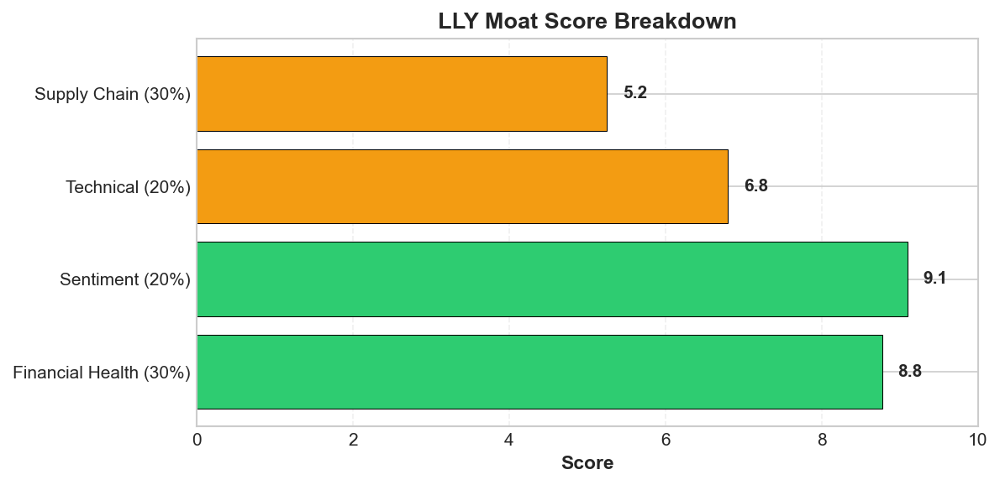
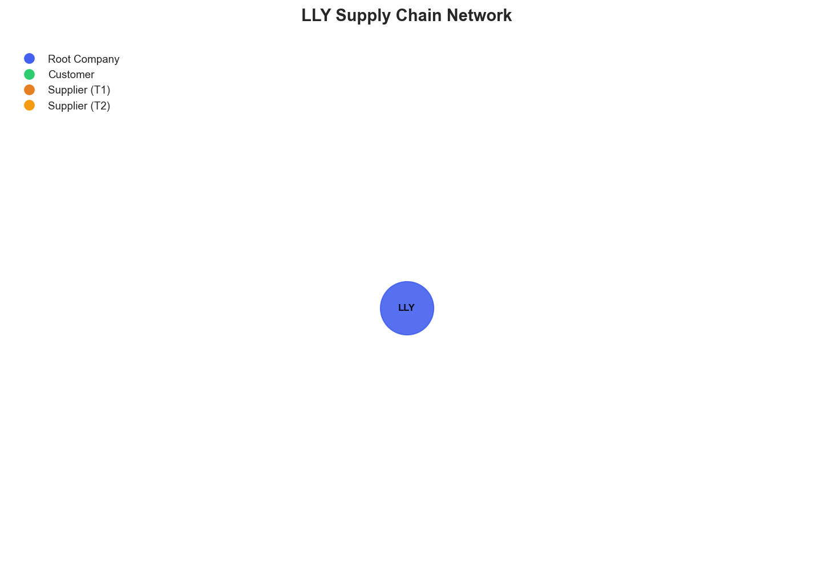

# Research Swarm Analysis Report

**Run ID:** 1934b5f2-6f31-46e3-9277-52cb4eb3b6f5
**Generated:** 2026-01-19 20:30:15
**Analysis Date:** 2026-01-19
**Analysis Period:** FY 2026

---

## Executive Summary

Analyzed **1** stocks for FY 2026. Average Moat Score: **7.5/10**

**No watchlist candidates** identified in this analysis (none reached threshold of 8.0)

### Top 1 Picks

#### 1. LLY - 7.5/10
LLY merits a HOLD recommendation with a moat score of 7.5/10, reflecting strong fundamentals but notable operational blind spots. The company demonstrates exceptional financial performance (8.8/10) with 53.9% revenue growth and 480% net income growth, driven by blockbuster GLP-1 drugs Mounjaro and Zepbound. Outstanding market sentiment (9.1/10) validates this operational excellence, with consistent analyst upgrades and projections for tirzepatide becoming the top-selling drug by 2030. The 15-year track record of 25.73% annualized returns demonstrates proven execution capabilities. However, critical concerns prevent a BUY rating. The supply chain assessment reveals a significant intelligence gap (5.2/10) with no visibility into suppliers or manufacturing networks—problematic for a pharmaceutical company dependent on complex global supply chains. Technical indicators (6.8/10) suggest near-term consolidation pressure, with price below the 50-day moving average despite strong long-term positioning. Intensifying competition from Novo Nordisk's pill formulation and Pfizer's GLP-1 development adds pressure to the core franchise. While strategic diversification through the $1.2 billion Ventyx acquisition shows promise, heavy GLP-1 dependence creates concentration risk. This position suits growth-oriented investors comfortable with pharmaceutical sector volatility, but the supply chain visibility gap and competitive dynamics warrant careful monitoring before increasing allocation.

**Key Insights:**
- Exceptional fundamental performance with 53.9% revenue growth and 480% net income growth validates the overwhelmingly positive market sentiment (9.1/10), creating rare alignment between operational execution and investor confidence
- Strategic diversification through the $1.2 billion Ventyx acquisition and geographic expansion demonstrates management's proactive approach to reducing dependence on GLP-1 drugs while leveraging current market dominance
- Technical indicators suggest near-term consolidation with price below 50-day MA but above 200-day MA, combined with neutral RSI of 41.6, potentially offering attractive entry points for long-term investors
- Tirzepatide's projection as the top-selling drug by 2030 provides substantial long-term revenue visibility, supported by consistent analyst upgrades from major institutions projecting continued growth through 2027

**Risk Factors:**
- Critical supply chain intelligence gap with no identifiable suppliers or multi-tier visibility represents significant operational risk for a pharmaceutical company dependent on complex global manufacturing networks
- Intensifying competitive pressure from Novo Nordisk's pill formulation of Wegovy and Pfizer's GLP-1 development efforts could erode market share in the core obesity drug franchise
- Heavy dependence on GLP-1 drugs for current growth trajectory creates concentration risk, despite diversification efforts, particularly if regulatory or safety concerns emerge
- Technical consolidation pressure with price below 50-day moving average suggests potential near-term volatility that could test investor confidence despite strong fundamentals
- Geographic expansion into emerging markets like India introduces regulatory and operational complexities that could impact execution of growth strategies

### Cost Summary

| Metric | Value |
|--------|-------|
| Total Cost | $0.25 |
| Cost per Stock | $0.251 |
| Budget Utilization | 0.1% |

#### Cost by Stock
| Ticker | Cost |
|--------|------|
| LLY | $0.251 |

---

## Detailed Stock Analysis

### LLY - 7.5/10
**Investment Thesis:** LLY merits a HOLD recommendation with a moat score of 7.5/10, reflecting strong fundamentals but notable operational blind spots. The company demonstrates exceptional financial performance (8.8/10) with 53.9% revenue growth and 480% net income growth, driven by blockbuster GLP-1 drugs Mounjaro and Zepbound. Outstanding market sentiment (9.1/10) validates this operational excellence, with consistent analyst upgrades and projections for tirzepatide becoming the top-selling drug by 2030. The 15-year track record of 25.73% annualized returns demonstrates proven execution capabilities. However, critical concerns prevent a BUY rating. The supply chain assessment reveals a significant intelligence gap (5.2/10) with no visibility into suppliers or manufacturing networks—problematic for a pharmaceutical company dependent on complex global supply chains. Technical indicators (6.8/10) suggest near-term consolidation pressure, with price below the 50-day moving average despite strong long-term positioning. Intensifying competition from Novo Nordisk's pill formulation and Pfizer's GLP-1 development adds pressure to the core franchise. While strategic diversification through the $1.2 billion Ventyx acquisition shows promise, heavy GLP-1 dependence creates concentration risk. This position suits growth-oriented investors comfortable with pharmaceutical sector volatility, but the supply chain visibility gap and competitive dynamics warrant careful monitoring before increasing allocation.

**Processing Time:** 193.0s | **Cost:** $0.2507

#### Moat Score Breakdown

| Component | Score | Weight |
|-----------|-------|--------|
| Financial Health | 8.8/10 | 30% |
| Sentiment & Catalysts | 9.1/10 | 20% |
| Technical Strength | 6.8/10 | 20% |
| Supply Chain Position | 5.2/10 | 30% |
| **Overall Moat Score** | **7.5/10** | **100%** |

#### Synthesis Narrative

Eli Lilly presents a compelling investment profile characterized by exceptional fundamental performance, overwhelmingly positive market sentiment, but notable operational blind spots that require careful consideration. The company's financial health score of 8.8/10 aligns strongly with the exceptional sentiment score of 9.1/10, creating a rare convergence of strong fundamentals and market enthusiasm that validates the current investment thesis. The sentiment analysis reveals extraordinary operational performance with 53.9% revenue growth and 480% net income growth driven by blockbuster GLP-1 drugs Mounjaro and Zepbound, positioning LLY as a dominant force in the high-growth obesity market. This fundamental strength is reinforced by consistent analyst upgrades from major institutions including UBS, BMO, Jefferies, and Bank of America, with projections for continued growth through 2027 and tirzepatide potentially becoming the top-selling drug by 2030. However, the technical analysis presents a more nuanced picture with a moderate score of 6.8/10, suggesting some near-term consolidation pressure. The current price of $1038.40 sits just below the 50-day moving average of $1042.08, while maintaining a strong position above the 200-day average of $837.77, indicating underlying bullish momentum despite short-term volatility. The RSI of 41.6 suggests the stock is neither overbought nor oversold, providing potential entry opportunities for new positions. The most concerning aspect of the analysis emerges from the supply chain assessment, which reveals a critical intelligence gap with a low resilience score of 5.2/10. The complete absence of identifiable suppliers, customers, or supply chain relationships represents a significant operational blind spot for a major pharmaceutical company. This lack of visibility is particularly problematic given the pharmaceutical industry's complex, multi-tier supply networks that often extend 4-6 levels deep and span geographically sensitive regions including China and India for API manufacturing. The strategic initiatives highlighted in the sentiment analysis, particularly the $1.2 billion Ventyx Biosciences acquisition and India market expansion, demonstrate management's proactive approach to diversification beyond the core GLP-1 franchise. These moves suggest recognition of the need to build sustainable competitive advantages while the current obesity drug dominance provides financial resources and market positioning. The 15-year performance track record showing 25.73% annualized returns, outperforming the market by 13.88%, provides historical context supporting management's execution capabilities. Despite competitive pressures from Novo Nordisk's new pill formulation and Pfizer's GLP-1 development efforts, the market appears confident in LLY's ability to maintain leadership through continued innovation and strategic acquisitions. The convergence of strong fundamentals, positive sentiment, and strategic positioning creates a compelling investment narrative, though the supply chain visibility gap and emerging competitive dynamics require ongoing monitoring.

#### Key Insights

1. Exceptional fundamental performance with 53.9% revenue growth and 480% net income growth validates the overwhelmingly positive market sentiment (9.1/10), creating rare alignment between operational execution and investor confidence
2. Strategic diversification through the $1.2 billion Ventyx acquisition and geographic expansion demonstrates management's proactive approach to reducing dependence on GLP-1 drugs while leveraging current market dominance
3. Technical indicators suggest near-term consolidation with price below 50-day MA but above 200-day MA, combined with neutral RSI of 41.6, potentially offering attractive entry points for long-term investors
4. Tirzepatide's projection as the top-selling drug by 2030 provides substantial long-term revenue visibility, supported by consistent analyst upgrades from major institutions projecting continued growth through 2027

#### Risk Factors

1. Critical supply chain intelligence gap with no identifiable suppliers or multi-tier visibility represents significant operational risk for a pharmaceutical company dependent on complex global manufacturing networks
2. Intensifying competitive pressure from Novo Nordisk's pill formulation of Wegovy and Pfizer's GLP-1 development efforts could erode market share in the core obesity drug franchise
3. Heavy dependence on GLP-1 drugs for current growth trajectory creates concentration risk, despite diversification efforts, particularly if regulatory or safety concerns emerge
4. Technical consolidation pressure with price below 50-day moving average suggests potential near-term volatility that could test investor confidence despite strong fundamentals
5. Geographic expansion into emerging markets like India introduces regulatory and operational complexities that could impact execution of growth strategies

---

## Supply Chain Analysis

### LLY Supply Chain Network

**Network Size:** 1 nodes, 0 connections

#### Network Nodes

- **LLY** (LLY) - *root*

---

## Watchlist Candidates

*No stocks currently meet the watchlist threshold of 8.0 or higher.*

**Closest Candidates:**

- **LLY**: 7.5/10 (0.5 points below threshold)

---

## Run Statistics

- **Total Stocks Analyzed:** 1
- **Successfully Completed:** 1
- **Failed:** 0
- **Average Moat Score:** 7.50/10
- **Total Cost:** $0.25
- **Total Time:** 193.0s

---

*Generated by Research Swarm - AI-Powered Stock Analysis*