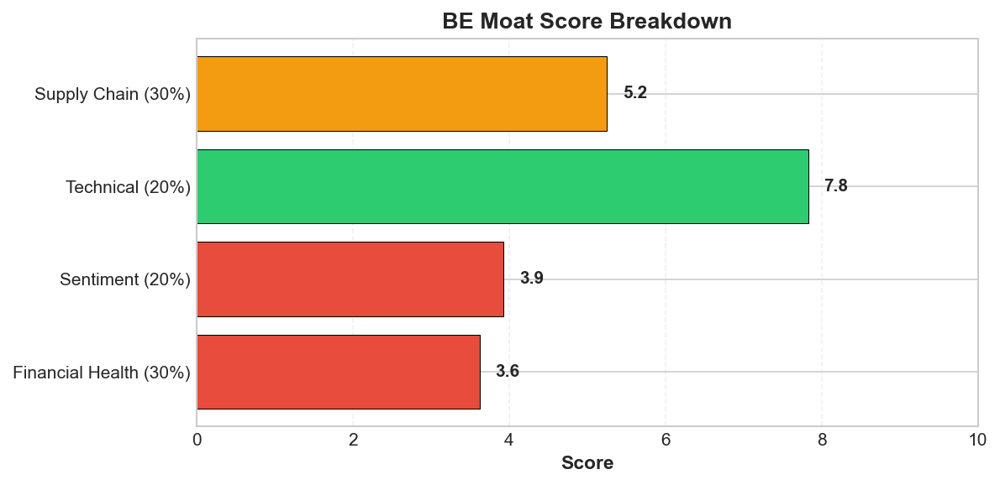
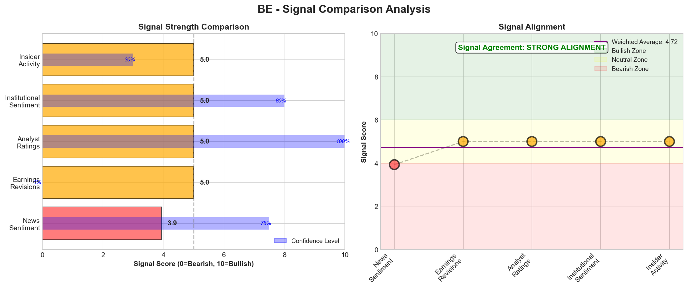
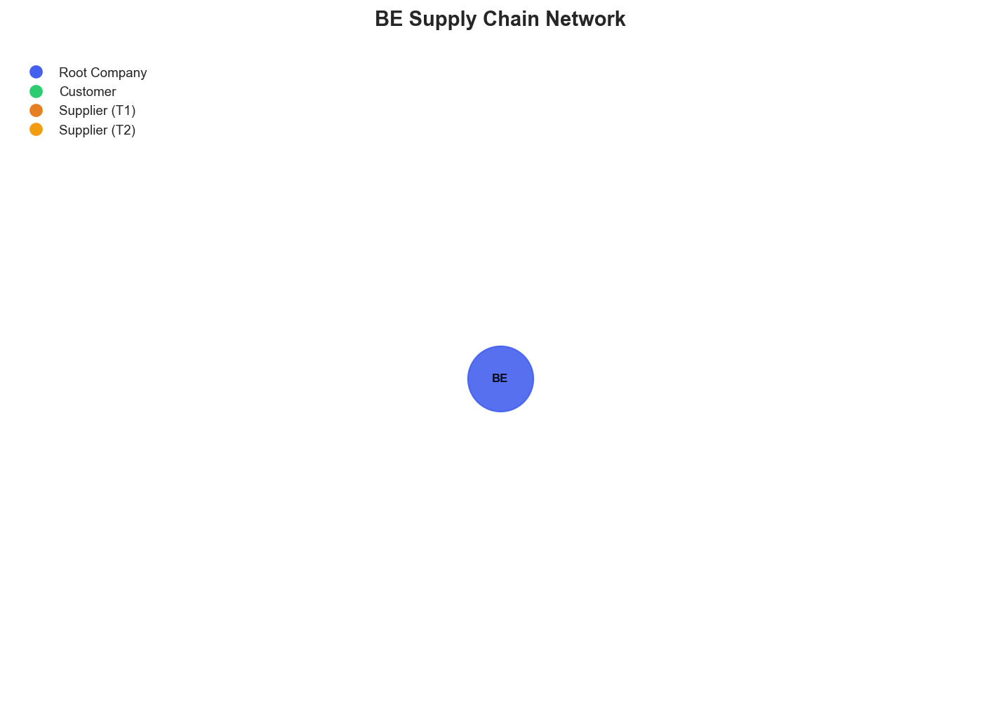

# Research Swarm Analysis Report

**Run ID:** 19dcee2f-732b-4e94-a25e-6326e692b567
**Generated:** 2026-02-10 21:08:52
**Analysis Date:** 2026-02-10
**Analysis Period:** FY 2026

---

## Executive Summary

Analyzed **1** stocks for FY 2026. Average Moat Score: **4.1/10**

**No watchlist candidates** identified in this analysis (none reached threshold of 8.0)

### Top 1 Picks

#### 1. BE - 4.1/10
**AVOID** - BE presents a fundamentally flawed investment opportunity with a moat score of 4.1/10, driven by critical operational and financial deficiencies that outweigh temporary technical strength. While the stock shows impressive momentum at $148.70 (106% above its 200-day MA), this performance masks severe underlying risks that make the investment unsuitable for most portfolios.

The company's financial health score of 3.6/10 signals significant business challenges, compounded by a concerning lack of available financial metrics that prevents proper due diligence. Most critically, BE exhibits complete supply chain opacity with zero identifiable suppliers or customer relationships, creating unquantified operational risks that could materially impact business continuity. The business model moat score of just 1.5/10 indicates minimal competitive advantages, while the company's absence from key technology sector developments suggests potential marginalization from growth opportunities.

The stark disconnect between technical performance and fundamental health suggests either market inefficiency or an unsustainable rally built on weak foundations. With neutral sentiment providing minimal catalyst support and technology sector headwinds intensifying, the risk-reward profile heavily favors downside.

This investment is unsuitable for quality-focused portfolios and poses excessive risk even for speculative allocations. The combination of operational opacity, poor fundamentals, and information asymmetry creates an investment environment where risks cannot be properly assessed or managed.

**Key Insights:**
- Technical momentum significantly diverges from fundamental health, with strong price performance ($148.70 vs $71.87 200-day MA) contrasting sharply with poor financial health scores (3.6/10), suggesting potential market inefficiency or unsustainable rally
- Complete supply chain opacity represents the most critical operational risk, with zero identified suppliers or relationships indicating either extreme vertical integration or dangerous lack of transparency that prevents proper risk assessment
- Market invisibility in technology sector discussions suggests BE may be marginalized from key growth areas like AI and robotics, potentially limiting long-term competitive positioning despite current price strength
- Neutral sentiment environment provides minimal catalyst support for continued appreciation, while broader technology sector headwinds from regulatory pressure and competitive intensity create additional challenges
- Absence of available financial metrics and operational data severely limits investor ability to conduct proper due diligence, creating information asymmetry that increases investment risk

**Risk Factors:**
- Severe supply chain transparency deficit with zero identified suppliers creates unquantified operational risks including potential single-source dependencies, geographic concentration, and hidden vulnerabilities that could disrupt business continuity
- Fundamental financial health deterioration (3.6/10 score) combined with lack of available metrics suggests underlying business challenges that may not be reflected in current technical price strength
- Technology sector marginalization evidenced by absence from major industry developments and AI/robotics discussions threatens long-term competitive relevance and growth prospects
- Potential market inefficiency where strong technical performance ($148.70 vs fundamentals) may indicate overvaluation relative to business quality, creating downside risk if fundamentals reassert influence
- Information asymmetry from limited financial disclosure and operational transparency prevents comprehensive risk assessment, increasing probability of unexpected negative developments

### Cost Summary

| Metric | Value |
|--------|-------|
| Total Cost | $0.29 |
| Cost per Stock | $0.291 |
| Budget Utilization | 0.1% |

#### Cost by Stock
| Ticker | Cost |
|--------|------|
| BE | $0.291 |

---

## Detailed Stock Analysis

### BE - 4.1/10
**Investment Thesis:** **AVOID** - BE presents a fundamentally flawed investment opportunity with a moat score of 4.1/10, driven by critical operational and financial deficiencies that outweigh temporary technical strength. While the stock shows impressive momentum at $148.70 (106% above its 200-day MA), this performance masks severe underlying risks that make the investment unsuitable for most portfolios.

The company's financial health score of 3.6/10 signals significant business challenges, compounded by a concerning lack of available financial metrics that prevents proper due diligence. Most critically, BE exhibits complete supply chain opacity with zero identifiable suppliers or customer relationships, creating unquantified operational risks that could materially impact business continuity. The business model moat score of just 1.5/10 indicates minimal competitive advantages, while the company's absence from key technology sector developments suggests potential marginalization from growth opportunities.

The stark disconnect between technical performance and fundamental health suggests either market inefficiency or an unsustainable rally built on weak foundations. With neutral sentiment providing minimal catalyst support and technology sector headwinds intensifying, the risk-reward profile heavily favors downside.

This investment is unsuitable for quality-focused portfolios and poses excessive risk even for speculative allocations. The combination of operational opacity, poor fundamentals, and information asymmetry creates an investment environment where risks cannot be properly assessed or managed.

**Processing Time:** 204.7s | **Cost:** $0.2913

#### Moat Score Breakdown

| Component | Score | Weight |
|-----------|-------|--------|
| Financial Health | 3.6/10 | 30% |
| Sentiment & Catalysts | 3.9/10 | 20% |
| Technical Strength | 7.8/10 | 20% |
| Supply Chain Position | 5.2/10 | 30% |
| **Overall Moat Score** | **4.1/10** | **100%** |

#### Signal Breakdown & Divergence Analysis

**Overall Sentiment Score:** 4.79/10

**Component Signals:**

| Signal | Score | Interpretation |
|--------|-------|---------------|
| News Sentiment | 3.93/10 | 🟡 Slightly Bearish |
| Earnings Revisions | 5.00/10 | ⚪ Neutral |
| Analyst Ratings | 5.00/10 | ⚪ Neutral |
| Institutional Activity | 5.00/10 | ⚪ Neutral |
| Insider Activity | 5.00/10 | ⚪ Neutral |

**Signal Alignment:** STRONG ALIGNMENT ✅

✅ **Signal Alignment:** All signals pointing in the same direction - neutral - no strong directional bias

#### Synthesis Narrative

BE presents a highly contradictory investment profile that demands careful analysis across multiple dimensions. The company exhibits a stark divergence between technical market performance and fundamental business health, creating both opportunity and significant risk for investors. From a technical perspective, BE demonstrates strong momentum with the stock trading at $148.70, well above both its 50-day ($120.26) and 200-day ($71.87) moving averages, suggesting sustained upward price action. The RSI of 49.3 indicates the stock is neither overbought nor oversold, providing room for continued movement in either direction. However, this technical strength stands in sharp contrast to concerning fundamental weaknesses, with a financial health score of just 3.6/10 indicating potential underlying business challenges. The absence of available financial metrics compounds this concern, suggesting either poor disclosure practices or data accessibility issues that limit investor visibility into core business performance. The sentiment analysis reveals a neutral market environment with technology sector headwinds, though BE appears largely absent from major industry discussions. This invisibility could indicate strategic positioning outside current market volatility, but more likely suggests marginalization from key growth sectors like AI and robotics. The lack of company-specific coverage in major technology announcements raises questions about BE's relevance in rapidly evolving tech markets. Most critically, the supply chain analysis exposes severe operational blind spots that represent the investment's most significant risk factor. The complete absence of identifiable suppliers, customers, or supply chain relationships indicates either extreme vertical integration or dangerous lack of operational transparency. This supply chain opacity creates unquantified risks around supplier concentration, geographic exposure, and hidden dependencies that could materially impact business continuity. The combination of poor fundamental health scores with supply chain invisibility suggests potential structural business challenges that may not yet be reflected in the stock's technical performance. The disconnect between strong price momentum and weak fundamental indicators could represent either a significant market inefficiency or a technical rally built on unstable foundations. The neutral sentiment environment provides little catalyst support for continued price appreciation, while regulatory and competitive pressures in the technology sector create additional headwinds. The absence of clear growth drivers or competitive positioning in emerging technologies like AI further compounds concerns about BE's long-term viability. For investors, BE represents a complex risk-reward proposition where strong technical momentum must be weighed against fundamental uncertainty and operational opacity. The investment requires careful consideration of whether current price levels adequately reflect the underlying business risks, particularly given the severe limitations in financial and operational visibility that prevent comprehensive due diligence.

#### Key Insights

1. Technical momentum significantly diverges from fundamental health, with strong price performance ($148.70 vs $71.87 200-day MA) contrasting sharply with poor financial health scores (3.6/10), suggesting potential market inefficiency or unsustainable rally
2. Complete supply chain opacity represents the most critical operational risk, with zero identified suppliers or relationships indicating either extreme vertical integration or dangerous lack of transparency that prevents proper risk assessment
3. Market invisibility in technology sector discussions suggests BE may be marginalized from key growth areas like AI and robotics, potentially limiting long-term competitive positioning despite current price strength
4. Neutral sentiment environment provides minimal catalyst support for continued appreciation, while broader technology sector headwinds from regulatory pressure and competitive intensity create additional challenges
5. Absence of available financial metrics and operational data severely limits investor ability to conduct proper due diligence, creating information asymmetry that increases investment risk

#### Risk Factors

1. Severe supply chain transparency deficit with zero identified suppliers creates unquantified operational risks including potential single-source dependencies, geographic concentration, and hidden vulnerabilities that could disrupt business continuity
2. Fundamental financial health deterioration (3.6/10 score) combined with lack of available metrics suggests underlying business challenges that may not be reflected in current technical price strength
3. Technology sector marginalization evidenced by absence from major industry developments and AI/robotics discussions threatens long-term competitive relevance and growth prospects
4. Potential market inefficiency where strong technical performance ($148.70 vs fundamentals) may indicate overvaluation relative to business quality, creating downside risk if fundamentals reassert influence
5. Information asymmetry from limited financial disclosure and operational transparency prevents comprehensive risk assessment, increasing probability of unexpected negative developments

---

## Supply Chain Analysis

### BE Supply Chain Network

**Network Size:** 1 nodes, 0 connections

#### Network Nodes

- **BE** (BE) - *root*

---

## Watchlist Candidates

*No stocks currently meet the watchlist threshold of 8.0 or higher.*

**Closest Candidates:**

- **BE**: 4.1/10 (3.9 points below threshold)

---

## Run Statistics

- **Total Stocks Analyzed:** 1
- **Successfully Completed:** 1
- **Failed:** 0
- **Average Moat Score:** 4.09/10
- **Total Cost:** $0.29
- **Total Time:** 204.7s

---

*Generated by Research Swarm - AI-Powered Stock Analysis*