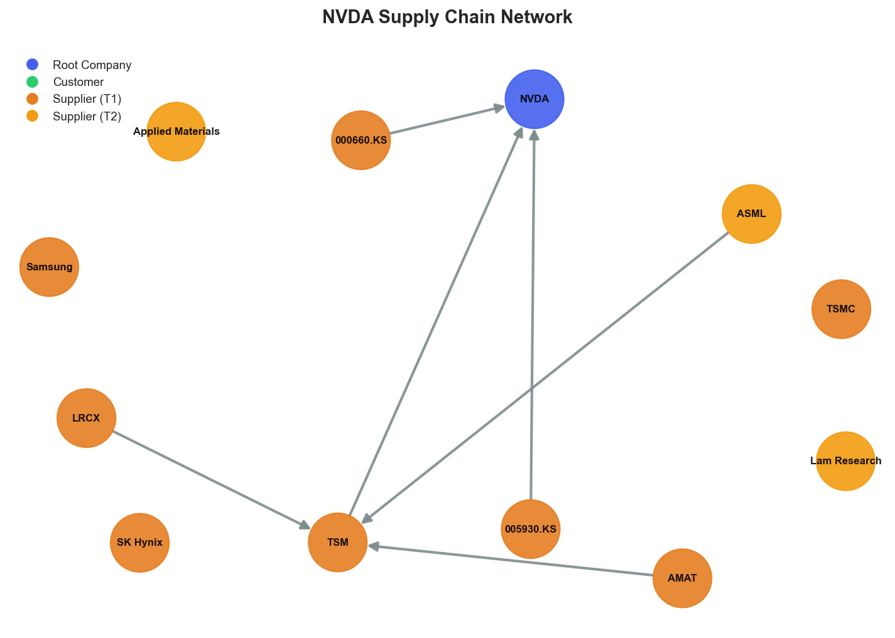

# Research Swarm Analysis Report

**Run ID:** 1c0f5bb9-4ec2-45c9-af95-de0a11b406f4
**Generated:** 2026-01-19 04:44:01
**Analysis Date:** 2026-01-19
**Analysis Period:** FY 2026

---

## Executive Summary

Analyzed **1** stocks for FY 2026. Average Moat Score: **7.7/10**

**No watchlist candidates** identified in this analysis (none reached threshold of 8.0)

### Top 1 Picks

#### 1. NVDA - 7.7/10
NVIDIA merits a HOLD rating with a moat score of 7.7/10, reflecting strong fundamentals tempered by emerging structural risks. The company's exceptional financial health (8.8/10) and positive market sentiment (8.0/10) demonstrate continued AI leadership, bolstered by strategic moves like the $20 billion Groq acquisition that transforms NVIDIA from hardware-centric to comprehensive AI infrastructure provider. Physical AI and autonomous vehicle initiatives represent significant untapped growth vectors beyond current data center dominance.

However, critical supply chain vulnerabilities prevent a BUY recommendation. The 7.2/10 supply chain score masks severe concentration risks, particularly TSMC dependency creating a single point of failure for advanced manufacturing. Geographic clustering in geopolitically sensitive East Asian regions compounds these risks. China market restrictions affecting 15-20% of addressable markets create both immediate revenue impact and long-term competitive challenges.

Technical indicators show consolidation above key moving averages with oversold RSI conditions, suggesting potential entry opportunities for patient investors. The moderate technical score (6.5/10) reflects near-term momentum concerns rather than fundamental deterioration.

This position suits growth-oriented investors with high risk tolerance who can weather geopolitical volatility. NVIDIA remains a core AI play but requires careful position sizing given supply chain vulnerabilities. Consider accumulating on weakness while monitoring geopolitical developments and supply chain diversification progress.

**Key Insights:**
- Strategic transformation from hardware-centric to comprehensive AI infrastructure provider through acquisitions like Groq positions NVIDIA for expanded market capture while addressing competitive threats, supported by strong fundamental metrics
- Physical AI and autonomous vehicle initiatives represent significant untapped growth vectors that could drive the next phase of expansion beyond current data center dominance, with market reception indicating strong commercial potential
- Technical consolidation above key moving averages combined with oversold RSI conditions suggests potential entry opportunity for investors confident in long-term AI adoption trends and NVIDIA's market position
- Supply chain resilience score of 7.2/10 masks critical concentration risks, particularly TSMC dependency and East Asian geographic clustering, creating structural vulnerabilities that could impact operational continuity

**Risk Factors:**
- Severe supply chain concentration risk with TSMC representing a critical single point of failure for advanced manufacturing, compounded by geographic clustering in geopolitically sensitive East Asian regions
- China market restrictions potentially affecting 15-20% of addressable markets while limiting crucial software ecosystem development, creating both immediate revenue impact and long-term competitive vulnerabilities
- Intensifying competitive landscape with emerging AI chipmakers threatening market share, requiring continued innovation excellence and successful execution of vertical integration strategy
- Geopolitical tensions affecting key supplier relationships and market access, particularly Taiwan Strait dynamics that could disrupt primary foundry capacity and Korean Peninsula security affecting memory supply chains
- Capital expenditure sustainability concerns as AI infrastructure spending levels face potential cyclical pressures, combined with insider selling patterns that warrant monitoring for sentiment shifts

### Cost Summary

| Metric | Value |
|--------|-------|
| Total Cost | $0.29 |
| Cost per Stock | $0.286 |
| Budget Utilization | 0.1% |

#### Cost by Stock
| Ticker | Cost |
|--------|------|
| NVDA | $0.286 |

---

## Detailed Stock Analysis

### NVDA - 7.7/10
**Investment Thesis:** NVIDIA merits a HOLD rating with a moat score of 7.7/10, reflecting strong fundamentals tempered by emerging structural risks. The company's exceptional financial health (8.8/10) and positive market sentiment (8.0/10) demonstrate continued AI leadership, bolstered by strategic moves like the $20 billion Groq acquisition that transforms NVIDIA from hardware-centric to comprehensive AI infrastructure provider. Physical AI and autonomous vehicle initiatives represent significant untapped growth vectors beyond current data center dominance.

However, critical supply chain vulnerabilities prevent a BUY recommendation. The 7.2/10 supply chain score masks severe concentration risks, particularly TSMC dependency creating a single point of failure for advanced manufacturing. Geographic clustering in geopolitically sensitive East Asian regions compounds these risks. China market restrictions affecting 15-20% of addressable markets create both immediate revenue impact and long-term competitive challenges.

Technical indicators show consolidation above key moving averages with oversold RSI conditions, suggesting potential entry opportunities for patient investors. The moderate technical score (6.5/10) reflects near-term momentum concerns rather than fundamental deterioration.

This position suits growth-oriented investors with high risk tolerance who can weather geopolitical volatility. NVIDIA remains a core AI play but requires careful position sizing given supply chain vulnerabilities. Consider accumulating on weakness while monitoring geopolitical developments and supply chain diversification progress.

**Processing Time:** 379.1s | **Cost:** $0.2859

#### Moat Score Breakdown

| Component | Score | Weight |
|-----------|-------|--------|
| Financial Health | 8.8/10 | 30% |
| Sentiment & Catalysts | 8.0/10 | 20% |
| Technical Strength | 6.5/10 | 20% |
| Supply Chain Position | 7.2/10 | 30% |
| **Overall Moat Score** | **7.7/10** | **100%** |

#### Synthesis Narrative

NVIDIA presents a compelling but increasingly complex investment proposition as of January 2026, characterized by exceptional fundamental strength tempered by emerging structural challenges. The company's outstanding financial health score of 8.8/10 reflects robust underlying business performance, while the positive sentiment score of 8.0/10 indicates continued market confidence in NVIDIA's AI leadership position. However, the moderate technical score of 6.5/10 suggests some near-term momentum concerns, with RSI at 40.4 indicating potential oversold conditions that could present entry opportunities. The convergence of these metrics paints a picture of a fundamentally strong company navigating a transitional period in its growth trajectory. The sentiment analysis reveals NVIDIA's strategic evolution from pure hardware dominance to comprehensive AI infrastructure solutions, exemplified by the transformative $20 billion Groq acquisition. This vertical integration strategy addresses competitive threats while expanding addressable markets, aligning with the company's strong fundamental position. The positive reception of physical AI initiatives and autonomous vehicle developments suggests NVIDIA is successfully positioning for the next wave of AI adoption beyond current data center applications. However, the supply chain analysis exposes critical vulnerabilities that could materially impact future performance. The 7.2/10 supply chain resilience score masks significant concentration risks, particularly NVIDIA's dependence on TSMC for advanced manufacturing and the broader geographic concentration in geopolitically sensitive East Asian regions. These structural dependencies create potential single points of failure that could disrupt the company's growth trajectory, especially given escalating China-related restrictions highlighted in the sentiment analysis. The technical indicators suggest NVIDIA is trading above both short-term and long-term moving averages (SMA50: $184.55, SMA200: $164.04, Current: $186.23), indicating underlying strength despite the moderate technical score. This positioning, combined with the RSI reading, suggests the stock may be consolidating gains rather than experiencing fundamental deterioration. The insider selling patterns noted in sentiment analysis warrant monitoring but appear consistent with profit-taking rather than fundamental concerns. A critical divergence emerges between NVIDIA's strategic expansion capabilities and its operational vulnerabilities. While the company demonstrates exceptional innovation leadership and market positioning strength, the supply chain concentration risks and geopolitical headwinds create meaningful uncertainty around execution. The China market restrictions represent a particularly acute challenge, potentially affecting 15-20% of addressable markets while limiting software ecosystem development in a crucial region. The synthesis reveals NVIDIA as a company successfully managing AI market leadership while confronting structural challenges that require careful navigation. The strong fundamentals and positive strategic positioning provide a solid foundation, but investors must weigh these strengths against supply chain vulnerabilities and geopolitical risks that could materially impact future performance. The current valuation appears to reflect optimism about strategic initiatives while potentially underpricing emerging risks.

#### Key Insights

1. Strategic transformation from hardware-centric to comprehensive AI infrastructure provider through acquisitions like Groq positions NVIDIA for expanded market capture while addressing competitive threats, supported by strong fundamental metrics
2. Physical AI and autonomous vehicle initiatives represent significant untapped growth vectors that could drive the next phase of expansion beyond current data center dominance, with market reception indicating strong commercial potential
3. Technical consolidation above key moving averages combined with oversold RSI conditions suggests potential entry opportunity for investors confident in long-term AI adoption trends and NVIDIA's market position
4. Supply chain resilience score of 7.2/10 masks critical concentration risks, particularly TSMC dependency and East Asian geographic clustering, creating structural vulnerabilities that could impact operational continuity

#### Risk Factors

1. Severe supply chain concentration risk with TSMC representing a critical single point of failure for advanced manufacturing, compounded by geographic clustering in geopolitically sensitive East Asian regions
2. China market restrictions potentially affecting 15-20% of addressable markets while limiting crucial software ecosystem development, creating both immediate revenue impact and long-term competitive vulnerabilities
3. Intensifying competitive landscape with emerging AI chipmakers threatening market share, requiring continued innovation excellence and successful execution of vertical integration strategy
4. Geopolitical tensions affecting key supplier relationships and market access, particularly Taiwan Strait dynamics that could disrupt primary foundry capacity and Korean Peninsula security affecting memory supply chains
5. Capital expenditure sustainability concerns as AI infrastructure spending levels face potential cyclical pressures, combined with insider selling patterns that warrant monitoring for sentiment shifts

---

## Supply Chain Analysis

### NVDA Supply Chain Network

**Network Size:** 7 nodes, 6 connections

#### Network Nodes

- **NVDA** (NVDA) - *root*- **TSMC** (TSM) - *supplier*- **SK Hynix** (000660.KS) - *supplier*- **Samsung** (005930.KS) - *supplier*- **ASML** (ASML) - *supplier_t2*- **Applied Materials** (AMAT) - *supplier_t2*- **Lam Research** (LRCX) - *supplier_t2*

---

## Watchlist Candidates

*No stocks currently meet the watchlist threshold of 8.0 or higher.*

**Closest Candidates:**

- **NVDA**: 7.7/10 (0.3 points below threshold)

---

## Run Statistics

- **Total Stocks Analyzed:** 1
- **Successfully Completed:** 1
- **Failed:** 0
- **Average Moat Score:** 7.69/10
- **Total Cost:** $0.29
- **Total Time:** 379.2s

---

*Generated by Research Swarm - AI-Powered Stock Analysis*