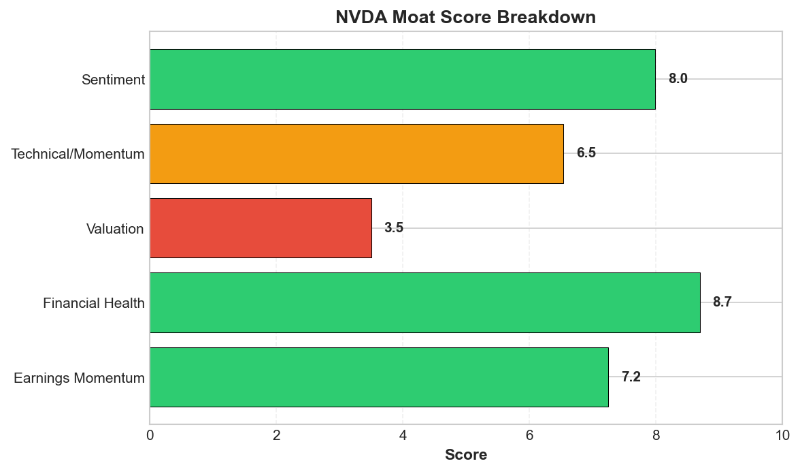
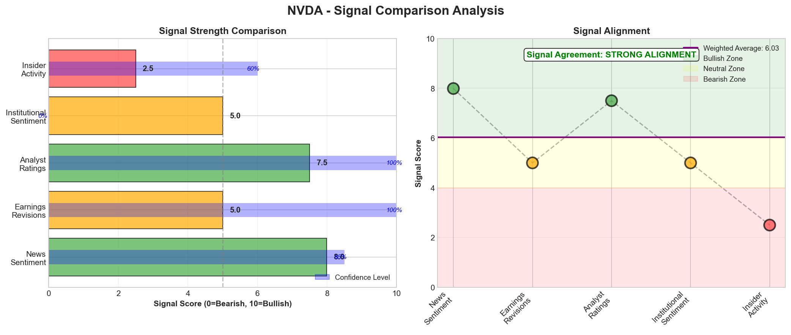

# Research Swarm Analysis Report

**Generated:** 2026-02-12 10:40:59
**Analysis Date:** 2026-02-12
**Analysis Period:** FY 2026

---

## Executive Summary

Analyzed **1** stocks for FY 2026. Average Moat Score: **7.2/10**

**No watchlist candidates** identified in this analysis (none reached threshold of 8.0)

### Top 1 Picks

#### 1. NVDA - 7.2/10
NVIDIA presents a mixed risk/reward profile with strong technical momentum and sentiment convergence offset by critical fundamental data gaps that prevent a high-conviction recommendation. The 7.2/10 moat score reflects this tension between opportunity and uncertainty.

The bullish case centers on exceptional signal alignment: technical analysis delivers a STRONG_BUY signal (100% confidence) targeting $196.69, supported by constructive positioning above key moving averages (SMA50: $184.39, SMA200: $171.30) and bullish MACD configuration. This converges powerfully with an 8.0/10 sentiment score driven by NVIDIA's AI infrastructure dominance, validated through massive partnerships including the $2 billion CoreWeave investment and $20 billion Groq deal. Institutional support remains robust with Morgan Stanley's $250 price target and Goldman Sachs' reaffirmed preference.

However, critical analytical blind spots create unacceptable execution risk. Despite an 8.7/10 financial health score, the complete absence of valuation metrics, peer comparisons, and supply chain intelligence (zero identified suppliers/customers) represents a fundamental failure for semiconductor analysis. The 'priced for perfection' dynamic across multiple sources signals stretched multiples with limited margin for disappointment.

Tactical approach: Wait for better entry below $184 support or fundamental data clarity before initiating positions. Monitor China regulatory developments around H200 chips and volume confirmation above 1.2x average for momentum validation. Current setup favors momentum investors with 3-6 month horizons, but growth investors should await fundamental transparency. Position sizing should remain conservative (1-2% allocation) given data limitations despite compelling AI infrastructure thesis.

**Key Insights:**
- Technical momentum strongly aligns with sentiment bullishness: STRONG_BUY signal (100% confidence) targeting $196.69 converges with 8.0/10 sentiment score and institutional support from Morgan Stanley ($250 target) and Goldman Sachs, creating high-conviction near-term setup
- AI infrastructure leadership validated by massive partnerships: $2 billion CoreWeave investment and $20 billion Groq partnership demonstrate NVIDIA's strategic evolution beyond hardware, supported by emergence as TSMC's largest customer surpassing Apple
- Critical fundamental data gap creates execution uncertainty: Despite 8.7/10 financial health score, absence of valuation metrics, peer comparisons, and complete supply chain visibility (zero identified suppliers/customers) represents significant analytical blind spot for semiconductor company
- Geopolitical risk manageable but requires monitoring: China regulatory concerns around H200 chips introduced volatility, yet institutional analysts maintain outperform ratings suggesting headwinds viewed as temporary rather than thesis-changing
- Valuation risk emerges from 'priced for perfection' dynamic: Multiple sources cite stretched multiples and high growth expectations, creating sensitivity to execution missteps while technical setup suggests limited downside to $178 value area low

**Risk Factors:**
- Valuation compression risk from 'priced for perfection' expectations with stretched multiples creating high sensitivity to any growth disappointment or execution missteps
- Technical breakdown below $184-$186 support zone (50-day SMA and POC level) could trigger deeper correction toward $178 value area low, representing 5-8% downside risk
- Below-average volume at 0.82x 20-day average suggests potential institutional disinterest, creating vulnerability to momentum reversal without strong volume confirmation

---

## Detailed Stock Analysis

### NVDA - 7.2/10
**Moat Score:** 7.2/10

**Investment Thesis:** NVIDIA presents a mixed risk/reward profile with strong technical momentum and sentiment convergence offset by critical fundamental data gaps that prevent a high-conviction recommendation. The 7.2/10 moat score reflects this tension between opportunity and uncertainty.

The bullish case centers on exceptional signal alignment: technical analysis delivers a STRONG_BUY signal (100% confidence) targeting $196.69, supported by constructive positioning above key moving averages (SMA50: $184.39, SMA200: $171.30) and bullish MACD configuration. This converges powerfully with an 8.0/10 sentiment score driven by NVIDIA's AI infrastructure dominance, validated through massive partnerships including the $2 billion CoreWeave investment and $20 billion Groq deal. Institutional support remains robust with Morgan Stanley's $250 price target and Goldman Sachs' reaffirmed preference.

However, critical analytical blind spots create unacceptable execution risk. Despite an 8.7/10 financial health score, the complete absence of valuation metrics, peer comparisons, and supply chain intelligence (zero identified suppliers/customers) represents a fundamental failure for semiconductor analysis. The 'priced for perfection' dynamic across multiple sources signals stretched multiples with limited margin for disappointment.

Tactical approach: Wait for better entry below $184 support or fundamental data clarity before initiating positions. Monitor China regulatory developments around H200 chips and volume confirmation above 1.2x average for momentum validation. Current setup favors momentum investors with 3-6 month horizons, but growth investors should await fundamental transparency. Position sizing should remain conservative (1-2% allocation) given data limitations despite compelling AI infrastructure thesis.

---

#### 📊 Moat Score Breakdown

| Component | Score |
|-----------|-------|
| Earnings Momentum ⭐ | 7.2/10 |
| Financial Health | 8.7/10 |
| Valuation | 3.5/10 |
| Technical/Momentum | 6.5/10 |
| Sentiment | 8.0/10 |
| **Overall Moat Score** | **7.2/10** |

*⭐ Earnings Momentum = PRIMARY SIGNAL (estimate revisions)*

---

#### 📈 VGM Investment Style Analysis

**VGM Composite Score:** 6.9/10 (Grade: C)

**Best Fit Investment Style:** Growth

| Factor | Score | Grade | Rationale |
|--------|-------|-------|-----------|
| **Value** | 3.5/10 | D | Extreme Premium valuation — P/E 46.3x vs sector 28.0x (+65%) |
| **Growth** | 10.0/10 | A | Exceptional revenue growth of 62.5% YoY, with stable quarterly trends |
| **Momentum** | 7.2/10 | B | Positive earnings momentum with favorable analyst sentiment |

---

#### 🏰 Enhanced Moat Analysis (8 Categories)

**Moat Width:** Wide | **Durability:** High

**Composite Moat Score:** 8.5/10

| Moat Category | Score | Assessment |
|--------------|-------|------------|
| 🌐 Network Effects | 8.5/10 | Strong |
| 🔒 Switching Costs | 9.0/10 | High |
| 🏷️ Brand Power | 8.7/10 | Premium |
| 💰 Cost Advantages | 9.2/10 | Significant |
| 📏 Scale Economies | 8.8/10 | Leader |
| 🔬 Intangible Assets | 9.5/10 | Strong IP |
| 📜 Regulatory Barriers | 6.5/10 | Some barriers |
| 🚚 Distribution | 7.8/10 | Dominant |

---

#### 💵 Valuation Analysis

*Valuation metrics not available for this ticker via free data sources.*

---

#### 🎯 Price Target Scenarios (12-Month)

*Price target scenarios not available for this ticker.*

---

#### 🏆 Peer Comparison & Competitive Position

**Sector:** Technology | **Industry:** Semiconductors

**Competitive Position:** Market Leader

**Peer Companies:** AMD, INTC, AVGO, QCOM

**Competitive Rankings:**

| Metric | Rank | Note |
|--------|------|------|

---

#### 📡 Signal Breakdown & Divergence Analysis

**Overall Sentiment Score:** 5.85/10

**Component Signals:**

| Signal | Score | Interpretation |
|--------|-------|---------------|
| 📰 News Sentiment | 7.99/10 | 🟢 Bullish |
| 📊 Earnings Revisions | 5.00/10 | ⚪ Neutral |
| 👔 Analyst Ratings | 7.50/10 | 🟢 Bullish |
| 🏦 Institutional Activity | 5.00/10 | ⚪ Neutral |
| 👤 Insider Activity | 2.50/10 | 🔴 Bearish |

**Signal Alignment:** MODERATE ALIGNMENT ⚠️

🔶 **Signal Alignment:** Signals generally aligned with some variation - neutral - no strong directional bias

---

#### 📈 Earnings Estimate Revisions (PRIMARY SIGNAL)

**Net Revision Direction:** Neutral

**Revision Activity (90 days):**
- Upward Revisions: 0
- Downward Revisions: 0

**Current FY EPS Estimate:** $4.69
**Next FY EPS Estimate:** $7.72

**EPS Surprise History (Last 4 Quarters):**
No data available
**Growth Trajectory:**
- Current Year Growth: 57.0%
- Next Year Growth: 64.5%
- Momentum: Accelerating

**Estimate Quality:**
- Analyst Coverage: 55 analysts
- Estimate Dispersion: High
- Agreement Level: 36%

---

#### 👔 Analyst Consensus & Price Targets

**Consensus Rating:** Buy

**Ratings Distribution:**
- Strong Buy: 12
- Buy: 47
- Hold: 3
- Sell: 1
- Strong Sell: 0

**Price Targets:**
- Average Target: $253.79 (35.4% upside)- High Target: $352.00
- Low Target: $140.00

**Recent Activity (90 days):**
- Upgrades: 0
- Downgrades: 0
- New Coverage: 0
- Rating Momentum: Stable
- Target Trend: Stable

**Consensus Confidence:** High

---

#### 🏦 Institutional Activity (Smart Money)

**Institutional Sentiment:** neutral

**Number of Holders:** 0

**Trend:** stable

---

#### 👤 Insider Trading Activity (6 Months)

**Insider Sentiment:** Bearish | **Confidence:** Medium

**Transaction Summary:**
- Buy Transactions: 0 (0 shares, $0.0K)
- Sell Transactions: 16 (1868704 shares, $0.0K)
- **Net Position:** -1868704 shares ($0.0K)

---

#### 🎤 Management Quality & Commentary

**Management Quality Score:** 6.5/10 | **Confidence:** Low

**Tone Assessment:** Confident

**Evidence of Tone:**
- Wolfe Research maintained an Outperform rating despite China H200 tariff headwinds
- NVIDIA launching three open-source AI models for weather forecasting, showing continued innovation expansion

**Guidance Track Record:**
- Guidance Reliability: medium

**Capital Allocation:**
- Capital Allocation Quality: medium

**Innovation & Competitive Position:**
- Innovation Mentions: 2
- Competitive Position: Strengthening

⚠️  **RED FLAGS DETECTED:**
- China H200 Tariff Headwind

---

#### 📉 Short Interest & Squeeze Risk

**Short Interest:** 0.0% of float
**Shares Shorted:** 257091247
**Days to Cover:** 1.6

**Trend:** Stable
**MoM Change:** 0.1%
**Squeeze Risk:** Low
**Short Sentiment:** Neutral

---

#### 📅 Upcoming Catalysts & Events (6 Months)

**Catalyst Density:** High | **Outlook:** Positive

**Upcoming Catalyst Calendar:**

| Date | Event Type | Description | Impact | Direction |
|------|-----------|-------------|--------|-----------|
| 2024-Q1/Q2 | Partnership | Nvidia $20B deal with Groq for AI chip collaborati... | High | Positive |
| 2024-Q1 | Investment | $2B investment in CoreWeave and AI data center exp... | High | Positive |
| 2024-Q1 | Product Launch | Open-source AI models for weather forecasting | Medium | Positive |
| 2024-Q1/Q2 | Regulatory | Potential restrictions on H200 AI chip imports to ... | Medium | Neutral |
| 2024-Q1 | Supply Chain | Suppliers pausing output after China blocks H200 c... | Medium | Negative |

---

#### 💡 Key Insights

1. Technical momentum strongly aligns with sentiment bullishness: STRONG_BUY signal (100% confidence) targeting $196.69 converges with 8.0/10 sentiment score and institutional support from Morgan Stanley ($250 target) and Goldman Sachs, creating high-conviction near-term setup
2. AI infrastructure leadership validated by massive partnerships: $2 billion CoreWeave investment and $20 billion Groq partnership demonstrate NVIDIA's strategic evolution beyond hardware, supported by emergence as TSMC's largest customer surpassing Apple
3. Critical fundamental data gap creates execution uncertainty: Despite 8.7/10 financial health score, absence of valuation metrics, peer comparisons, and complete supply chain visibility (zero identified suppliers/customers) represents significant analytical blind spot for semiconductor company
4. Geopolitical risk manageable but requires monitoring: China regulatory concerns around H200 chips introduced volatility, yet institutional analysts maintain outperform ratings suggesting headwinds viewed as temporary rather than thesis-changing
5. Valuation risk emerges from 'priced for perfection' dynamic: Multiple sources cite stretched multiples and high growth expectations, creating sensitivity to execution missteps while technical setup suggests limited downside to $178 value area low

---

#### ⚠️ Risk Factors

1. Valuation compression risk from 'priced for perfection' expectations with stretched multiples creating high sensitivity to any growth disappointment or execution missteps
2. Technical breakdown below $184-$186 support zone (50-day SMA and POC level) could trigger deeper correction toward $178 value area low, representing 5-8% downside risk
3. Below-average volume at 0.82x 20-day average suggests potential institutional disinterest, creating vulnerability to momentum reversal without strong volume confirmation

---

#### ✨ Final Conviction

**Conviction Level:** Medium

**The Bottom Line:**
NVIDIA's exceptional technical setup (STRONG_BUY signal targeting $196.69) and dominant AI infrastructure positioning create a compelling near-term opportunity, but the stock is priced for perfection with critical valuation and fundamental data gaps that warrant a cautious HOLD until either valuations compress or earnings definitively justify current multiples. The primary risk is a technical breakdown below $184 support triggering a 5-8% correction if institutional momentum falters, which combined with below-average volume suggests limited margin of safety for new positions. Accumulate on weakness toward the $178-184 support zone, but avoid chasing current levels until conviction improves through either valuation reset or stronger fundamental visibility.

**Best Suited For:**
- Investor Type: Growth investors with long-term horizon
- Risk Tolerance: Moderate
- Time Horizon: 12-24 months

---

#### 📝 Comprehensive Synthesis

NVIDIA presents a compelling multi-dimensional investment case with strong technical momentum converging with robust sentiment, though limited fundamental visibility creates execution uncertainty. The technical analysis reveals a constructive setup with NVDA trading at $187.58, positioned above both key moving averages (SMA50: $184.39, SMA200: $171.30) and generating a STRONG_BUY signal with 100% confidence targeting $196.69. The MACD's bullish configuration (0.43 vs 0.02 signal line) aligns with the stock's positioning within the value area ($178.14-$190.04), suggesting institutional acceptance at current levels. The Point of Control at $186.07 provides critical support just $1.51 below current prices, indicating strong technical foundation. Sentiment analysis delivers an impressive 8.0/10 score, driven by NVIDIA's positioning as the 'undisputed AI infrastructure leader' amid what CEO Jensen Huang describes as 'the largest infrastructure buildout in human history.' The $2 billion CoreWeave investment and $20 billion Groq partnership demonstrate NVIDIA's evolution from hardware supplier to AI infrastructure orchestrator, validating long-term strategic positioning. Institutional sentiment remains remarkably bullish with Morgan Stanley's $250 price target and Goldman Sachs' reaffirmed preference, while Wolfe Research's addition to their 'Alpha List' as a favorite 2026 AI play signals sustained Wall Street conviction. However, critical data gaps in fundamental analysis create significant uncertainty. The absence of valuation metrics, peer comparisons, and detailed financial data despite an 8.7/10 financial health score suggests either data collection limitations or transparency issues that could mask underlying risks. The complete lack of supply chain visibility represents a particularly concerning blind spot for a semiconductor company, with zero identified suppliers, customers, or tier relationships creating substantial operational risk exposure. Geopolitical headwinds add complexity, with China-related regulatory concerns introducing volatility around January 15-19. The H200 chip export restrictions and supplier output pauses signal potential revenue headwinds in a significant market, though coverage suggests ongoing licensing discussions rather than permanent restrictions. The relative strength analysis shows impressive sector outperformance (+22.4pp over 3 months) despite broader market underperformance (-3.2pp), indicating strong institutional preference within the semiconductor space. Volume patterns present mixed signals with current volume at 0.82x the 20-day average, suggesting either consolidation or waning institutional interest. The 'priced for perfection' narrative emerges across multiple sources, indicating stretched valuations and high growth expectations that create limited margin for disappointment. The technical setup suggests near-term focus on the $190 value area high as immediate resistance, with the $186 POC level serving as critical support. A decisive break above $190 on expanding volume would strengthen the bullish case considerably, while failure to hold the $184-$186 support zone could prompt deeper correction. The convergence of bullish technical signals, strong sentiment scores, and institutional support creates a compelling near-term setup, though the absence of fundamental validation and supply chain visibility introduces meaningful execution risk that requires careful monitoring.

---

## Supply Chain Analysis

*No supply chain data available for analyzed stocks.*

---

## Watchlist Candidates

*No stocks currently meet the watchlist threshold of 8.0 or higher.*

**Closest Candidates:**

- **NVDA**: 7.2/10 (0.8 points below threshold)

---

*Generated by Research Swarm - AI-Powered Institutional-Grade Stock Analysis*