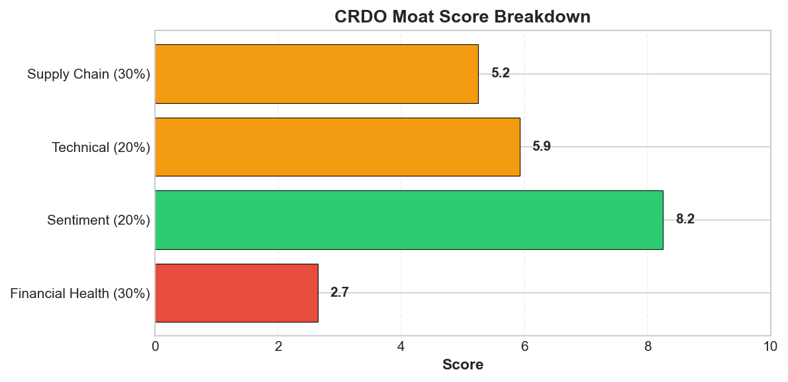
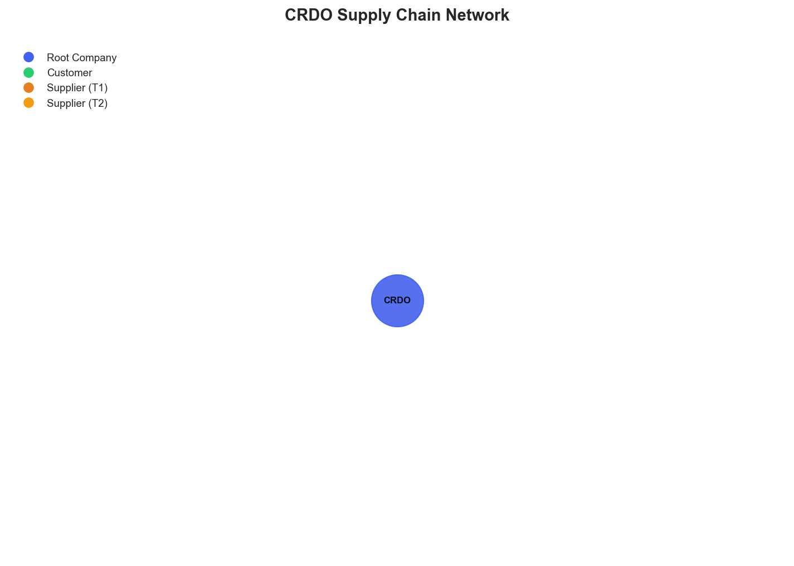

# Research Swarm Analysis Report

**Run ID:** 4f23a254-789d-4c47-8a07-f0a15a99cd34
**Generated:** 2026-01-18 17:38:06
**Analysis Date:** 2026-01-18
**Fiscal Year:** 2024

---

## Executive Summary

Analyzed **1** stocks for fiscal year 2024. Average Moat Score: **5.2/10**

**No watchlist candidates** identified in this analysis (none reached threshold of 8.0)

### Top 1 Picks

#### 1. CRDO - 5.2/10
CRDO earns an AVOID recommendation with a 5.2/10 moat score, reflecting a dangerous disconnect between AI hype and operational reality. While sentiment scores an impressive 8.2/10 with analyst positioning as a 'must-buy AI stock' and BofA's $200 price target, the fundamentals tell a starkly different story. The company's abysmal 2.7/10 financial health score, zero reported revenue, and mathematically impossible 6190% gross margin raise serious data quality and transparency concerns. Most troubling is the complete supply chain opacity (5.2/10 score) for what should be a complex AI infrastructure business requiring extensive partnerships. The technical picture at 5.9/10 shows neutral consolidation around $151, suggesting market uncertainty despite recent institutional positioning. This represents a classic speculative bubble scenario where AI thematic enthusiasm has divorced from operational fundamentals. The extreme volatility between zero revenue and premium valuation, combined with supply chain invisibility, creates unacceptable risk-reward dynamics. While early-stage AI companies merit consideration, CRDO's fundamental opacity and potential accounting irregularities present red flags that outweigh thematic positioning. This investment suits only the most aggressive speculators willing to bet on pure AI sentiment rather than demonstrable business metrics. Conservative and growth-oriented investors should avoid until operational clarity emerges.

**Key Insights:**
- Extreme disconnect between fundamentals (2.7/10 health score, zero revenue) and sentiment (8.2/10, 'must-buy AI stock') suggests either early-stage development opportunity or speculative bubble formation
- AI infrastructure thematic positioning drives strong analyst support (Needham top pick, BofA $200 target) despite absence of demonstrable operational metrics or supply chain visibility
- Complete supply chain opacity with zero identified suppliers or customers presents either extreme vertical integration advantage or critical operational blind spots requiring immediate investigation
- Technical consolidation around $151 between moving averages, combined with pre-announcement rally, indicates institutional positioning for potential catalyst events despite fundamental uncertainties
- Revenue-margin mathematical impossibility (zero revenue, 6190% gross margin) signals either data quality issues or extraordinary developmental accounting that demands clarification

**Risk Factors:**
- Fundamental financial distress with zero reported revenue and concerning health metrics contradicts positive market positioning, suggesting potential overvaluation relative to operational reality
- Complete absence of visible supply chain relationships creates maximum operational vulnerability and prevents effective risk assessment for an AI infrastructure company requiring complex partnerships
- Heavy reliance on AI thematic sentiment without demonstrable product commercialization or customer traction exposes investment to sector rotation and sentiment reversal risks
- Data quality concerns evidenced by impossible financial metrics and supply chain opacity raise questions about transparency and reporting reliability
- Concentrated analyst coverage from limited sources (primarily Yahoo Finance) and coordinated positive messaging suggests potential echo chamber effects rather than diverse analytical validation

### Cost Summary

| Metric | Value |
|--------|-------|
| Total Cost | $0.00 |
| Cost per Stock | $0.000 |
| Budget Utilization | 0.0% |

#### Cost by Stock
| Ticker | Cost |
|--------|------|
| CRDO | $0.000 |

---

## Detailed Stock Analysis

### CRDO - 5.2/10
**Investment Thesis:** CRDO earns an AVOID recommendation with a 5.2/10 moat score, reflecting a dangerous disconnect between AI hype and operational reality. While sentiment scores an impressive 8.2/10 with analyst positioning as a 'must-buy AI stock' and BofA's $200 price target, the fundamentals tell a starkly different story. The company's abysmal 2.7/10 financial health score, zero reported revenue, and mathematically impossible 6190% gross margin raise serious data quality and transparency concerns. Most troubling is the complete supply chain opacity (5.2/10 score) for what should be a complex AI infrastructure business requiring extensive partnerships. The technical picture at 5.9/10 shows neutral consolidation around $151, suggesting market uncertainty despite recent institutional positioning. This represents a classic speculative bubble scenario where AI thematic enthusiasm has divorced from operational fundamentals. The extreme volatility between zero revenue and premium valuation, combined with supply chain invisibility, creates unacceptable risk-reward dynamics. While early-stage AI companies merit consideration, CRDO's fundamental opacity and potential accounting irregularities present red flags that outweigh thematic positioning. This investment suits only the most aggressive speculators willing to bet on pure AI sentiment rather than demonstrable business metrics. Conservative and growth-oriented investors should avoid until operational clarity emerges.

**Processing Time:** 168.6s | **Cost:** $0.0000

#### Moat Score Breakdown

| Component | Score | Weight |
|-----------|-------|--------|
| Financial Health | 2.7/10 | 30% |
| Sentiment & Catalysts | 8.2/10 | 20% |
| Technical Strength | 5.9/10 | 20% |
| Supply Chain Position | 5.2/10 | 30% |
| **Overall Moat Score** | **5.2/10** | **100%** |

#### Synthesis Narrative

CRDO presents a highly contradictory investment profile that demands careful scrutiny across multiple dimensions. The most striking divergence emerges between the company's abysmal fundamental metrics and overwhelmingly positive market sentiment, creating a classic disconnect between perception and reality that warrants immediate attention.

From a fundamental perspective, CRDO exhibits severe financial distress with a concerning 2.7/10 health score and reported zero revenue despite an anomalous 6190% gross margin figure—a mathematical impossibility that suggests significant data quality issues or extraordinary accounting circumstances. This fundamental weakness stands in stark contrast to the robust 8.2/10 sentiment score, where analysts consistently position CRDO as a 'must-buy AI stock' and top growth pick for 2026. This sentiment appears driven primarily by thematic AI infrastructure positioning rather than underlying financial performance, suggesting potential speculative enthusiasm disconnected from operational reality.

The technical analysis provides a neutral perspective with a 5.9/10 score, showing CRDO trading at $150.97 between its 50-day ($153.71) and 200-day ($114.36) moving averages, indicating recent consolidation after a longer-term uptrend. The RSI of 55.6 suggests neither overbought nor oversold conditions, providing little directional bias. However, the 6% pre-announcement rally mentioned in sentiment analysis indicates active institutional positioning ahead of business updates.

Perhaps most concerning is the complete opacity surrounding CRDO's supply chain operations. The 5.2/10 supply chain score reflects not operational strength but rather a critical absence of visible supplier relationships, customer dependencies, or operational infrastructure. This could indicate either extreme vertical integration, early-stage development, or significant transparency issues—all of which present substantial strategic risks for an AI infrastructure company that should theoretically require complex semiconductor and technology partnerships.

The convergence of zero revenue, exceptional gross margins, and invisible supply chains suggests CRDO may be in a pre-commercial or development stage, potentially explaining the disconnect between current fundamentals and future-oriented AI sentiment. Needham's reaffirmation as a 2026 top pick, coupled with Bank of America's $200 price target (albeit reduced), indicates institutional belief in future monetization despite current operational gaps.

This analysis reveals a company riding significant AI thematic tailwinds while lacking demonstrable operational foundation. The positive sentiment appears forward-looking, betting on AI infrastructure buildout, while fundamentals reflect either early-stage development or operational challenges. The technical picture suggests market indecision, with price action reflecting this fundamental uncertainty. For investors, CRDO represents a high-risk, high-reward proposition where AI positioning potential must be weighed against operational opacity and fundamental weakness.

#### Key Insights

1. Extreme disconnect between fundamentals (2.7/10 health score, zero revenue) and sentiment (8.2/10, 'must-buy AI stock') suggests either early-stage development opportunity or speculative bubble formation
2. AI infrastructure thematic positioning drives strong analyst support (Needham top pick, BofA $200 target) despite absence of demonstrable operational metrics or supply chain visibility
3. Complete supply chain opacity with zero identified suppliers or customers presents either extreme vertical integration advantage or critical operational blind spots requiring immediate investigation
4. Technical consolidation around $151 between moving averages, combined with pre-announcement rally, indicates institutional positioning for potential catalyst events despite fundamental uncertainties
5. Revenue-margin mathematical impossibility (zero revenue, 6190% gross margin) signals either data quality issues or extraordinary developmental accounting that demands clarification

#### Risk Factors

1. Fundamental financial distress with zero reported revenue and concerning health metrics contradicts positive market positioning, suggesting potential overvaluation relative to operational reality
2. Complete absence of visible supply chain relationships creates maximum operational vulnerability and prevents effective risk assessment for an AI infrastructure company requiring complex partnerships
3. Heavy reliance on AI thematic sentiment without demonstrable product commercialization or customer traction exposes investment to sector rotation and sentiment reversal risks
4. Data quality concerns evidenced by impossible financial metrics and supply chain opacity raise questions about transparency and reporting reliability
5. Concentrated analyst coverage from limited sources (primarily Yahoo Finance) and coordinated positive messaging suggests potential echo chamber effects rather than diverse analytical validation

---

## Supply Chain Analysis

### CRDO Supply Chain Network

**Network Size:** 1 nodes, 0 connections

#### Network Nodes

- **CRDO** (CRDO) - *root*

---

## Watchlist Candidates

*No stocks currently meet the watchlist threshold of 8.0 or higher.*

**Closest Candidates:**

- **CRDO**: 5.2/10 (2.8 points below threshold)

---

## Run Statistics

- **Total Stocks Analyzed:** 1
- **Successfully Completed:** 1
- **Failed:** 0
- **Average Moat Score:** 5.21/10
- **Total Cost:** $0.00
- **Total Time:** 168.6s

---

*Generated by Research Swarm - AI-Powered Stock Analysis*