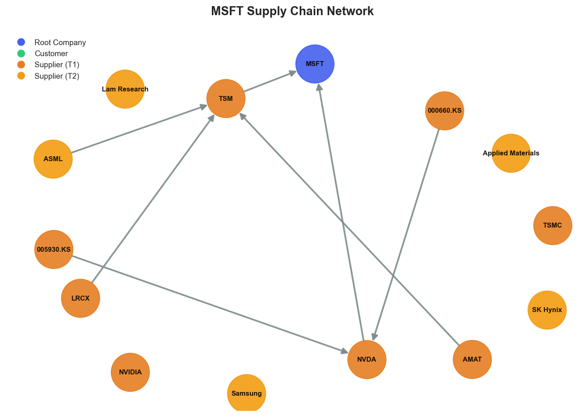

# Research Swarm Analysis Report

**Run ID:** 5bcdea6d-16dc-4301-b243-9b26138e4a8e
**Generated:** 2026-01-19 04:52:53
**Analysis Date:** 2026-01-19
**Analysis Period:** FY 2026

---

## Executive Summary

Analyzed **1** stocks for FY 2026. Average Moat Score: **7.1/10**

**No watchlist candidates** identified in this analysis (none reached threshold of 8.0)

### Top 1 Picks

#### 1. MSFT - 7.1/10
Microsoft merits a HOLD recommendation with a moat score of 7.1/10, reflecting a compelling but incomplete investment opportunity. The company's exceptional financial health (8.4/10) and positive sentiment around AI leadership (7.6/10) demonstrate strong fundamental positioning, supported by institutional confidence from Goldman Sachs and Morgan Stanley despite recent market underperformance.

The investment case centers on Microsoft's strategic inflection point in AI monetization, where strong fundamentals meet oversold technical conditions (RSI 26.2). This creates potential asymmetric upside for patient investors willing to weather near-term volatility. The upcoming earnings catalyst will be critical in resolving the disconnect between analyst optimism and weak market performance.

However, significant risks prevent a stronger recommendation. Microsoft's alarming supply chain concentration with only two tier-1 suppliers (TSMC, NVIDIA) creates structural vulnerabilities that could amplify both positive and negative outcomes. The heavy Asia-Pacific geographic exposure introduces geopolitical risks, while technical weakness suggests continued pressure until fundamental catalysts emerge.

This position suits investors with moderate risk tolerance seeking exposure to AI transformation themes. The combination of strong fundamentals and institutional backing provides downside protection, while supply chain risks and execution uncertainty on AI revenue conversion limit conviction. Microsoft represents a 'wait and see' opportunity where patience may be rewarded, but immediate compelling value remains elusive.

**Key Insights:**
- Strategic inflection point opportunity: Strong fundamental health (8.4/10) combined with oversold technical conditions (RSI 26.2) and maintained analyst confidence suggests potential value creation as AI monetization accelerates
- Institutional-retail sentiment divergence: Analyst upgrades from Goldman Sachs and Morgan Stanley contrast with market underperformance, indicating potential opportunity for contrarian investors willing to align with institutional conviction
- AI competitive moat validation: Positive sentiment around Microsoft's AI leadership and strategic partnerships (Cognizant, Agentic AI solutions) reinforces fundamental strength despite near-term execution concerns
- Supply chain concentration creates asymmetric risk: Binary tier-1 supplier dependency (TSMC, NVIDIA) introduces structural vulnerabilities that could amplify both positive and negative operational outcomes
- Earnings catalyst as inflection point: Upcoming earnings report represents critical juncture for resolving disconnect between strong fundamentals/analyst optimism and weak technical performance

**Risk Factors:**
- Critical supply chain vulnerabilities: Extreme concentration in only two tier-1 suppliers (TSMC, NVIDIA) with heavy Asia-Pacific geographic exposure creates single points of failure that could severely disrupt operations
- AI competitive positioning uncertainty: Despite positive sentiment, market underperformance suggests investor skepticism about Microsoft's ability to maintain competitive advantages against Google and other AI rivals
- Technical momentum deterioration: Trading below key moving averages with oversold conditions may indicate further downside potential before stabilization, particularly if earnings disappoint
- Execution risk on AI monetization: Strong analyst expectations for AI revenue conversion create high bar for performance, with potential for significant multiple compression if growth targets are missed
- Geopolitical supply chain exposure: Heavy dependence on Taiwan (TSMC) and South Korean suppliers creates vulnerability to trade tensions, regional conflicts, or natural disasters that could disrupt critical component flows

### Cost Summary

| Metric | Value |
|--------|-------|
| Total Cost | $0.27 |
| Cost per Stock | $0.274 |
| Budget Utilization | 0.1% |

#### Cost by Stock
| Ticker | Cost |
|--------|------|
| MSFT | $0.274 |

---

## Detailed Stock Analysis

### MSFT - 7.1/10
**Investment Thesis:** Microsoft merits a HOLD recommendation with a moat score of 7.1/10, reflecting a compelling but incomplete investment opportunity. The company's exceptional financial health (8.4/10) and positive sentiment around AI leadership (7.6/10) demonstrate strong fundamental positioning, supported by institutional confidence from Goldman Sachs and Morgan Stanley despite recent market underperformance.

The investment case centers on Microsoft's strategic inflection point in AI monetization, where strong fundamentals meet oversold technical conditions (RSI 26.2). This creates potential asymmetric upside for patient investors willing to weather near-term volatility. The upcoming earnings catalyst will be critical in resolving the disconnect between analyst optimism and weak market performance.

However, significant risks prevent a stronger recommendation. Microsoft's alarming supply chain concentration with only two tier-1 suppliers (TSMC, NVIDIA) creates structural vulnerabilities that could amplify both positive and negative outcomes. The heavy Asia-Pacific geographic exposure introduces geopolitical risks, while technical weakness suggests continued pressure until fundamental catalysts emerge.

This position suits investors with moderate risk tolerance seeking exposure to AI transformation themes. The combination of strong fundamentals and institutional backing provides downside protection, while supply chain risks and execution uncertainty on AI revenue conversion limit conviction. Microsoft represents a 'wait and see' opportunity where patience may be rewarded, but immediate compelling value remains elusive.

**Processing Time:** 191.4s | **Cost:** $0.2742

#### Moat Score Breakdown

| Component | Score | Weight |
|-----------|-------|--------|
| Financial Health | 8.4/10 | 30% |
| Sentiment & Catalysts | 7.6/10 | 20% |
| Technical Strength | 4.2/10 | 20% |
| Supply Chain Position | 7.4/10 | 30% |
| **Overall Moat Score** | **7.1/10** | **100%** |

#### Synthesis Narrative

Microsoft presents a compelling yet complex investment picture characterized by strong fundamental positioning offset by near-term technical weakness and structural supply chain vulnerabilities. The company's exceptional financial health score of 8.4/10 reflects robust underlying business fundamentals, while the positive sentiment score of 7.6/10 indicates continued institutional confidence in Microsoft's AI-driven transformation strategy. However, these strengths are tempered by concerning technical indicators, with the stock trading below key moving averages and an oversold RSI of 26.2 suggesting significant near-term pressure.

The most striking theme across all analyses is Microsoft's positioning at a strategic inflection point around AI monetization. Sentiment analysis reveals strong analyst conviction in Microsoft's AI leadership, with Goldman Sachs and Morgan Stanley maintaining bullish outlooks despite recent underperformance. This institutional confidence aligns with the company's strong fundamental health, suggesting the current technical weakness may represent a temporary disconnect rather than fundamental deterioration. The upcoming earnings catalyst will be critical in resolving this divergence between analyst optimism and market performance.

A significant contradiction emerges between Microsoft's market leadership aspirations and its supply chain vulnerabilities. While sentiment analysis highlights Microsoft's competitive positioning in AI and cloud services, the quantitative assessment reveals alarming supply chain concentration with only two tier-1 suppliers (TSMC and NVIDIA). This binary dependency structure creates substantial operational risk that contrasts sharply with the company's otherwise strong strategic positioning. The heavy geographic concentration in Asia-Pacific, particularly Taiwan and South Korea, introduces geopolitical risks that could materially impact operations regardless of strong fundamentals.

The technical analysis reveals Microsoft's second consecutive year of market underperformance, with the stock declining 2.21% recently while broader indices advanced. This weakness occurs despite positive AI developments and strategic partnerships, suggesting market skepticism about near-term execution capabilities. The oversold RSI condition, combined with trading below both 50-day and 200-day moving averages, indicates significant technical deterioration that may persist until fundamental catalysts emerge.

Integrating these perspectives suggests Microsoft offers asymmetric risk-reward characteristics. The combination of strong fundamentals, positive long-term sentiment, and oversold technical conditions could create an attractive entry point for investors with appropriate risk tolerance. However, the supply chain vulnerabilities and competitive pressures in AI represent structural challenges that could limit upside potential or create unexpected downside scenarios. The company's ability to convert AI investments into measurable revenue growth while managing supply chain risks will likely determine whether current analyst price targets proving achievable or overly optimistic.

#### Key Insights

1. Strategic inflection point opportunity: Strong fundamental health (8.4/10) combined with oversold technical conditions (RSI 26.2) and maintained analyst confidence suggests potential value creation as AI monetization accelerates
2. Institutional-retail sentiment divergence: Analyst upgrades from Goldman Sachs and Morgan Stanley contrast with market underperformance, indicating potential opportunity for contrarian investors willing to align with institutional conviction
3. AI competitive moat validation: Positive sentiment around Microsoft's AI leadership and strategic partnerships (Cognizant, Agentic AI solutions) reinforces fundamental strength despite near-term execution concerns
4. Supply chain concentration creates asymmetric risk: Binary tier-1 supplier dependency (TSMC, NVIDIA) introduces structural vulnerabilities that could amplify both positive and negative operational outcomes
5. Earnings catalyst as inflection point: Upcoming earnings report represents critical juncture for resolving disconnect between strong fundamentals/analyst optimism and weak technical performance

#### Risk Factors

1. Critical supply chain vulnerabilities: Extreme concentration in only two tier-1 suppliers (TSMC, NVIDIA) with heavy Asia-Pacific geographic exposure creates single points of failure that could severely disrupt operations
2. AI competitive positioning uncertainty: Despite positive sentiment, market underperformance suggests investor skepticism about Microsoft's ability to maintain competitive advantages against Google and other AI rivals
3. Technical momentum deterioration: Trading below key moving averages with oversold conditions may indicate further downside potential before stabilization, particularly if earnings disappoint
4. Execution risk on AI monetization: Strong analyst expectations for AI revenue conversion create high bar for performance, with potential for significant multiple compression if growth targets are missed
5. Geopolitical supply chain exposure: Heavy dependence on Taiwan (TSMC) and South Korean suppliers creates vulnerability to trade tensions, regional conflicts, or natural disasters that could disrupt critical component flows

---

## Supply Chain Analysis

### MSFT Supply Chain Network

**Network Size:** 8 nodes, 7 connections

#### Network Nodes

- **MSFT** (MSFT) - *root*- **TSMC** (TSM) - *supplier*- **NVIDIA** (NVDA) - *supplier*- **ASML** (ASML) - *supplier_t2*- **Applied Materials** (AMAT) - *supplier_t2*- **Lam Research** (LRCX) - *supplier_t2*- **SK Hynix** (000660.KS) - *supplier_t2*- **Samsung** (005930.KS) - *supplier_t2*

---

## Watchlist Candidates

*No stocks currently meet the watchlist threshold of 8.0 or higher.*

**Closest Candidates:**

- **MSFT**: 7.1/10 (0.9 points below threshold)

---

## Run Statistics

- **Total Stocks Analyzed:** 1
- **Successfully Completed:** 1
- **Failed:** 0
- **Average Moat Score:** 7.10/10
- **Total Cost:** $0.27
- **Total Time:** 191.4s

---

*Generated by Research Swarm - AI-Powered Stock Analysis*