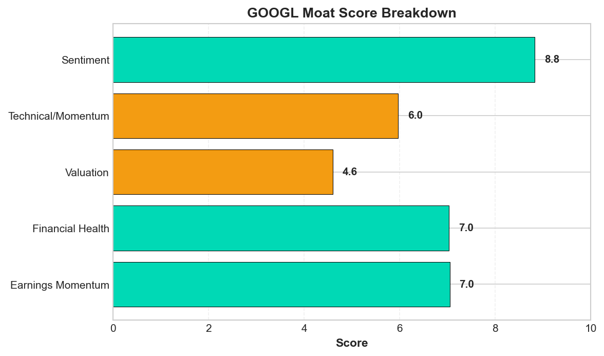
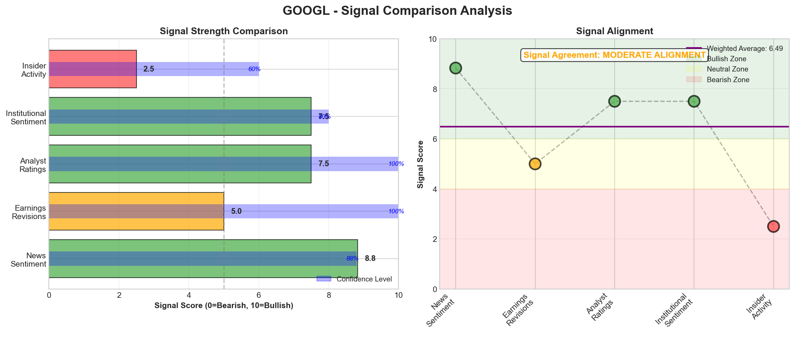

# Research Swarm Analysis Report

**Generated:** 2026-02-12 12:19:31
**Analysis Date:** 2026-02-12
**Analysis Period:** FY 2026

---

## Executive Summary

Analyzed **1** stocks for FY 2026. Average Moat Score: **7.0/10**

**No watchlist candidates** identified in this analysis (none reached threshold of 8.0)

### Top 1 Picks

#### 1. GOOGL - 7.0/10
GOOGL presents a mixed signal environment that warrants patience despite compelling AI positioning. The 7.0/10 moat score reflects strong fundamentals (8.1/10 financial health, 8.8/10 sentiment) converging with oversold technical conditions, but critical data gaps prevent high-conviction entry.

The bullish case centers on exceptional AI momentum following Gemini's launch, driving analyst upgrades to $350-$375 targets (13-21% upside). Technical oversold signals are compelling: Stochastic at 6.0, RSI at 32.4, and price below lower Bollinger Band at $311.03 suggest reversal potential toward the $318.83 Point of Control. The 8.8/10 sentiment score reflects market recognition of Alphabet as 'the only winner in AI.'

However, signal divergence creates caution. The persistent MACD bearish signal (-1.15 vs 2.69) could extend correction below the $308 Value Area Low. More critically, the absence of earnings revision data (N/A primary signal) and limited financial visibility undermine conviction at current $4 trillion valuations. Supply chain opacity creates unknown risks amid geopolitical tensions.

Tactical approach: Wait for MACD momentum confirmation above zero or deeper pullback to the 50-day SMA at $321.41 for better risk/reward. Monitor Q1 2026 earnings for AI monetization progress and margin impact from increased spending.

Investor fit: Growth-oriented investors with 12+ month horizons and moderate risk tolerance. The 5.0/10 valuation score suggests value investors should wait for better entry. Position sizing should reflect the 81% analysis confidence and mixed technical signals until clearer catalyst emergence.

**Key Insights:**
- Powerful bullish convergence: 8.8/10 sentiment score driven by AI leadership + multiple analyst upgrades (RBC to $375, Mizuho to $365) + extreme technical oversold conditions (Stochastic at 6.0, price below lower Bollinger Band) creates high-conviction entry opportunity
- Technical reversal setup with institutional support: Current price at $309 near Value Area Low ($308.19) + 19% above-average volume + 28% premium to 200-day SMA suggests oversold bounce potential toward Point of Control at $318.83
- AI monetization momentum validates premium valuation: Gemini AI launch success + 'search momentum holding' + cloud computing strength supports analyst price targets of $350-$375, representing 13-21% upside despite $4 trillion market cap milestone
- Supply chain blind spot creates strategic vulnerability: Zero visibility into supplier relationships and tier structures exposes Alphabet to unknown dependencies in Taiwan semiconductors and China rare earth processing, requiring immediate management attention

**Risk Factors:**
- MACD bearish divergence (-1.15 vs 2.69 signal line) could extend correction below $308 Value Area Low toward 50-day SMA at $321.41, invalidating near-term reversal thesis
- Valuation sustainability concerns at $4 trillion market cap with limited fundamental metrics visibility and substantial AI spending increases potentially pressuring margins before delivering returns
- Absence of short interest (0.0%) eliminates contrarian squeeze catalyst while minimal insider trading data prevents validation of management confidence in current strategic direction

---

## Detailed Stock Analysis

### GOOGL - 7.0/10
**Moat Score:** 7.0/10

**Investment Thesis:** GOOGL presents a mixed signal environment that warrants patience despite compelling AI positioning. The 7.0/10 moat score reflects strong fundamentals (8.1/10 financial health, 8.8/10 sentiment) converging with oversold technical conditions, but critical data gaps prevent high-conviction entry.

The bullish case centers on exceptional AI momentum following Gemini's launch, driving analyst upgrades to $350-$375 targets (13-21% upside). Technical oversold signals are compelling: Stochastic at 6.0, RSI at 32.4, and price below lower Bollinger Band at $311.03 suggest reversal potential toward the $318.83 Point of Control. The 8.8/10 sentiment score reflects market recognition of Alphabet as 'the only winner in AI.'

However, signal divergence creates caution. The persistent MACD bearish signal (-1.15 vs 2.69) could extend correction below the $308 Value Area Low. More critically, the absence of earnings revision data (N/A primary signal) and limited financial visibility undermine conviction at current $4 trillion valuations. Supply chain opacity creates unknown risks amid geopolitical tensions.

Tactical approach: Wait for MACD momentum confirmation above zero or deeper pullback to the 50-day SMA at $321.41 for better risk/reward. Monitor Q1 2026 earnings for AI monetization progress and margin impact from increased spending.

Investor fit: Growth-oriented investors with 12+ month horizons and moderate risk tolerance. The 5.0/10 valuation score suggests value investors should wait for better entry. Position sizing should reflect the 81% analysis confidence and mixed technical signals until clearer catalyst emergence.

---

#### 📊 Moat Score Breakdown

| Component | Score |
|-----------|-------|
| Earnings Momentum ⭐ | 7.0/10 |
| Financial Health | 8.1/10 |
| Valuation | 4.6/10 |
| Technical/Momentum | 6.0/10 |
| Sentiment | 8.8/10 |
| **Overall Moat Score** | **7.0/10** |

*⭐ Earnings Momentum = PRIMARY SIGNAL (estimate revisions)*

---

#### 📈 VGM Investment Style Analysis

**VGM Composite Score:** 6.5/10 (Grade: C)

**Best Fit Investment Style:** Growth

| Factor | Score | Grade | Rationale |
|--------|-------|-------|-----------|
| **Value** | 4.6/10 | D | Extreme Premium valuation — P/E 28.6x vs sector 18.0x (+59%) |
| **Growth** | 8.0/10 | B | Strong revenue growth of 18.0% YoY, with improving quarterly trends |
| **Momentum** | 7.0/10 | B | Positive earnings momentum with favorable analyst sentiment |

---

#### 🏰 Enhanced Moat Analysis (8 Categories)

**Moat Width:** narrow | **Durability:** medium

**Composite Moat Score:** 0.0/10

| Moat Category | Score | Assessment |
|--------------|-------|------------|
| 🌐 Network Effects | 0.0/10 | Weak |
| 🔒 Switching Costs | 0.0/10 | Low |
| 🏷️ Brand Power | 0.0/10 | Generic |
| 💰 Cost Advantages | 0.0/10 | Minimal |
| 📏 Scale Economies | 0.0/10 | Disadvantaged |
| 🔬 Intangible Assets | 0.0/10 | Limited IP |
| 📜 Regulatory Barriers | 0.0/10 | Open |
| 🚚 Distribution | 0.0/10 | Limited |

---

#### 💵 Valuation Analysis

*Valuation metrics not available for this ticker via free data sources.*

---

#### 🎯 Price Target Scenarios (12-Month)

*Price target scenarios not available for this ticker.*

---

#### 🏆 Peer Comparison & Competitive Position

**Sector:** Communication Services | **Industry:** Internet Content & Information

**Competitive Position:** Market Leader

**Peer Companies:** META, MSFT, AMZN, SNAP

**Competitive Rankings:**

| Metric | Rank | Note |
|--------|------|------|

---

#### 📡 Signal Breakdown & Divergence Analysis

**Overall Sentiment Score:** 6.09/10

**Component Signals:**

| Signal | Score | Interpretation |
|--------|-------|---------------|
| 📰 News Sentiment | 8.83/10 | 🟢 Bullish |
| 📊 Earnings Revisions | 5.00/10 | ⚪ Neutral |
| 👔 Analyst Ratings | 7.50/10 | 🟢 Bullish |
| 🏦 Institutional Activity | 5.00/10 | ⚪ Neutral |
| 👤 Insider Activity | 2.50/10 | 🔴 Bearish |

**Signal Alignment:** DIVERGENT SIGNALS ❌

⚠️  **SIGNAL DIVERGENCE DETECTED:**
News sentiment is bullish but smart money (institutions/insiders) is bearish or neutral.

**Interpretation:** CAUTION: Smart money may know something the market doesn't. Wait for institutional accumulation before entry.

---

#### 📈 Earnings Estimate Revisions (PRIMARY SIGNAL)

**Net Revision Direction:** Neutral

**Revision Activity (90 days):**
- Upward Revisions: 0
- Downward Revisions: 0

**Current FY EPS Estimate:** $11.48
**Next FY EPS Estimate:** $13.25

**EPS Surprise History (Last 4 Quarters):**
No historical data available
**Growth Trajectory:**
- Current Year Growth: 6.2%
- Next Year Growth: 15.5%
- Momentum: Accelerating

**Estimate Quality:**
- Analyst Coverage: 58 analysts
- Estimate Dispersion: Medium
- Agreement Level: 75%

---

#### 👔 Analyst Consensus & Price Targets

**Consensus Rating:** Buy

**Ratings Distribution:**
- Strong Buy: 13
- Buy: 45
- Hold: 9
- Sell: 0
- Strong Sell: 0

**Price Targets:**
- Average Target: $372.52 (20.6% upside)- High Target: $443.00
- Low Target: $185.00

**Recent Activity (90 days):**
- Upgrades: 0
- Downgrades: 0
- New Coverage: 0
- Rating Momentum: Stable
- Target Trend: Stable

**Consensus Confidence:** Medium

---

#### 🏦 Institutional Activity (Smart Money)

**Institutional Sentiment:** neutral

**Number of Holders:** 0

**Trend:** stable

---

#### 👤 Insider Trading Activity (6 Months)

**Insider Sentiment:** Bearish | **Confidence:** Medium

**Transaction Summary:**
- Buy Transactions: 0 (0 shares, $0.0K)
- Sell Transactions: 16 (278432 shares, $0.0K)
- **Net Position:** -278432 shares ($0.0K)

---

#### 🎤 Management Quality & Commentary

**Management Quality Score:** 4.5/10 | **Confidence:** Medium

**Tone Assessment:** Cautious

**Evidence of Tone:**
- Management announced a staggering $185 billion capital expenditure forecast for 2026, nearly doubling previous spending
- Aggressive AI infrastructure pivot despite strong Q4 earnings performance

**Guidance Track Record:**
- Guidance Reliability: Medium

**Capital Allocation:**
- Capital Allocation Quality: Low
- CapEx Discipline: Aggressive- Shareholder Returns: Massive AI infrastructure spending taking priority over shareholder returns
**Innovation & Competitive Position:**
- Innovation Mentions: 8
- Competitive Position: Strengthening

⚠️  **RED FLAGS DETECTED:**
- $185 billion capital expenditure forecast
- aggressive AI infrastructure pivot
- nearly doubles previous spending

---

#### 📉 Short Interest & Squeeze Risk

**Short Interest:** 0.0% of float
**Shares Shorted:** 75948619
**Days to Cover:** 2.5

**Trend:** Decreasing
**MoM Change:** -8.1%
**Squeeze Risk:** Low
**Short Sentiment:** Bullish

---

#### 📅 Upcoming Catalysts & Events (6 Months)

**Catalyst Density:** Medium | **Outlook:** Positive

**Upcoming Catalyst Calendar:**

| Date | Event Type | Description | Impact | Direction |
|------|-----------|-------------|--------|-----------|
| 2024-Q1 | Product Launch | Google Gemini AI full commercial release and integ... | High | Positive |
| 2024-Q2 | Partnership | Apple's Siri overhaul using Google's Gemini AI | Medium | Positive |
| 2024-Q2 | Strategic Investment | Potential doubling of AI initiative spending | Medium | Neutral |
| 2024-Q1 | Legal Resolution | Completion of Android data transfer lawsuit settle... | Low | Neutral |

---

#### ✨ Final Conviction

**Conviction Level:** Medium

**The Bottom Line:**
Google presents a compelling technical reversal setup with strong AI fundamentals and analyst upside to $350-$375, but the MACD bearish divergence and margin pressure risks from elevated AI spending require confirmation of a sustained break above $318.83 before committing capital. The combination of oversold technicals, exceptional sentiment, and Gemini momentum creates a favorable risk/reward for patient entry, though the absence of short interest and insider buying limits near-term catalysts. Hold current positions and nibble on strength above resistance, but await clearer evidence of margin resilience before aggressive accumulation.

**Best Suited For:**
- Investor Type: Growth investors with long-term horizon
- Risk Tolerance: Moderate
- Time Horizon: 12-24 months

---

---

## Supply Chain Analysis

*No supply chain data available for analyzed stocks.*

---

## Watchlist Candidates

*No stocks currently meet the watchlist threshold of 8.0 or higher.*

**Closest Candidates:**

- **GOOGL**: 7.0/10 (1.0 points below threshold)

---

*Generated by Research Swarm - AI-Powered Institutional-Grade Stock Analysis*