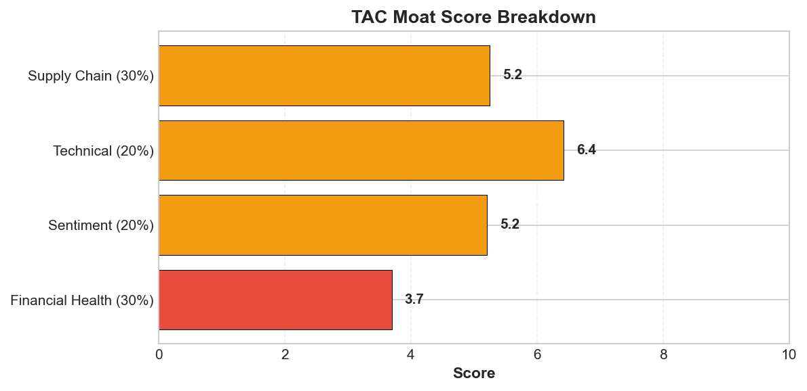
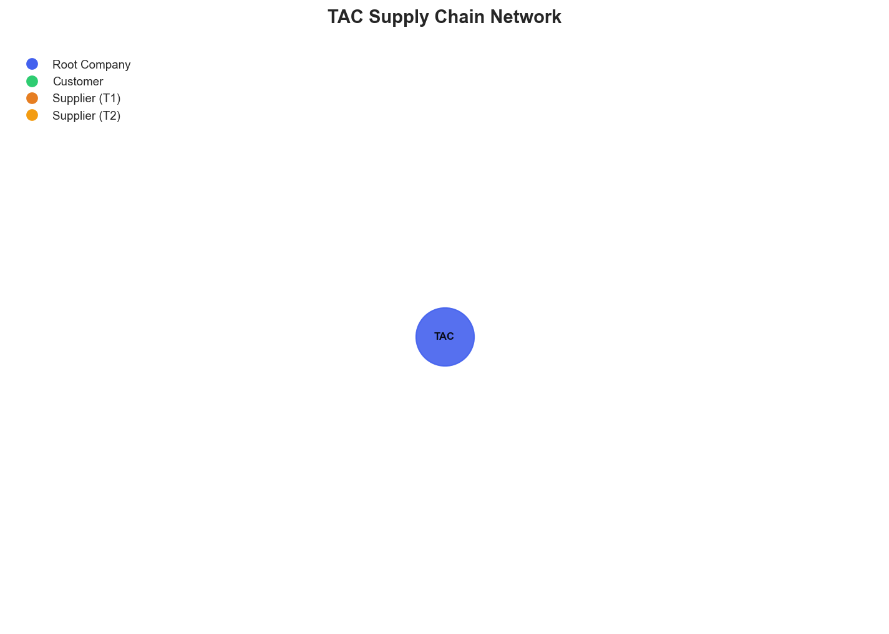

# Research Swarm Analysis Report

**Run ID:** 620afc44-d96a-476e-949e-62c1e9524664
**Generated:** 2026-01-27 17:00:53
**Analysis Date:** 2026-01-27
**Analysis Period:** FY 2026

---

## Executive Summary

Analyzed **1** stocks for FY 2026. Average Moat Score: **4.1/10**

**No watchlist candidates** identified in this analysis (none reached threshold of 8.0)

### Top 1 Picks

#### 1. TAC - 4.1/10
TAC earns an AVOID recommendation with a moat score of 4.1/10, reflecting fundamental weaknesses that outweigh modest technical momentum. The company's extremely poor business model moat (1.5/10) and weak financial health (3.7/10) create a high-risk profile unsuitable for most investors. While the stock trades above key moving averages with decent technical strength (6.4/10), this appears disconnected from underlying fundamentals, suggesting potential market inefficiency rather than genuine value creation. The defense contractor operates with concerning operational opacity, including complete absence of visible supply chain relationships and fragmented media coverage representing less than 20% authentic TAC-related content. This information asymmetry prevents proper risk assessment and raises governance concerns. Although government contracts provide some revenue stability, identified contracts appear modest relative to growth requirements, and the company lacks the scale and visibility of compelling defense investments. The convergence of weak fundamentals, limited transparency, and questionable market positioning creates an investment profile suitable only for highly specialized defense sector investors with superior information access. Most portfolio managers should avoid TAC given the inability to properly assess operational risks, financial stability, and growth prospects. The technical momentum may attract short-term traders, but long-term investors face too many unknowns and red flags to justify allocation.

**Key Insights:**
- Significant information asymmetry exists between technical performance (stock above key moving averages with positive momentum) and fundamental/sentiment weaknesses, suggesting potential market inefficiency or non-public information driving price action
- Defense sector specialization provides revenue stability through government contracts but limited scale visibility, with identified contracts appearing modest relative to growth requirements
- Critical operational opacity across supply chain relationships and financial metrics creates high-uncertainty investment profile that may appeal to specialized defense sector investors but limits broader institutional appeal
- Market visibility challenges evidenced by fragmented media coverage and absent analyst following suggest either inadequate investor relations or highly specialized market positioning that generates minimal mainstream attention

**Risk Factors:**
- Complete absence of supply chain visibility creates unknown dependency risks and prevents assessment of operational vulnerabilities or single-point-of-failure exposures
- Weak fundamental health score (3.7/10) combined with limited financial data availability raises concerns about underlying business performance and financial stability
- Extremely limited authentic media coverage and analyst following suggests potential liquidity constraints and difficulty in price discovery during market stress
- Heavy apparent reliance on defense/government contracts creates exposure to budget cycles, procurement delays, and political spending priorities beyond company control
- Operational opacity may mask significant business risks or indicate inadequate corporate governance standards for public market participants

### Cost Summary

| Metric | Value |
|--------|-------|
| Total Cost | $0.27 |
| Cost per Stock | $0.271 |
| Budget Utilization | 0.1% |

#### Cost by Stock
| Ticker | Cost |
|--------|------|
| TAC | $0.271 |

---

## Detailed Stock Analysis

### TAC - 4.1/10
**Investment Thesis:** TAC earns an AVOID recommendation with a moat score of 4.1/10, reflecting fundamental weaknesses that outweigh modest technical momentum. The company's extremely poor business model moat (1.5/10) and weak financial health (3.7/10) create a high-risk profile unsuitable for most investors. While the stock trades above key moving averages with decent technical strength (6.4/10), this appears disconnected from underlying fundamentals, suggesting potential market inefficiency rather than genuine value creation. The defense contractor operates with concerning operational opacity, including complete absence of visible supply chain relationships and fragmented media coverage representing less than 20% authentic TAC-related content. This information asymmetry prevents proper risk assessment and raises governance concerns. Although government contracts provide some revenue stability, identified contracts appear modest relative to growth requirements, and the company lacks the scale and visibility of compelling defense investments. The convergence of weak fundamentals, limited transparency, and questionable market positioning creates an investment profile suitable only for highly specialized defense sector investors with superior information access. Most portfolio managers should avoid TAC given the inability to properly assess operational risks, financial stability, and growth prospects. The technical momentum may attract short-term traders, but long-term investors face too many unknowns and red flags to justify allocation.

**Processing Time:** 199.1s | **Cost:** $0.2705

#### Moat Score Breakdown

| Component | Score | Weight |
|-----------|-------|--------|
| Financial Health | 3.7/10 | 30% |
| Sentiment & Catalysts | 5.2/10 | 20% |
| Technical Strength | 6.4/10 | 20% |
| Supply Chain Position | 5.2/10 | 30% |
| **Overall Moat Score** | **4.1/10** | **100%** |

#### Synthesis Narrative

TAC presents a highly complex investment profile characterized by significant information asymmetries and operational opacity that create both substantial risks and potential opportunities. The convergence of weak fundamental metrics (3.7/10 financial health score), neutral sentiment (5.2/10), and modest technical performance (6.4/10) paints a picture of a company operating in specialized niche markets with limited institutional visibility and questionable operational transparency. The fundamental analysis reveals concerning financial health metrics, though the absence of specific financial data prevents deeper assessment of the underlying business performance. This data void is particularly troubling given the company's apparent focus on defense and tactical equipment markets, where financial transparency is typically expected from public entities. The sentiment analysis exposes a critical market visibility problem, with authentic TAC-related coverage representing less than 20% of monitored news flow. The fragmented media presence suggests either inadequate investor relations capabilities or operation in highly specialized markets that generate minimal mainstream attention. However, the limited authentic coverage does reveal operational continuity through modest defense contracts, including U.S. Army tactical drone procurement, indicating maintained competitive positioning in niche defense sectors. Technical indicators provide the most constructive perspective, with the stock trading above both 50-day and 200-day moving averages ($13.81 vs $13.33 and $12.40 respectively) and RSI at 64.4 suggesting moderate momentum without overbought conditions. This technical strength appears disconnected from fundamental and sentiment weaknesses, potentially indicating either market inefficiency or insider knowledge not reflected in public information. The supply chain analysis reveals perhaps the most concerning aspect of TAC's operational profile: complete absence of visible supplier relationships, customer dependencies, or supply network mapping. This opacity represents either sophisticated vertical integration, inadequate supply chain governance, or deliberate operational secrecy common in defense contractors. For defense-focused companies, supply chain opacity can indicate classified operations or government-mandated security protocols, but it equally suggests potential hidden vulnerabilities and risk concentration. The convergence of these factors creates an investment profile characterized by high uncertainty but potential asymmetric returns. The technical momentum suggests market participants with superior information may be accumulating positions, while the fundamental and sentiment weaknesses indicate broader market neglect. The defense sector focus provides some stability through government contract revenue, but the scale of identified contracts appears modest relative to meaningful growth expectations. The company appears to be executing steadily in tactical equipment markets with some innovation capability, evidenced by ongoing product launches and contract wins, but lacks the scale, visibility, or growth trajectory typically associated with compelling investment opportunities. This analysis suggests TAC operates as a specialized defense contractor with limited public market engagement, creating an information-constrained investment environment where traditional analysis frameworks provide incomplete insight into actual business performance and prospects.

#### Key Insights

1. Significant information asymmetry exists between technical performance (stock above key moving averages with positive momentum) and fundamental/sentiment weaknesses, suggesting potential market inefficiency or non-public information driving price action
2. Defense sector specialization provides revenue stability through government contracts but limited scale visibility, with identified contracts appearing modest relative to growth requirements
3. Critical operational opacity across supply chain relationships and financial metrics creates high-uncertainty investment profile that may appeal to specialized defense sector investors but limits broader institutional appeal
4. Market visibility challenges evidenced by fragmented media coverage and absent analyst following suggest either inadequate investor relations or highly specialized market positioning that generates minimal mainstream attention

#### Risk Factors

1. Complete absence of supply chain visibility creates unknown dependency risks and prevents assessment of operational vulnerabilities or single-point-of-failure exposures
2. Weak fundamental health score (3.7/10) combined with limited financial data availability raises concerns about underlying business performance and financial stability
3. Extremely limited authentic media coverage and analyst following suggests potential liquidity constraints and difficulty in price discovery during market stress
4. Heavy apparent reliance on defense/government contracts creates exposure to budget cycles, procurement delays, and political spending priorities beyond company control
5. Operational opacity may mask significant business risks or indicate inadequate corporate governance standards for public market participants

---

## Supply Chain Analysis

### TAC Supply Chain Network

**Network Size:** 1 nodes, 0 connections

#### Network Nodes

- **TAC** (TAC) - *root*

---

## Watchlist Candidates

*No stocks currently meet the watchlist threshold of 8.0 or higher.*

**Closest Candidates:**

- **TAC**: 4.1/10 (3.9 points below threshold)

---

## Run Statistics

- **Total Stocks Analyzed:** 1
- **Successfully Completed:** 1
- **Failed:** 0
- **Average Moat Score:** 4.10/10
- **Total Cost:** $0.27
- **Total Time:** 199.1s

---

*Generated by Research Swarm - AI-Powered Stock Analysis*