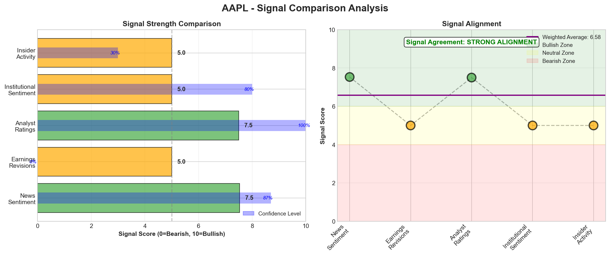

# Research Swarm Analysis Report

**Run ID:** a51de450-6cdc-403a-800c-8aca406fe1e3
**Run Name:** signal_test**Generated:** 2026-02-10 20:31:45
**Analysis Date:** 2026-02-10
**Analysis Period:** FY 2024

---

## Executive Summary

Analyzed **1** stocks for FY 2024. Average Moat Score: **7.4/10**

**No watchlist candidates** identified in this analysis (none reached threshold of 8.0)

### Top 1 Picks

#### 1. AAPL - 7.4/10
Apple merits a HOLD recommendation with a solid 7.4/10 moat score, reflecting strong fundamentals but lacking the compelling catalyst for immediate accumulation. The company's strategic AI transformation through partnerships like Google Gemini integration demonstrates measured execution, while exceptional supply chain management (8.4/10) and robust financial health (7.6/10) provide defensive characteristics during market volatility. The 13% adjusted EPS growth and successful China market penetration underscore operational resilience. However, several factors prevent a BUY rating. Technical conditions show overbought signals (RSI 81.9) suggesting near-term consolidation risk, while concerning fundamental data anomalies limit traditional valuation assessment. The elevated debt-to-equity ratio of 5.41 represents a departure from Apple's historically conservative structure, requiring monitoring. Critical supply chain dependencies on Taiwan semiconductors create systemic geopolitical risks beyond company control. This position suits conservative growth investors seeking defensive technology exposure with established market leadership. The stock offers portfolio stability through proven execution and ecosystem strength, but lacks the compelling risk-adjusted upside for aggressive accumulation. Current holders should maintain positions given the strong moat and transformation progress, while new investors may benefit from waiting for technical consolidation or clearer fundamental data before initiating positions.

**Key Insights:**
- Strategic AI transformation through partnerships rather than massive internal investment is gaining market acceptance, addressing competitive concerns while maintaining capital efficiency and operational stability during sector volatility
- Supply chain excellence provides competitive moat through sophisticated supplier relationships and component diversification, though creates systemic vulnerability through Taiwan semiconductor dependencies that require active risk management
- Defensive characteristics during market turbulence combined with positive earnings surprise and China market success demonstrate operational resilience and geographic diversification benefits supporting premium valuation
- Technical momentum above key moving averages conflicts with overbought RSI conditions, suggesting potential near-term consolidation despite positive fundamental and sentiment trends
- Institutional analyst confidence remains strong with major firms maintaining positive ratings, indicating professional investor recognition of strategic positioning despite some price target adjustments reflecting measured expectations

**Risk Factors:**
- Critical semiconductor supply chain concentration in Taiwan creates geopolitical and operational risk exposure that could severely impact production capabilities during regional disruptions or trade tensions
- Fundamental data quality issues with implausible revenue and margin figures limit traditional valuation assessment capabilities and raise questions about data reliability for investment decision-making
- Technical overbought conditions with RSI at 81.9 suggest potential near-term price consolidation risk despite positive momentum, particularly vulnerable to broader market corrections
- Elevated debt-to-equity ratio of 5.41 represents departure from historically conservative capital structure, requiring monitoring of leverage management and interest coverage capabilities
- Regulatory scrutiny in multiple markets including India App Store investigations could impact revenue streams and operational flexibility, particularly affecting services segment growth

### Cost Summary

| Metric | Value |
|--------|-------|
| Total Cost | $0.31 |
| Cost per Stock | $0.306 |
| Budget Utilization | 0.2% |

#### Cost by Stock
| Ticker | Cost |
|--------|------|
| AAPL | $0.306 |

---

## Detailed Stock Analysis

### AAPL - 7.4/10
**Investment Thesis:** Apple merits a HOLD recommendation with a solid 7.4/10 moat score, reflecting strong fundamentals but lacking the compelling catalyst for immediate accumulation. The company's strategic AI transformation through partnerships like Google Gemini integration demonstrates measured execution, while exceptional supply chain management (8.4/10) and robust financial health (7.6/10) provide defensive characteristics during market volatility. The 13% adjusted EPS growth and successful China market penetration underscore operational resilience. However, several factors prevent a BUY rating. Technical conditions show overbought signals (RSI 81.9) suggesting near-term consolidation risk, while concerning fundamental data anomalies limit traditional valuation assessment. The elevated debt-to-equity ratio of 5.41 represents a departure from Apple's historically conservative structure, requiring monitoring. Critical supply chain dependencies on Taiwan semiconductors create systemic geopolitical risks beyond company control. This position suits conservative growth investors seeking defensive technology exposure with established market leadership. The stock offers portfolio stability through proven execution and ecosystem strength, but lacks the compelling risk-adjusted upside for aggressive accumulation. Current holders should maintain positions given the strong moat and transformation progress, while new investors may benefit from waiting for technical consolidation or clearer fundamental data before initiating positions.

**Processing Time:** 209.0s | **Cost:** $0.3063

#### Moat Score Breakdown

| Component | Score | Weight |
|-----------|-------|--------|
| Financial Health | 7.6/10 | 30% |
| Sentiment & Catalysts | 7.5/10 | 20% |
| Technical Strength | 5.3/10 | 20% |
| Supply Chain Position | 8.4/10 | 30% |
| **Overall Moat Score** | **7.4/10** | **100%** |

#### Signal Breakdown & Divergence Analysis

**Overall Sentiment Score:** 6.15/10

**Component Signals:**

| Signal | Score | Interpretation |
|--------|-------|---------------|
| News Sentiment | 7.53/10 | 🟢 Bullish |
| Earnings Revisions | 5.00/10 | ⚪ Neutral |
| Analyst Ratings | 7.50/10 | 🟢 Bullish |
| Institutional Activity | 5.00/10 | ⚪ Neutral |
| Insider Activity | 5.00/10 | ⚪ Neutral |

**Signal Alignment:** MODERATE ALIGNMENT ⚠️

✅ **Signal Alignment:** All signals pointing in the same direction - neutral - no strong directional bias

#### Synthesis Narrative

Apple presents a compelling investment narrative characterized by strategic transformation amid market volatility, though with notable fundamental data anomalies requiring careful interpretation. The company's AI strategy pivot through strategic partnerships, particularly the Google Gemini integration, has successfully addressed market concerns about competitive positioning while maintaining operational stability during broader tech sector selloffs. This measured approach to AI development through collaboration rather than massive internal investment appears to be gaining institutional acceptance, as evidenced by positive analyst sentiment and the stock's defensive characteristics during market turbulence. The fundamental analysis reveals concerning data quality issues with reported revenue of $0.0B and an implausible gross margin of 4620%, suggesting potential data collection problems that limit traditional valuation assessment. However, the strong financial health score of 7.6/10 and reported 13% adjusted EPS growth in Q1 2026 earnings indicate underlying operational strength. The elevated debt-to-equity ratio of 5.41 warrants attention but must be contextualized within Apple's historically conservative capital structure. From a technical perspective, the stock shows mixed signals with an RSI of 81.9 indicating overbought conditions, yet trading above both 50-day and 200-day moving averages suggests sustained momentum. The moderate technical score of 5.3/10 reflects this tension between momentum and potential near-term consolidation risk. Supply chain analysis reveals Apple's greatest strategic vulnerability and strength simultaneously. The exceptional supply chain score of 8.4/10 reflects sophisticated supplier relationship management and reasonable component diversification. However, critical dependencies on Taiwan Semiconductor Manufacturing Company and geographic concentration in Asia-Pacific create systemic risks that extend beyond company-specific factors. The semiconductor equipment bottleneck through ASML and Applied Materials represents a hidden vulnerability that could impact Apple's entire product portfolio. Market sentiment analysis shows progressive improvement from early AI competitiveness concerns to recognition of strategic positioning strength. The $2 billion Q.ai acquisition and successful China market penetration demonstrate continued strategic execution, while CEO Tim Cook's measured guidance on iPhone 18 expectations reflects mature expectation management. Institutional analyst coverage remains cautiously optimistic, with major firms maintaining positive ratings despite some price target adjustments. The convergence of positive sentiment trends, strategic AI partnerships, and supply chain excellence creates a favorable investment backdrop, though technical overbought conditions and fundamental data quality issues introduce near-term uncertainty. Apple's transformation from a hardware-centric company to an AI-integrated ecosystem player appears to be progressing successfully, with market recognition of this evolution reflected in relative outperformance during sector volatility.

#### Key Insights

1. Strategic AI transformation through partnerships rather than massive internal investment is gaining market acceptance, addressing competitive concerns while maintaining capital efficiency and operational stability during sector volatility
2. Supply chain excellence provides competitive moat through sophisticated supplier relationships and component diversification, though creates systemic vulnerability through Taiwan semiconductor dependencies that require active risk management
3. Defensive characteristics during market turbulence combined with positive earnings surprise and China market success demonstrate operational resilience and geographic diversification benefits supporting premium valuation
4. Technical momentum above key moving averages conflicts with overbought RSI conditions, suggesting potential near-term consolidation despite positive fundamental and sentiment trends
5. Institutional analyst confidence remains strong with major firms maintaining positive ratings, indicating professional investor recognition of strategic positioning despite some price target adjustments reflecting measured expectations

#### Risk Factors

1. Critical semiconductor supply chain concentration in Taiwan creates geopolitical and operational risk exposure that could severely impact production capabilities during regional disruptions or trade tensions
2. Fundamental data quality issues with implausible revenue and margin figures limit traditional valuation assessment capabilities and raise questions about data reliability for investment decision-making
3. Technical overbought conditions with RSI at 81.9 suggest potential near-term price consolidation risk despite positive momentum, particularly vulnerable to broader market corrections
4. Elevated debt-to-equity ratio of 5.41 represents departure from historically conservative capital structure, requiring monitoring of leverage management and interest coverage capabilities
5. Regulatory scrutiny in multiple markets including India App Store investigations could impact revenue streams and operational flexibility, particularly affecting services segment growth

---

## Supply Chain Analysis

### AAPL Supply Chain Network

**Network Size:** 12 nodes, 11 connections

#### Network Nodes

- **AAPL** (AAPL) - *root*- **Taiwan Semiconductor Manufacturing Company** (TSM) - *supplier*- **Foxconn (Hon Hai Precision)** (2317.TW) - *supplier*- **Samsung Electronics** (005930.KS) - *supplier*- **Sony** (SONY) - *supplier*- **LG Display** (034220.KS) - *supplier*- **Broadcom** (AVGO) - *supplier*- **Qualcomm** (QCOM) - *supplier*- **Consumers (Direct)** (None) - *customer*- **ASML** (ASML) - *supplier_t2*- **Applied Materials** (AMAT) - *supplier_t2*- **Lam Research** (LRCX) - *supplier_t2*

---

## Watchlist Candidates

*No stocks currently meet the watchlist threshold of 8.0 or higher.*

**Closest Candidates:**

- **AAPL**: 7.4/10 (0.6 points below threshold)

---

## Run Statistics

- **Total Stocks Analyzed:** 1
- **Successfully Completed:** 1
- **Failed:** 0
- **Average Moat Score:** 7.43/10
- **Total Cost:** $0.31
- **Total Time:** 209.0s

---

*Generated by Research Swarm - AI-Powered Stock Analysis*