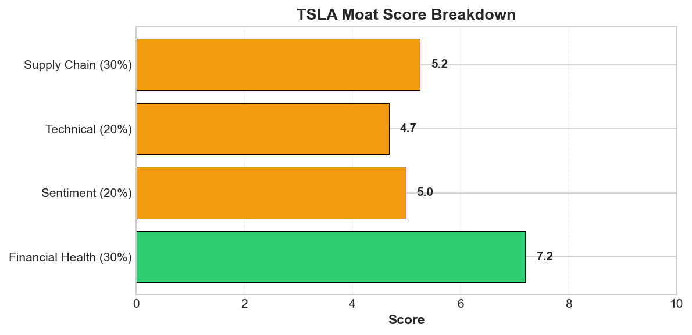
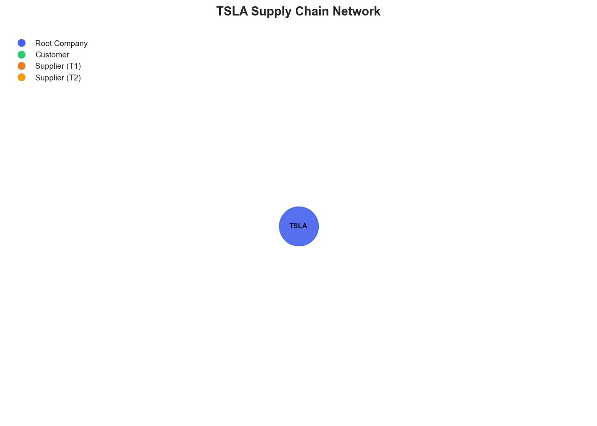

# Research Swarm Analysis Report

**Run ID:** b233c242-45a8-46d8-b6b7-dbf146de2010
**Generated:** 2026-01-19 20:32:05
**Analysis Date:** 2026-01-19
**Analysis Period:** FY 2026

---

## Executive Summary

Analyzed **1** stocks for FY 2026. Average Moat Score: **5.9/10**

**No watchlist candidates** identified in this analysis (none reached threshold of 8.0)

### Top 1 Picks

#### 1. TSLA - 5.9/10
Tesla warrants an AVOID recommendation with a moat score of 5.9/10, reflecting significant execution risks that outweigh its strategic positioning. While the company maintains solid financial health (7.2/10) and a reasonable business model moat (6.2/10), critical weaknesses in technical momentum (4.7/10) and supply chain visibility (5.2/10) create substantial near-term vulnerabilities.

The 16% Q4 delivery decline and 34.2% European sales drop to three-year lows signal fundamental demand challenges in core markets, while oversold technical conditions (RSI 31.2) suggest continued downward pressure. Most concerning are the supply chain visibility gaps, which leave Tesla exposed to unmapped dependencies across critical semiconductor and battery networks during a period requiring flawless execution.

The market's valuation increasingly reflects AI and autonomous vehicle potential rather than automotive fundamentals, creating a dangerous disconnect. While this transformation thesis may prove correct long-term, the execution risks are too elevated for current entry, particularly given geographic market share erosion and competitive pressure from established automakers.

This analysis suits risk-averse investors who should wait for clearer operational stabilization and improved supply chain transparency. Growth-oriented investors might consider Tesla after delivery trends improve and technical indicators show sustained reversal, but current risk-reward dynamics favor patience over immediate exposure.

**Key Insights:**
- Market valuation increasingly reflects technology platform potential rather than automotive fundamentals, creating opportunity for investors who believe in Tesla's AI/autonomous vehicle transformation despite near-term delivery challenges
- Oversold technical conditions (RSI 31.2) combined with analyst target maintenance despite delivery misses suggests potential for mean reversion if operational improvements materialize
- Strong financial health (7.2/10) provides stability foundation during strategic transition, but execution risks remain elevated as evidenced by geographic market share erosion, particularly in Europe
- Supply chain visibility gaps represent significant blind spots for a company dependent on complex semiconductor and battery supply networks, potentially creating hidden operational vulnerabilities during scaling phases

**Risk Factors:**
- Delivery execution challenges evidenced by 16% Q4 decline and 34.2% European sales drop indicate potential demand elasticity issues in maturing EV markets
- Critical supply chain visibility gaps leave Tesla exposed to unmapped dependencies across battery, semiconductor, and raw material suppliers, particularly vulnerable to geopolitical disruptions
- Valuation disconnect between technology expectations and automotive fundamentals creates vulnerability to sentiment shifts if AI/autonomous development timelines extend beyond market expectations
- Geographic concentration risks in key markets, with European weakness potentially signaling broader competitive pressure from established automakers and Chinese EV manufacturers

### Cost Summary

| Metric | Value |
|--------|-------|
| Total Cost | $0.35 |
| Cost per Stock | $0.349 |
| Budget Utilization | 0.2% |

#### Cost by Stock
| Ticker | Cost |
|--------|------|
| TSLA | $0.349 |

---

## Detailed Stock Analysis

### TSLA - 5.9/10
**Investment Thesis:** Tesla warrants an AVOID recommendation with a moat score of 5.9/10, reflecting significant execution risks that outweigh its strategic positioning. While the company maintains solid financial health (7.2/10) and a reasonable business model moat (6.2/10), critical weaknesses in technical momentum (4.7/10) and supply chain visibility (5.2/10) create substantial near-term vulnerabilities.

The 16% Q4 delivery decline and 34.2% European sales drop to three-year lows signal fundamental demand challenges in core markets, while oversold technical conditions (RSI 31.2) suggest continued downward pressure. Most concerning are the supply chain visibility gaps, which leave Tesla exposed to unmapped dependencies across critical semiconductor and battery networks during a period requiring flawless execution.

The market's valuation increasingly reflects AI and autonomous vehicle potential rather than automotive fundamentals, creating a dangerous disconnect. While this transformation thesis may prove correct long-term, the execution risks are too elevated for current entry, particularly given geographic market share erosion and competitive pressure from established automakers.

This analysis suits risk-averse investors who should wait for clearer operational stabilization and improved supply chain transparency. Growth-oriented investors might consider Tesla after delivery trends improve and technical indicators show sustained reversal, but current risk-reward dynamics favor patience over immediate exposure.

**Processing Time:** 200.3s | **Cost:** $0.3487

#### Moat Score Breakdown

| Component | Score | Weight |
|-----------|-------|--------|
| Financial Health | 7.2/10 | 30% |
| Sentiment & Catalysts | 5.0/10 | 20% |
| Technical Strength | 4.7/10 | 20% |
| Supply Chain Position | 5.2/10 | 30% |
| **Overall Moat Score** | **5.9/10** | **100%** |

#### Synthesis Narrative

Tesla presents a complex investment profile characterized by a fundamental disconnect between near-term operational challenges and long-term strategic positioning. The company's solid financial health score of 7.2/10 provides a foundation of stability, yet this strength is tempered by significant execution headwinds evidenced in recent delivery performance and technical indicators suggesting oversold conditions with an RSI of 31.2.

The most striking aspect of Tesla's current investment thesis is the market's measured response to operational disappointments. Despite a 16% Q4 delivery plunge and European sales declining 34.2% to three-year lows, analyst sentiment remains constructive with several firms maintaining or raising price targets. This resilience reflects a fundamental shift in how Tesla is valued—increasingly as a technology platform rather than a traditional automotive manufacturer. The bifurcated sentiment, scoring exactly neutral at 5.0/10, captures this tension between disappointing automotive metrics and optimism around AI and autonomous vehicle capabilities.

Technically, Tesla appears oversold with the stock trading at $437.50, positioned between its 50-day ($443.07) and 200-day ($369.12) moving averages, suggesting potential for mean reversion if fundamental catalysts emerge. However, the technical score of 4.7/10 indicates continued near-term pressure, aligning with the delivery challenges highlighted in sentiment analysis.

A critical concern emerges from the supply chain analysis, which reveals significant visibility gaps that could represent substantial operational risks. The inability to map Tesla's supplier network beyond two tiers, with zero identified suppliers, suggests either inadequate transparency or analytical blind spots. For a company transitioning toward AI and autonomous vehicles—sectors requiring complex semiconductor and battery supply chains—this lack of visibility is particularly concerning given Tesla's exposure to geopolitical risks in Taiwan, China, and critical mineral-producing regions.

The convergence of analyses points to Tesla as a company in strategic transition, where traditional automotive valuation metrics increasingly conflict with technology-focused expectations. Analyst price targets ranging from UBS's bearish $247 to bullish projections near $800 reflect this valuation uncertainty. The fact that energy storage hit records despite vehicle delivery weakness supports the diversification narrative, yet automotive remains the core revenue driver.

Most significantly, the analyses reveal Tesla's vulnerability to execution risk during a critical transformation period. While the financial foundation appears solid and long-term positioning remains compelling, the company faces the challenge of maintaining investor confidence through what may be an extended period of automotive market share pressure and operational complexity. The removal of 'sustainable' from Tesla's mission, noted in sentiment analysis, could further complicate the investment narrative by potentially alienating ESG-focused investors who have been core supporters.

The investment opportunity appears to hinge on Tesla's ability to accelerate AI and autonomous vehicle development while stabilizing core automotive operations. Current valuation levels may offer entry opportunities for investors with conviction in the technology transformation thesis, but the execution risks and supply chain vulnerabilities suggest careful position sizing and monitoring will be essential.

#### Key Insights

1. Market valuation increasingly reflects technology platform potential rather than automotive fundamentals, creating opportunity for investors who believe in Tesla's AI/autonomous vehicle transformation despite near-term delivery challenges
2. Oversold technical conditions (RSI 31.2) combined with analyst target maintenance despite delivery misses suggests potential for mean reversion if operational improvements materialize
3. Strong financial health (7.2/10) provides stability foundation during strategic transition, but execution risks remain elevated as evidenced by geographic market share erosion, particularly in Europe
4. Supply chain visibility gaps represent significant blind spots for a company dependent on complex semiconductor and battery supply networks, potentially creating hidden operational vulnerabilities during scaling phases

#### Risk Factors

1. Delivery execution challenges evidenced by 16% Q4 decline and 34.2% European sales drop indicate potential demand elasticity issues in maturing EV markets
2. Critical supply chain visibility gaps leave Tesla exposed to unmapped dependencies across battery, semiconductor, and raw material suppliers, particularly vulnerable to geopolitical disruptions
3. Valuation disconnect between technology expectations and automotive fundamentals creates vulnerability to sentiment shifts if AI/autonomous development timelines extend beyond market expectations
4. Geographic concentration risks in key markets, with European weakness potentially signaling broader competitive pressure from established automakers and Chinese EV manufacturers

---

## Supply Chain Analysis

### TSLA Supply Chain Network

**Network Size:** 1 nodes, 0 connections

#### Network Nodes

- **TSLA** (TSLA) - *root*

---

## Watchlist Candidates

*No stocks currently meet the watchlist threshold of 8.0 or higher.*

**Closest Candidates:**

- **TSLA**: 5.9/10 (2.1 points below threshold)

---

## Run Statistics

- **Total Stocks Analyzed:** 1
- **Successfully Completed:** 1
- **Failed:** 0
- **Average Moat Score:** 5.86/10
- **Total Cost:** $0.35
- **Total Time:** 200.3s

---

*Generated by Research Swarm - AI-Powered Stock Analysis*