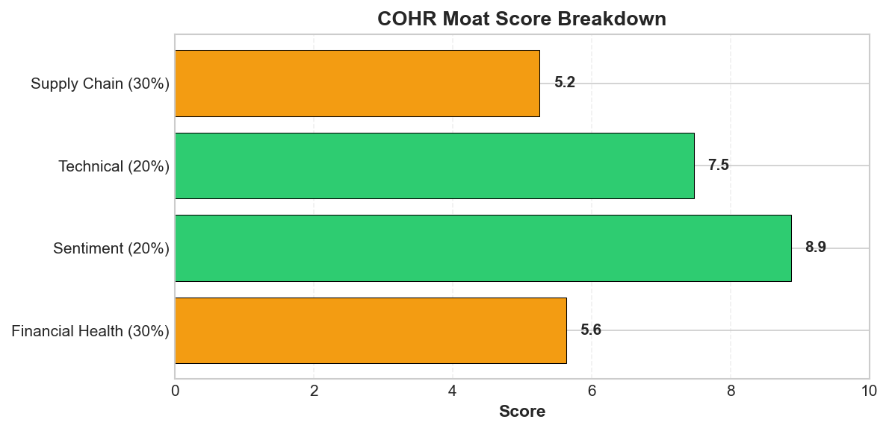
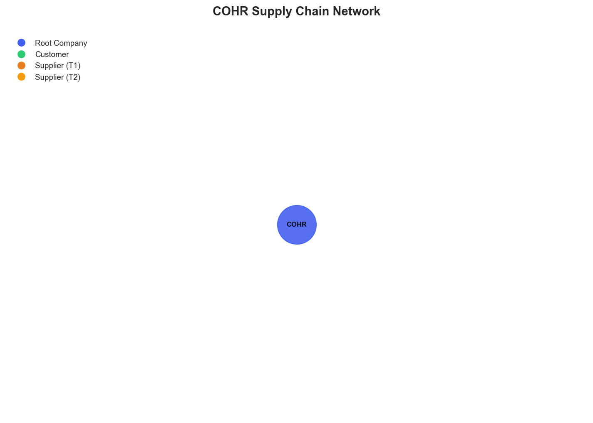

# Research Swarm Analysis Report

**Run ID:** ba07797f-c03c-4431-a841-47fe1bedada8
**Generated:** 2026-01-27 17:09:22
**Analysis Date:** 2026-01-27
**Analysis Period:** FY 2026

---

## Executive Summary

Analyzed **1** stocks for FY 2026. Average Moat Score: **6.2/10**

**No watchlist candidates** identified in this analysis (none reached threshold of 8.0)

### Top 1 Picks

#### 1. COHR - 6.2/10
COHR presents a compelling momentum play with significant fundamental blind spots, earning a 6.2/10 moat score that warrants cautious positioning. The company benefits from exceptional market sentiment (8.9/10) driven by AI and quantum technology tailwinds, supported by concrete product launches in quantum-safe encryption and medical imaging. Strong technical momentum ($214 vs $177 SMA50) and analyst upgrades to $180 targets provide near-term support.

However, critical data integrity issues undermine confidence. The reported $0.0B revenue and weak financial health score (5.6/10) suggest either analytical gaps or underlying business concerns. Most troubling is the complete absence of supply chain visibility (5.2/10) for a photonics company operating in geopolitically sensitive technology sectors dependent on specialized components.

This creates a high-risk, high-reward scenario where market enthusiasm may not be sustainable given fundamental uncertainties. The 120% recent stock appreciation appears driven by narrative rather than verifiable performance improvements.

COHR suits aggressive growth investors comfortable with momentum-driven positions and significant volatility. Position sizing should reflect the elevated risk profile. The investment thesis depends on whether technological positioning in AI/quantum markets can justify premium valuations despite operational blind spots. Consider a small allocation pending resolution of fundamental data quality issues and improved operational transparency.

**Key Insights:**
- Momentum-driven opportunity with COHR benefiting from AI/quantum technology tailwinds, supported by concrete product launches and analyst upgrades, but trading on narrative rather than verifiable fundamentals
- Critical data integrity issues across financial reporting ($0.0B revenue) and operational visibility (zero supply chain mapping) create significant analytical blind spots that could mask material risks
- Strong technical momentum (price $214 vs SMA50 $177) and positive sentiment (8.9/10) provide near-term support but may not be sustainable given fundamental uncertainties and potential valuation concerns
- Strategic positioning in high-growth markets (quantum encryption, medical imaging) offers genuine long-term potential, but execution risks are amplified by complete lack of supply chain visibility in geopolitically sensitive technology sectors

**Risk Factors:**
- Fundamental data quality issues including $0.0B reported revenue and 5.6/10 financial health score suggest either analytical gaps or underlying business model concerns that could trigger sharp sentiment reversals
- Complete absence of supply chain visibility represents critical operational risk, particularly dangerous for a technology company exposed to semiconductor shortages, rare earth dependencies, and geopolitical supply disruptions
- Valuation sustainability concerns given 120% recent stock appreciation driven primarily by sentiment and momentum rather than verifiable financial performance improvements
- Concentration risk in analyst coverage and company-generated news (8 of 15 recent articles) may create echo chamber effects that could amplify both positive and negative sentiment swings
- Technical overbought conditions developing with potential for significant correction if fundamental concerns emerge or AI/quantum technology narratives lose market favor

### Cost Summary

| Metric | Value |
|--------|-------|
| Total Cost | $0.26 |
| Cost per Stock | $0.264 |
| Budget Utilization | 0.1% |

#### Cost by Stock
| Ticker | Cost |
|--------|------|
| COHR | $0.264 |

---

## Detailed Stock Analysis

### COHR - 6.2/10
**Investment Thesis:** COHR presents a compelling momentum play with significant fundamental blind spots, earning a 6.2/10 moat score that warrants cautious positioning. The company benefits from exceptional market sentiment (8.9/10) driven by AI and quantum technology tailwinds, supported by concrete product launches in quantum-safe encryption and medical imaging. Strong technical momentum ($214 vs $177 SMA50) and analyst upgrades to $180 targets provide near-term support.

However, critical data integrity issues undermine confidence. The reported $0.0B revenue and weak financial health score (5.6/10) suggest either analytical gaps or underlying business concerns. Most troubling is the complete absence of supply chain visibility (5.2/10) for a photonics company operating in geopolitically sensitive technology sectors dependent on specialized components.

This creates a high-risk, high-reward scenario where market enthusiasm may not be sustainable given fundamental uncertainties. The 120% recent stock appreciation appears driven by narrative rather than verifiable performance improvements.

COHR suits aggressive growth investors comfortable with momentum-driven positions and significant volatility. Position sizing should reflect the elevated risk profile. The investment thesis depends on whether technological positioning in AI/quantum markets can justify premium valuations despite operational blind spots. Consider a small allocation pending resolution of fundamental data quality issues and improved operational transparency.

**Processing Time:** 211.0s | **Cost:** $0.2636

#### Moat Score Breakdown

| Component | Score | Weight |
|-----------|-------|--------|
| Financial Health | 5.6/10 | 30% |
| Sentiment & Catalysts | 8.9/10 | 20% |
| Technical Strength | 7.5/10 | 20% |
| Supply Chain Position | 5.2/10 | 30% |
| **Overall Moat Score** | **6.2/10** | **100%** |

#### Synthesis Narrative

Coherent Corp. (COHR) presents a complex investment profile characterized by stark contradictions across fundamental, sentiment, and operational dimensions. The most striking divergence emerges between exceptionally strong market sentiment (8.9/10) and concerning fundamental metrics, creating a classic momentum versus value tension that demands careful analysis.

The sentiment analysis reveals overwhelming market enthusiasm, with COHR positioned as an 'unstoppable technology stock' benefiting from AI tailwinds. This narrative is supported by tangible catalysts including robust product launches in quantum-safe encryption and medical imaging, plus analyst price target increases to $180. The company's 20-year track record of 17.13% annualized returns and recent 120% stock appreciation demonstrate sustained market confidence. However, this positive sentiment contrasts sharply with fundamental concerns, including a low financial health score of 5.6/10 and anomalous revenue reporting of $0.0B, suggesting significant data quality issues or extraordinary circumstances requiring investigation.

Technically, COHR shows strong momentum with the stock trading at $214 versus a 50-day moving average of $177.74, indicating continued upward pressure. The RSI of 60.5 suggests the stock isn't yet in overbought territory despite substantial recent gains. This technical strength aligns with positive sentiment but raises valuation concerns given the fundamental uncertainties.

Perhaps most concerning is the complete absence of supply chain visibility, representing a critical operational blind spot. For a photonics company operating in complex technology markets, the inability to map supplier relationships, assess geographic risks, or identify critical path dependencies constitutes a fundamental risk management failure. This gap is particularly troubling given COHR's positioning in AI and quantum technologies, sectors heavily dependent on specialized components and materials subject to geopolitical tensions.

The convergence of strong sentiment and technical momentum against weak fundamental visibility creates a high-risk, high-reward scenario. The market's enthusiasm appears driven by secular technology trends and product innovation rather than traditional financial metrics. However, the fundamental data gaps and supply chain blindness suggest either incomplete analysis capabilities or underlying operational challenges that could materially impact future performance.

The investment opportunity hinges on whether COHR's market positioning in AI, quantum computing, and medical technology can sustain premium valuations despite operational uncertainties. The company's innovation pipeline and strategic partnerships suggest genuine technological capabilities, but the absence of reliable fundamental metrics and supply chain intelligence makes risk assessment extremely challenging.

#### Key Insights

1. Momentum-driven opportunity with COHR benefiting from AI/quantum technology tailwinds, supported by concrete product launches and analyst upgrades, but trading on narrative rather than verifiable fundamentals
2. Critical data integrity issues across financial reporting ($0.0B revenue) and operational visibility (zero supply chain mapping) create significant analytical blind spots that could mask material risks
3. Strong technical momentum (price $214 vs SMA50 $177) and positive sentiment (8.9/10) provide near-term support but may not be sustainable given fundamental uncertainties and potential valuation concerns
4. Strategic positioning in high-growth markets (quantum encryption, medical imaging) offers genuine long-term potential, but execution risks are amplified by complete lack of supply chain visibility in geopolitically sensitive technology sectors

#### Risk Factors

1. Fundamental data quality issues including $0.0B reported revenue and 5.6/10 financial health score suggest either analytical gaps or underlying business model concerns that could trigger sharp sentiment reversals
2. Complete absence of supply chain visibility represents critical operational risk, particularly dangerous for a technology company exposed to semiconductor shortages, rare earth dependencies, and geopolitical supply disruptions
3. Valuation sustainability concerns given 120% recent stock appreciation driven primarily by sentiment and momentum rather than verifiable financial performance improvements
4. Concentration risk in analyst coverage and company-generated news (8 of 15 recent articles) may create echo chamber effects that could amplify both positive and negative sentiment swings
5. Technical overbought conditions developing with potential for significant correction if fundamental concerns emerge or AI/quantum technology narratives lose market favor

---

## Supply Chain Analysis

### COHR Supply Chain Network

**Network Size:** 1 nodes, 0 connections

#### Network Nodes

- **COHR** (COHR) - *root*

---

## Watchlist Candidates

*No stocks currently meet the watchlist threshold of 8.0 or higher.*

**Closest Candidates:**

- **COHR**: 6.2/10 (1.8 points below threshold)

---

## Run Statistics

- **Total Stocks Analyzed:** 1
- **Successfully Completed:** 1
- **Failed:** 0
- **Average Moat Score:** 6.22/10
- **Total Cost:** $0.26
- **Total Time:** 211.0s

---

*Generated by Research Swarm - AI-Powered Stock Analysis*