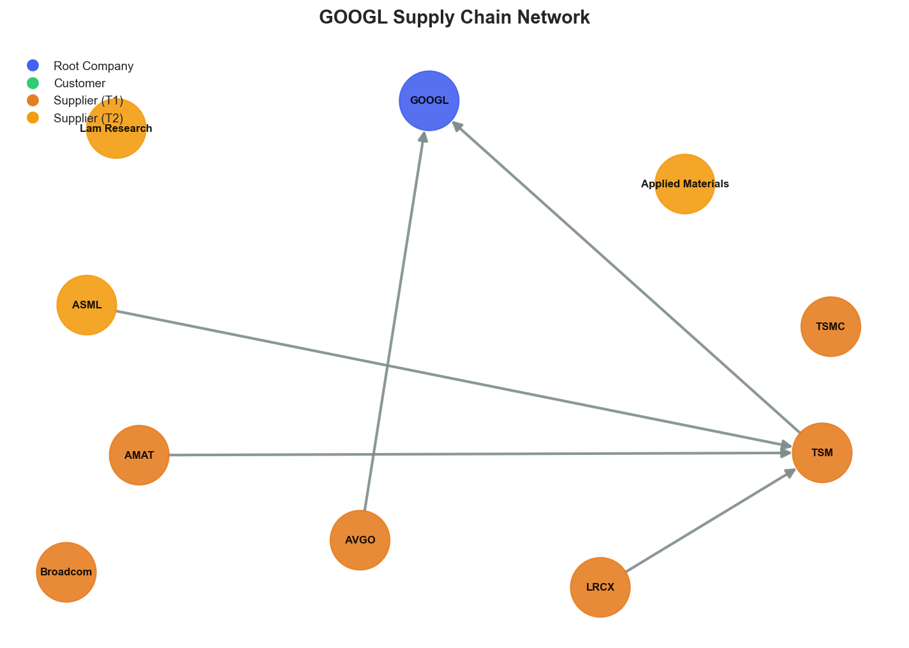

# Research Swarm Analysis Report

**Run ID:** c7f73572-9c02-4021-8722-c4b3f7b92ff7
**Generated:** 2026-01-19 05:09:43
**Analysis Date:** 2026-01-19
**Analysis Period:** FY 2026

---

## Executive Summary

Analyzed **1** stocks for FY 2026. Average Moat Score: **7.5/10**

**No watchlist candidates** identified in this analysis (none reached threshold of 8.0)

### Top 1 Picks

#### 1. GOOGL - 7.5/10
GOOGL merits a HOLD recommendation with a solid 7.5/10 moat score, reflecting strong execution on AI transformation but falling short of compelling buy criteria due to structural vulnerabilities. The investment case is anchored by exceptional market sentiment (9.3/10) driven by concrete developments including Apple's Gemini partnership and $4.75B Intersect Power acquisition, positioning Alphabet to capture the projected AI data center market expansion from $236B to $933B by 2030. Technical momentum supports this narrative with the stock trading above key moving averages at $330, while multiple analyst upgrades demonstrate institutional confidence. However, critical supply chain concentration through TSMC dependence creates significant structural risk, exposing operations to Taiwan geopolitical vulnerabilities and semiconductor manufacturing disruptions. The elevated RSI of 73.9 suggests potential overbought conditions, raising entry timing concerns despite positive fundamentals. This profile suits growth-oriented investors seeking AI exposure through an established technology leader with strong competitive moats, but the combination of supply chain risks and stretched valuations prevents a more aggressive recommendation. The stock offers solid long-term prospects for investors already holding positions, but new investors should consider waiting for better entry points or position sizing conservatively given the risk-reward balance at current levels.

**Key Insights:**
- AI leadership validation through strategic partnerships with Apple and infrastructure investments creates multiple monetization pathways while expanding Gemini's distribution to massive user bases, supported by analyst confidence in sustainable competitive advantages
- Strong technical momentum with price above key moving averages aligns with exceptional market sentiment driven by concrete developments rather than speculation, though RSI levels suggest careful entry timing consideration
- Supply chain concentration risk creates significant structural vulnerability despite positive operational momentum, with TSMC dependence and Taiwan geopolitical exposure representing material threats to hardware operations
- Broad-based analyst optimism with multiple price target upgrades reflects institutional confidence in Alphabet's ability to capture projected AI market growth, positioning the company as a primary beneficiary of secular technology trends

**Risk Factors:**
- Critical supply chain vulnerability through TSMC dependence exposes Alphabet to Taiwan geopolitical risks and semiconductor manufacturing disruptions that could materially impact hardware operations and custom chip production
- Technical indicators showing RSI at 73.9 suggest potential overbought conditions, raising concerns about entry timing and possible near-term price volatility despite strong underlying momentum
- Overwhelmingly positive sentiment across all sources may indicate potential confirmation bias or momentum-driven coverage, creating risk of sentiment reversal if execution falls short of elevated expectations
- Limited supplier diversification options due to technological constraints in advanced semiconductor manufacturing reduce flexibility to mitigate supply chain risks through alternative sourcing strategies

### Cost Summary

| Metric | Value |
|--------|-------|
| Total Cost | $0.29 |
| Cost per Stock | $0.293 |
| Budget Utilization | 0.1% |

#### Cost by Stock
| Ticker | Cost |
|--------|------|
| GOOGL | $0.293 |

---

## Detailed Stock Analysis

### GOOGL - 7.5/10
**Investment Thesis:** GOOGL merits a HOLD recommendation with a solid 7.5/10 moat score, reflecting strong execution on AI transformation but falling short of compelling buy criteria due to structural vulnerabilities. The investment case is anchored by exceptional market sentiment (9.3/10) driven by concrete developments including Apple's Gemini partnership and $4.75B Intersect Power acquisition, positioning Alphabet to capture the projected AI data center market expansion from $236B to $933B by 2030. Technical momentum supports this narrative with the stock trading above key moving averages at $330, while multiple analyst upgrades demonstrate institutional confidence. However, critical supply chain concentration through TSMC dependence creates significant structural risk, exposing operations to Taiwan geopolitical vulnerabilities and semiconductor manufacturing disruptions. The elevated RSI of 73.9 suggests potential overbought conditions, raising entry timing concerns despite positive fundamentals. This profile suits growth-oriented investors seeking AI exposure through an established technology leader with strong competitive moats, but the combination of supply chain risks and stretched valuations prevents a more aggressive recommendation. The stock offers solid long-term prospects for investors already holding positions, but new investors should consider waiting for better entry points or position sizing conservatively given the risk-reward balance at current levels.

**Processing Time:** 192.2s | **Cost:** $0.2930

#### Moat Score Breakdown

| Component | Score | Weight |
|-----------|-------|--------|
| Financial Health | 7.3/10 | 30% |
| Sentiment & Catalysts | 9.3/10 | 20% |
| Technical Strength | 7.2/10 | 20% |
| Supply Chain Position | 6.8/10 | 30% |
| **Overall Moat Score** | **7.5/10** | **100%** |

#### Synthesis Narrative

Alphabet presents a compelling investment profile characterized by strong momentum across multiple analytical dimensions, though with notable structural vulnerabilities that require careful consideration. The convergence of exceptional market sentiment (9.3/10) with solid fundamental health (7.3/10) and robust technical positioning (7.2/10) suggests a company executing effectively on its strategic AI transformation while maintaining operational excellence. The overwhelmingly positive sentiment is anchored by concrete developments rather than speculative optimism. Strategic partnerships with Apple for Gemini integration and the $4.75 billion Intersect Power acquisition demonstrate Alphabet's commitment to scaling AI infrastructure while expanding distribution reach. Multiple analyst upgrades, including Canaccord Genuity's aggressive target raise to $390, reflect institutional confidence in the company's ability to capitalize on the projected AI data center market growth from $236 billion to $933 billion by 2030. Technical indicators support this bullish narrative, with the stock trading at $330 above both 50-day ($309.27) and 200-day ($226.11) moving averages, indicating sustained upward momentum. However, the RSI reading of 73.9 suggests the stock is approaching overbought territory, warranting caution on entry timing. The fundamental analysis, while showing solid financial health, lacks detailed metrics that would provide deeper insight into operational efficiency and capital allocation effectiveness. This analytical gap is partially offset by the comprehensive sentiment analysis, which reveals consistent positive developments across AI partnerships, product innovation, and market positioning. The supply chain analysis reveals a critical structural vulnerability that contrasts sharply with the positive sentiment and technical momentum. Alphabet's heavy dependence on TSMC for advanced semiconductor manufacturing creates a significant single point of failure, particularly given Taiwan's geopolitical risks. The concentrated supplier base, while enabling access to cutting-edge technology, limits diversification options and exposes the company to potential disruptions that could materially impact hardware operations including Pixel devices and custom Tensor chips. The shallow two-tier supply chain structure, dominated by semiconductor equipment oligopolists ASML, Applied Materials, and Lam Research, compounds these risks by creating multiple bottlenecks that could cascade through TSMC operations. Despite these supply chain concerns, the overall investment profile suggests a company well-positioned to benefit from secular AI trends while maintaining strong competitive moats through its data advantages and ecosystem integration. The alignment of positive sentiment with technical momentum, supported by concrete strategic developments, indicates genuine fundamental progress rather than speculative enthusiasm. However, investors must weigh these strengths against supply chain concentration risks and potential valuation concerns given the stock's recent strong performance and elevated RSI levels.

#### Key Insights

1. AI leadership validation through strategic partnerships with Apple and infrastructure investments creates multiple monetization pathways while expanding Gemini's distribution to massive user bases, supported by analyst confidence in sustainable competitive advantages
2. Strong technical momentum with price above key moving averages aligns with exceptional market sentiment driven by concrete developments rather than speculation, though RSI levels suggest careful entry timing consideration
3. Supply chain concentration risk creates significant structural vulnerability despite positive operational momentum, with TSMC dependence and Taiwan geopolitical exposure representing material threats to hardware operations
4. Broad-based analyst optimism with multiple price target upgrades reflects institutional confidence in Alphabet's ability to capture projected AI market growth, positioning the company as a primary beneficiary of secular technology trends

#### Risk Factors

1. Critical supply chain vulnerability through TSMC dependence exposes Alphabet to Taiwan geopolitical risks and semiconductor manufacturing disruptions that could materially impact hardware operations and custom chip production
2. Technical indicators showing RSI at 73.9 suggest potential overbought conditions, raising concerns about entry timing and possible near-term price volatility despite strong underlying momentum
3. Overwhelmingly positive sentiment across all sources may indicate potential confirmation bias or momentum-driven coverage, creating risk of sentiment reversal if execution falls short of elevated expectations
4. Limited supplier diversification options due to technological constraints in advanced semiconductor manufacturing reduce flexibility to mitigate supply chain risks through alternative sourcing strategies

---

## Supply Chain Analysis

### GOOGL Supply Chain Network

**Network Size:** 6 nodes, 5 connections

#### Network Nodes

- **GOOGL** (GOOGL) - *root*- **TSMC** (TSM) - *supplier*- **Broadcom** (AVGO) - *supplier*- **ASML** (ASML) - *supplier_t2*- **Applied Materials** (AMAT) - *supplier_t2*- **Lam Research** (LRCX) - *supplier_t2*

---

## Watchlist Candidates

*No stocks currently meet the watchlist threshold of 8.0 or higher.*

**Closest Candidates:**

- **GOOGL**: 7.5/10 (0.5 points below threshold)

---

## Run Statistics

- **Total Stocks Analyzed:** 1
- **Successfully Completed:** 1
- **Failed:** 0
- **Average Moat Score:** 7.51/10
- **Total Cost:** $0.29
- **Total Time:** 192.3s

---

*Generated by Research Swarm - AI-Powered Stock Analysis*