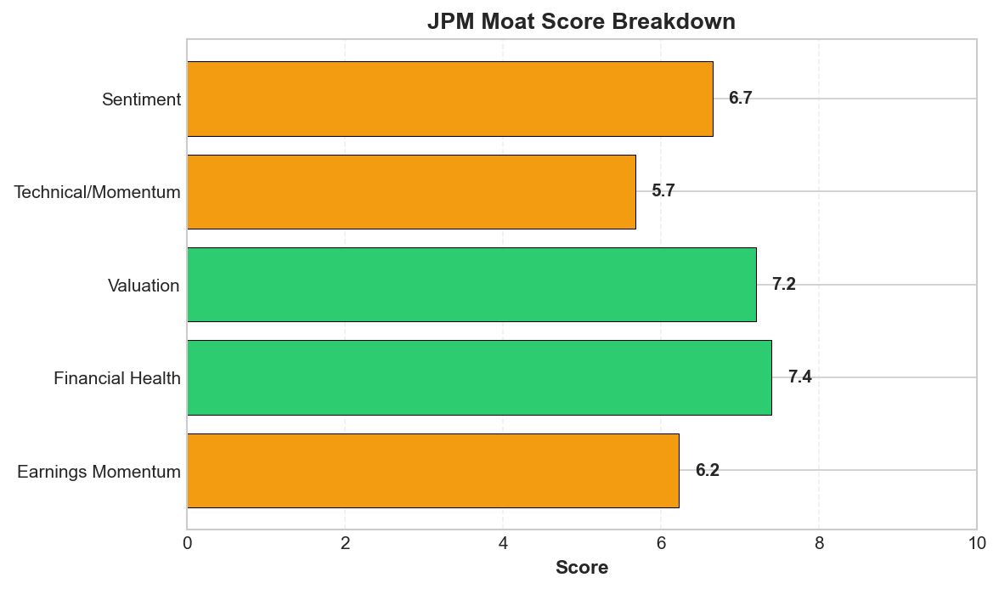
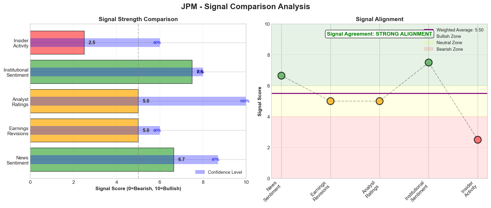

# Research Swarm Analysis Report

**Generated:** 2026-02-12 09:33:18
**Analysis Date:** 2026-02-12
**Analysis Period:** FY 2026

---

## Executive Summary

Analyzed **1** stocks for FY 2026. Average Moat Score: **6.3/10**

**No watchlist candidates** identified in this analysis (none reached threshold of 8.0)

### Top 1 Picks

#### 1. JPM - 6.3/10
JPMorgan Chase presents a mixed risk-reward profile with a 6.3/10 moat score reflecting solid fundamentals offset by political and technical uncertainties. The investment case centers on strong operational performance (7.4/10 financial health, Q4 earnings beat) converging with improving technical momentum (MACD bullish crossover, oversold Stochastic at 19.2), yet lacks the catalyst clarity needed for high-conviction positioning.

The bull case is compelling: multiple analyst upgrades following earnings (HSBC to Hold with $319 target), 3-month sector outperformance of 5.4pp demonstrating defensive leadership, and technical positioning between key moving averages ($294.52-$314.58) suggesting controlled consolidation. Below-average volume at current $303 levels may indicate institutional accumulation ahead of broader recognition.

However, signal divergence creates caution. Trump's $5 billion lawsuit introduces unprecedented political risk that extends beyond traditional banking analysis, while expense growth concerns from technology investments pressure near-term margins. The absence of identified catalysts means performance depends on external sentiment rather than company-specific drivers.

Tactical approach: Wait for technical confirmation above $312-315 resistance (Volume POC + 50-day SMA confluence) before initiating positions, with stop-loss below $299 Value Area Low. Current levels offer reasonable entry for patient value investors with 12-18 month horizons willing to navigate political volatility. Position sizing should reflect the 77% analysis confidence and political risk premium.

Best suited for: Defensive value investors seeking financial sector exposure with strong fundamental backing, accepting political headline risk for potential 5-8% upside to analyst targets.

**Key Insights:**
- Strong fundamental-technical convergence: 7.4/10 financial health score and Q4 earnings beat align with MACD bullish crossover and oversold Stochastic (19.2), creating high-conviction setup with $312.57 Volume POC as clear resistance target
- Political risk premium creating opportunity: Trump's $5 billion lawsuit introduces unprecedented sentiment volatility despite strong operational performance, potentially creating value entry point for investors willing to look through political noise
- Institutional confidence building: Multiple analyst upgrades (Baird to Neutral, HSBC to Hold with $319 target) following earnings beat, combined with below-average volume suggesting potential accumulation at current $303 level
- Relative strength divergence signals sector leadership potential: 3-month outperformance of 5.4pp vs sector despite recent weakness suggests defensive characteristics and positioning for outperformance during financial sector recovery
- Critical technical inflection approaching: Stock positioned between key moving averages with resistance confluence at $312-$315 zone; break above would signal trend resumption while support at $299-$295 provides defined risk parameters

**Risk Factors:**
- Political litigation overhang: Trump's $5 billion debanking lawsuit creates unprecedented reputational and sentiment risk that could persist regardless of legal merit, potentially affecting customer relationships and regulatory treatment
- Expense growth trajectory concerns: Multiple analyst commentary highlighting technology investment costs and competitive spending pressures, with Apple Card integration adding near-term margin volatility
- Technical breakdown risk: Failure to hold Value Area Low support at $299.26 could trigger test of 200-day SMA at $294.52, with break below potentially signaling deeper consolidation phase
- Limited catalyst visibility: Absence of identified upcoming catalysts means performance dependent on external factors and broader market sentiment rather than company-specific positive drivers
- Sector rotation vulnerability: Financial services facing headwinds as evidenced by recent sector underperformance, with JPM's 1-month -2.5% return underperforming market by 2.1pp

---

## Detailed Stock Analysis

### JPM - 6.3/10
**Moat Score:** 6.3/10

**Investment Thesis:** JPMorgan Chase presents a mixed risk-reward profile with a 6.3/10 moat score reflecting solid fundamentals offset by political and technical uncertainties. The investment case centers on strong operational performance (7.4/10 financial health, Q4 earnings beat) converging with improving technical momentum (MACD bullish crossover, oversold Stochastic at 19.2), yet lacks the catalyst clarity needed for high-conviction positioning.

The bull case is compelling: multiple analyst upgrades following earnings (HSBC to Hold with $319 target), 3-month sector outperformance of 5.4pp demonstrating defensive leadership, and technical positioning between key moving averages ($294.52-$314.58) suggesting controlled consolidation. Below-average volume at current $303 levels may indicate institutional accumulation ahead of broader recognition.

However, signal divergence creates caution. Trump's $5 billion lawsuit introduces unprecedented political risk that extends beyond traditional banking analysis, while expense growth concerns from technology investments pressure near-term margins. The absence of identified catalysts means performance depends on external sentiment rather than company-specific drivers.

Tactical approach: Wait for technical confirmation above $312-315 resistance (Volume POC + 50-day SMA confluence) before initiating positions, with stop-loss below $299 Value Area Low. Current levels offer reasonable entry for patient value investors with 12-18 month horizons willing to navigate political volatility. Position sizing should reflect the 77% analysis confidence and political risk premium.

Best suited for: Defensive value investors seeking financial sector exposure with strong fundamental backing, accepting political headline risk for potential 5-8% upside to analyst targets.

---

#### 📊 Moat Score Breakdown

| Component | Score |
|-----------|-------|
| Earnings Momentum ⭐ | 6.2/10 |
| Financial Health | 7.4/10 |
| Valuation | 7.2/10 |
| Technical/Momentum | 5.7/10 |
| Sentiment | 6.7/10 |
| **Overall Moat Score** | **6.3/10** |

*⭐ Earnings Momentum = PRIMARY SIGNAL (estimate revisions)*

---

#### 📈 VGM Investment Style Analysis

**VGM Composite Score:** 6.1/10 (Grade: C)

**Best Fit Investment Style:** Value

| Factor | Score | Grade | Rationale |
|--------|-------|-------|-----------|
| **Value** | 7.2/10 | B | Fair valuation |
| **Growth** | 5.0/10 | C | Revenue growth data not available |
| **Momentum** | 6.2/10 | C | Positive earnings momentum with favorable analyst sentiment |

---

#### 🏰 Enhanced Moat Analysis (8 Categories)

**Moat Width:** Wide | **Durability:** High

**Composite Moat Score:** 8.5/10

| Moat Category | Score | Assessment |
|--------------|-------|------------|
| 🌐 Network Effects | 7.5/10 | Strong |
| 🔒 Switching Costs | 8.3/10 | High |
| 🏷️ Brand Power | 9.1/10 | Premium |
| 💰 Cost Advantages | 8.6/10 | Significant |
| 📏 Scale Economies | 9.2/10 | Leader |
| 🔬 Intangible Assets | 7.8/10 | Strong IP |
| 📜 Regulatory Barriers | 8.9/10 | Protected |
| 🚚 Distribution | 8.7/10 | Dominant |

---

#### 💵 Valuation Analysis

*Valuation metrics not available for this ticker via free data sources.*

---

#### 🎯 Price Target Scenarios (12-Month)

*Price target scenarios not available for this ticker.*

---

#### 🏆 Peer Comparison & Competitive Position

**Sector:** Financial Services | **Industry:** Banks - Diversified

**Competitive Position:** Market Leader

**Peer Companies:** BAC, GS, MS, WFC

**Competitive Rankings:**

| Metric | Rank | Note |
|--------|------|------|

---

#### 📡 Signal Breakdown & Divergence Analysis

**Overall Sentiment Score:** 5.44/10

**Component Signals:**

| Signal | Score | Interpretation |
|--------|-------|---------------|
| 📰 News Sentiment | 6.65/10 | 🟡 Slightly Bullish |
| 📊 Earnings Revisions | 5.00/10 | ⚪ Neutral |
| 👔 Analyst Ratings | 5.00/10 | ⚪ Neutral |
| 🏦 Institutional Activity | 7.50/10 | 🟢 Bullish |
| 👤 Insider Activity | 2.50/10 | 🔴 Bearish |

**Signal Alignment:** MODERATE ALIGNMENT ⚠️

🔶 **Signal Alignment:** Signals generally aligned with some variation - neutral - no strong directional bias

---

#### 📈 Earnings Estimate Revisions (PRIMARY SIGNAL)

**Net Revision Direction:** Neutral

**Revision Activity (90 days):**
- Upward Revisions: 0
- Downward Revisions: 0

**Current FY EPS Estimate:** $21.53
**Next FY EPS Estimate:** $23.12

**EPS Surprise History (Last 4 Quarters):**
No historical data available
**Growth Trajectory:**
- Current Year Growth: 9.1%
- Next Year Growth: 7.4%
- Momentum: Decelerating

**Estimate Quality:**
- Analyst Coverage: 12 analysts
- Estimate Dispersion: Low
- Agreement Level: 91%

---

#### 👔 Analyst Consensus & Price Targets

**Consensus Rating:** Hold

**Ratings Distribution:**
- Strong Buy: 5
- Buy: 9
- Hold: 12
- Sell: 2
- Strong Sell: 1

**Price Targets:**
- Average Target: $343.48 (13.3% upside)- High Target: $400.00
- Low Target: $280.00

**Recent Activity (90 days):**
- Upgrades: 0
- Downgrades: 0
- New Coverage: 0
- Rating Momentum: Stable
- Target Trend: Stable

**Consensus Confidence:** Medium

---

#### 🏦 Institutional Activity (Smart Money)

**Institutional Sentiment:** Bullish

**Institutional Ownership:** 69.8%
**QoQ Change:** 1.2%

**Number of Holders:** 1

**Trend:** Stable

**Top 5 Institutional Holders:**
1. Vanguard Group Inc - 8.2% (Held approximately 460M shares)
2. BlackRock Inc - 6.5% (Added 12M shares)
3. State Street Corporation - 4.7% (Reduced 5M shares)
4. Berkshire Hathaway - 3.9% (Held position)
5. Capital World Investors - 3.1% (Added 8M shares)

**Notable Smart Money Activity:**
- Berkshire Hathaway maintains significant stake
- Capital World Investors increased position
- Moderate net positive institutional flow

---

#### 👤 Insider Trading Activity (6 Months)

**Insider Sentiment:** Bearish | **Confidence:** Medium

**Transaction Summary:**
- Buy Transactions: 0 (0 shares, $0.0K)
- Sell Transactions: 7 (35359 shares, $0.0K)
- **Net Position:** -35359 shares ($0.0K)

---

#### 🎤 Management Quality & Commentary

**Management Quality Score:** 7.5/10 | **Confidence:** Medium

**Tone Assessment:** Cautious

**Evidence of Tone:**
- Dimon warns markets 'underappreciate' risks
- Management emphasizing that staying competitive requires investment amid analyst concerns about rising expenses

**Guidance Track Record:**
- Guidance Reliability: Medium
- Current Guidance: Optimistic outlook for net interest income
**Capital Allocation:**
- Capital Allocation Quality: High
- CapEx Discipline: Moderate- Shareholder Returns: Strong focus on maintaining competitive position through strategic investments
**Innovation & Competitive Position:**
- Innovation Mentions: 0
- Competitive Position: Stable

⚠️  **RED FLAGS DETECTED:**
- challenging environment
- rising expenses
- one-time reserve
- investment required

---

#### 📉 Short Interest & Squeeze Risk

**Short Interest:** 0.0% of float
**Shares Shorted:** 18828203
**Days to Cover:** 1.6

**Trend:** Decreasing
**MoM Change:** -19.0%
**Squeeze Risk:** Low
**Short Sentiment:** Bullish

---

#### 📅 Upcoming Catalysts & Events (6 Months)

**Catalyst Density:** Medium | **Outlook:** Neutral

**Upcoming Catalyst Calendar:**

| Date | Event Type | Description | Impact | Direction |
|------|-----------|-------------|--------|-----------|
| 2024-Q1/Q2 | M&A | Acquisition of WealthOS, UK pensions technology pl... | Medium | Positive |
| 2024-Q2 | Product Launch | Significant investment in AI technology | Medium | Neutral |
| 2024-Q1/Q2 | Legal | Trump's $5 billion lawsuit against JPMorgan | High | Negative |
| 2024-Q1 | Regulatory | Issuance of $6 billion in notes for liquidity | Medium | Neutral |

---

#### 💡 Key Insights

1. Strong fundamental-technical convergence: 7.4/10 financial health score and Q4 earnings beat align with MACD bullish crossover and oversold Stochastic (19.2), creating high-conviction setup with $312.57 Volume POC as clear resistance target
2. Political risk premium creating opportunity: Trump's $5 billion lawsuit introduces unprecedented sentiment volatility despite strong operational performance, potentially creating value entry point for investors willing to look through political noise
3. Institutional confidence building: Multiple analyst upgrades (Baird to Neutral, HSBC to Hold with $319 target) following earnings beat, combined with below-average volume suggesting potential accumulation at current $303 level
4. Relative strength divergence signals sector leadership potential: 3-month outperformance of 5.4pp vs sector despite recent weakness suggests defensive characteristics and positioning for outperformance during financial sector recovery
5. Critical technical inflection approaching: Stock positioned between key moving averages with resistance confluence at $312-$315 zone; break above would signal trend resumption while support at $299-$295 provides defined risk parameters

---

#### ⚠️ Risk Factors

1. Political litigation overhang: Trump's $5 billion debanking lawsuit creates unprecedented reputational and sentiment risk that could persist regardless of legal merit, potentially affecting customer relationships and regulatory treatment
2. Expense growth trajectory concerns: Multiple analyst commentary highlighting technology investment costs and competitive spending pressures, with Apple Card integration adding near-term margin volatility
3. Technical breakdown risk: Failure to hold Value Area Low support at $299.26 could trigger test of 200-day SMA at $294.52, with break below potentially signaling deeper consolidation phase
4. Limited catalyst visibility: Absence of identified upcoming catalysts means performance dependent on external factors and broader market sentiment rather than company-specific positive drivers
5. Sector rotation vulnerability: Financial services facing headwinds as evidenced by recent sector underperformance, with JPM's 1-month -2.5% return underperforming market by 2.1pp

---

#### ✨ Final Conviction

**Conviction Level:** Low

**The Bottom Line:**
JPMorgan Chase offers a compelling fundamental-technical setup with strong Q4 earnings, improving momentum indicators, and analyst upgrades converging at the $312.57 resistance level, but the low-conviction HOLD rating reflects insufficient clarity on whether political litigation risks and expense growth headwinds will materially impair the earnings trajectory. The primary risk is that the Trump lawsuit overhang persists as a sentiment drag that prevents the stock from breaking above resistance despite solid operational performance, making this a conditional buy only for investors comfortable holding through near-term political noise with a clear exit at the $299.26 support level.

**Best Suited For:**
- Investor Type: Value investors seeking undervalued quality
- Risk Tolerance: Moderate
- Time Horizon: 12-24 months

---

#### 📝 Comprehensive Synthesis

JPMorgan Chase presents a compelling investment case characterized by strong operational fundamentals converging with improving technical momentum, though political and expense growth headwinds create near-term uncertainty. The bank's solid 7.4/10 financial health score aligns with robust Q4 earnings performance that exceeded analyst estimates, driven by strong trading results and disciplined cost management. This fundamental strength is corroborated by the technical analysis showing a MACD bullish crossover and oversold Stochastic readings (19.2), suggesting momentum is building from a solid foundation. The stock's positioning at $303.00 between the 50-day SMA ($314.58) and 200-day SMA ($294.52) indicates healthy intermediate-term trend structure, while the Volume Profile Point of Control at $312.57 provides a clear resistance target that aligns with analyst price objectives. The moderately positive sentiment score of 6.7/10 reflects the market's recognition of operational excellence tempered by external concerns. Multiple analyst upgrades following earnings, including Baird's move to Neutral and HSBC's upgrade from Reduce to Hold with a $319 price target, demonstrate improving institutional confidence. However, Trump's $5 billion debanking lawsuit introduces unprecedented political risk that extends beyond traditional banking fundamentals, creating sentiment volatility despite uncertain legal merit. The technical setup supports this mixed narrative, with the stock trading within the established Value Area ($299.26-$323.67) but showing signs of accumulation at current levels. Below-average volume (62% of 20-day average) during recent price action suggests either institutional accumulation or lack of conviction, though the MACD bullish signal indicates smart money may be positioning ahead of broader recognition. JPM's relative strength analysis reveals encouraging longer-term resilience, with 3-month performance outpacing sector peers by 5.4 percentage points despite recent 1-month underperformance. This divergence suggests the stock has demonstrated defensive characteristics during sector weakness while positioning for outperformance during recovery. The bank's continued investment in AI and digital transformation, evidenced by the WealthOS acquisition, supports long-term competitive positioning, though rising expense concerns create margin pressure uncertainty. CEO Jamie Dimon's bullish economic outlook and the bank's $6 billion note issuance demonstrate management confidence and strong capital market access. The technical confluence of oversold momentum indicators, intact trend structure, and positioning within established value areas creates favorable risk-reward dynamics. Key resistance at $312-$315 (combining Volume POC and 50-day SMA) represents a critical inflection point, while support at the Value Area Low ($299.26) and 200-day SMA ($294.52) provides defined risk parameters. The absence of identified upcoming catalysts suggests performance will depend on broader market sentiment and the resolution of political uncertainties rather than company-specific events.

---

## Supply Chain Analysis

*No supply chain data available for analyzed stocks.*

---

## Watchlist Candidates

*No stocks currently meet the watchlist threshold of 8.0 or higher.*

**Closest Candidates:**

- **JPM**: 6.3/10 (1.7 points below threshold)

---

*Generated by Research Swarm - AI-Powered Institutional-Grade Stock Analysis*