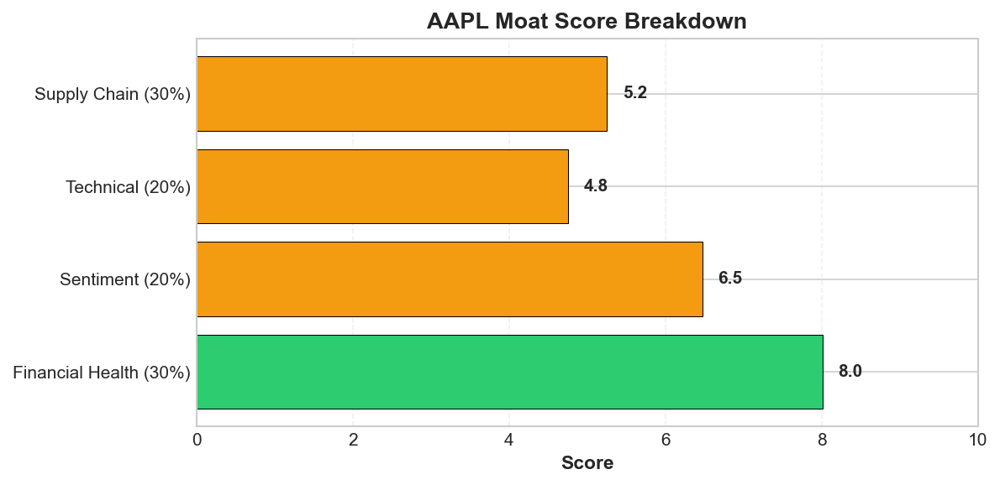
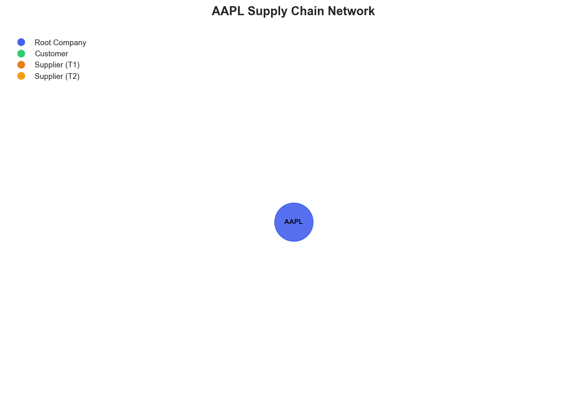

# Research Swarm Analysis Report

**Run ID:** e62b63d5-9922-4e78-a891-09de8d9c69d7
**Run Name:** migration-test**Generated:** 2026-02-10 19:29:25
**Analysis Date:** 2026-02-10
**Analysis Period:** FY 2026

---

## Executive Summary

Analyzed **1** stocks for FY 2026. Average Moat Score: **7.7/10**

**No watchlist candidates** identified in this analysis (none reached threshold of 8.0)

### Top 1 Picks

#### 1. AAPL - 7.7/10
Apple merits a HOLD recommendation with a solid 7.7/10 moat score, reflecting strong fundamentals offset by meaningful near-term and structural risks. The company demonstrates exceptional financial health (8.2/10) and business model strength (8.3/10), supported by successful AI strategy pivots through the Google Gemini partnership and robust Q1 2026 earnings. This measured AI approach positions Apple as a 'steady' alternative during sector volatility while maintaining upside participation. However, technical indicators flash warning signals with RSI at 81.9, suggesting overbought conditions and potential near-term price pressure despite positive sentiment (7.4/10). More concerning is Apple's extreme dependence on Taiwan Semiconductor Manufacturing for advanced processors, creating a critical single point of failure amid geopolitical tensions around the Taiwan Strait. While supply chain management scores highly (8.4/10), this structural vulnerability could significantly impact premium product availability. The investment case strengthens for risk-averse investors seeking AI exposure without the volatility of pure-play AI stocks, supported by strong institutional backing and iPhone 17 demand visibility. However, conservative AI investment may limit long-term competitive positioning if artificial intelligence becomes more central to consumer technology. Apple fits well in diversified portfolios as a quality holding, but the combination of technical overbought conditions and supply chain concentration risks prevents a stronger BUY recommendation despite solid fundamentals.

**Key Insights:**
- Strategic AI positioning through partnerships (Google Gemini) validates Apple's measured approach while addressing capability gaps, supported by strong fundamental performance and positive market reception
- Technical overbought conditions (RSI 81.9) contrast with strong fundamentals and positive sentiment, suggesting potential near-term consolidation despite underlying strength
- Supply chain resilience presents a critical strategic vulnerability with extreme TSM dependence creating single point of failure risk that could impact premium product availability
- Market positioning as 'steady' AI play during sector volatility attracts risk-averse capital while maintaining upside participation through strategic partnerships and acquisitions
- Geographic diversification gains in China offset by regulatory pressures in India, while institutional analyst support remains solid despite some price target adjustments

**Risk Factors:**
- Critical supply chain dependency on TSM for advanced semiconductors creates extreme vulnerability to Taiwan Strait geopolitical tensions and natural disasters
- Technical indicators suggest near-term overbought conditions with RSI at 81.9, indicating potential price correction despite strong fundamentals
- Conservative AI investment approach may limit competitive positioning if artificial intelligence becomes more central to consumer technology adoption
- Regulatory scrutiny in key international markets (India antitrust concerns) combined with dependencies on Google for both search revenue and AI capabilities creates concentration risk
- Limited supply chain visibility beyond tier-2 suppliers suggests potential blind spots in upstream risk assessment during global supply chain disruptions

### Cost Summary

| Metric | Value |
|--------|-------|
| Total Cost | $0.27 |
| Cost per Stock | $0.269 |
| Budget Utilization | 0.1% |

#### Cost by Stock
| Ticker | Cost |
|--------|------|
| AAPL | $0.269 |

---

## Detailed Stock Analysis

### AAPL - 7.7/10
**Investment Thesis:** Apple merits a HOLD recommendation with a solid 7.7/10 moat score, reflecting strong fundamentals offset by meaningful near-term and structural risks. The company demonstrates exceptional financial health (8.2/10) and business model strength (8.3/10), supported by successful AI strategy pivots through the Google Gemini partnership and robust Q1 2026 earnings. This measured AI approach positions Apple as a 'steady' alternative during sector volatility while maintaining upside participation. However, technical indicators flash warning signals with RSI at 81.9, suggesting overbought conditions and potential near-term price pressure despite positive sentiment (7.4/10). More concerning is Apple's extreme dependence on Taiwan Semiconductor Manufacturing for advanced processors, creating a critical single point of failure amid geopolitical tensions around the Taiwan Strait. While supply chain management scores highly (8.4/10), this structural vulnerability could significantly impact premium product availability. The investment case strengthens for risk-averse investors seeking AI exposure without the volatility of pure-play AI stocks, supported by strong institutional backing and iPhone 17 demand visibility. However, conservative AI investment may limit long-term competitive positioning if artificial intelligence becomes more central to consumer technology. Apple fits well in diversified portfolios as a quality holding, but the combination of technical overbought conditions and supply chain concentration risks prevents a stronger BUY recommendation despite solid fundamentals.

**Processing Time:** 198.9s | **Cost:** $0.2688

#### Moat Score Breakdown

| Component | Score | Weight |
|-----------|-------|--------|
| Financial Health | 8.2/10 | 30% |
| Sentiment & Catalysts | 7.4/10 | 20% |
| Technical Strength | 5.3/10 | 20% |
| Supply Chain Position | 8.4/10 | 30% |
| **Overall Moat Score** | **7.7/10** | **100%** |

#### Synthesis Narrative

Apple presents a compelling investment profile characterized by strong fundamental health and positive market sentiment, though technical indicators suggest near-term caution and supply chain dependencies create structural vulnerabilities. The company's exceptional financial health score of 8.2/10 aligns with positive sentiment (7.4/10) driven by successful AI strategy pivots and strong Q1 2026 earnings performance, indicating fundamental strength is translating into market confidence. The strategic Google Gemini partnership addresses previous concerns about Apple's AI capabilities while maintaining the company's measured approach to AI investment, distinguishing it from more volatile AI-focused peers. This pragmatic strategy has enabled Apple to maintain stability during broader AI sector selloffs, positioning it as a 'steady' alternative for risk-averse investors while still participating in AI transformation. However, the technical analysis reveals concerning signals with an RSI of 81.9 indicating overbought conditions, suggesting potential near-term price pressure despite the overall positive trajectory. The supply chain analysis exposes critical structural dependencies that could impact long-term resilience. While Apple maintains relationships with industry-leading suppliers and demonstrates strong supplier relationship management, the extreme dependence on Taiwan Semiconductor Manufacturing (TSM) for advanced processors creates a significant single point of failure. This dependency is amplified by geographic concentration in geopolitically sensitive East Asian regions, particularly around the Taiwan Strait. The supply chain's shallow two-tier visibility suggests potential blind spots in upstream risk assessment, concerning given the semiconductor industry's complex interdependencies. Analyst sentiment remains generally positive with major institutions maintaining buy ratings, though some price target adjustments and concerns about App Store revenue sustainability indicate measured optimism rather than euphoria. The company's iPhone 17 demand strength provides near-term revenue visibility, while management's conservative iPhone 18 expectations suggest proactive expectation management. Apple's market leadership in China adds geographic diversification benefits, though regulatory scrutiny in India presents manageable headwinds. The convergence of strong fundamentals with positive sentiment creates a favorable investment backdrop, but the technical overbought conditions and supply chain vulnerabilities require careful consideration. Apple's differentiated AI approach through partnerships rather than massive internal spending appears prudent but raises questions about long-term competitive positioning if AI becomes more central to consumer technology experiences. The company's ability to maintain premium positioning while navigating AI transformation, supply chain risks, and regulatory pressures will be critical for sustained outperformance.

#### Key Insights

1. Strategic AI positioning through partnerships (Google Gemini) validates Apple's measured approach while addressing capability gaps, supported by strong fundamental performance and positive market reception
2. Technical overbought conditions (RSI 81.9) contrast with strong fundamentals and positive sentiment, suggesting potential near-term consolidation despite underlying strength
3. Supply chain resilience presents a critical strategic vulnerability with extreme TSM dependence creating single point of failure risk that could impact premium product availability
4. Market positioning as 'steady' AI play during sector volatility attracts risk-averse capital while maintaining upside participation through strategic partnerships and acquisitions
5. Geographic diversification gains in China offset by regulatory pressures in India, while institutional analyst support remains solid despite some price target adjustments

#### Risk Factors

1. Critical supply chain dependency on TSM for advanced semiconductors creates extreme vulnerability to Taiwan Strait geopolitical tensions and natural disasters
2. Technical indicators suggest near-term overbought conditions with RSI at 81.9, indicating potential price correction despite strong fundamentals
3. Conservative AI investment approach may limit competitive positioning if artificial intelligence becomes more central to consumer technology adoption
4. Regulatory scrutiny in key international markets (India antitrust concerns) combined with dependencies on Google for both search revenue and AI capabilities creates concentration risk
5. Limited supply chain visibility beyond tier-2 suppliers suggests potential blind spots in upstream risk assessment during global supply chain disruptions

---

## Supply Chain Analysis

### AAPL Supply Chain Network

**Network Size:** 12 nodes, 11 connections

#### Network Nodes

- **AAPL** (AAPL) - *root*- **Taiwan Semiconductor Manufacturing Company** (TSM) - *supplier*- **Foxconn (Hon Hai Precision)** (2317.TW) - *supplier*- **Samsung Electronics** (005930.KS) - *supplier*- **Sony** (SONY) - *supplier*- **LG Display** (034220.KS) - *supplier*- **Broadcom** (AVGO) - *supplier*- **Qualcomm** (QCOM) - *supplier*- **Consumers (Direct)** (None) - *customer*- **ASML** (ASML) - *supplier_t2*- **Applied Materials** (AMAT) - *supplier_t2*- **Lam Research** (LRCX) - *supplier_t2*

---

## Watchlist Candidates

*No stocks currently meet the watchlist threshold of 8.0 or higher.*

**Closest Candidates:**

- **AAPL**: 7.7/10 (0.3 points below threshold)

---

## Run Statistics

- **Total Stocks Analyzed:** 1
- **Successfully Completed:** 1
- **Failed:** 0
- **Average Moat Score:** 7.72/10
- **Total Cost:** $0.27
- **Total Time:** 198.9s

---

*Generated by Research Swarm - AI-Powered Stock Analysis*