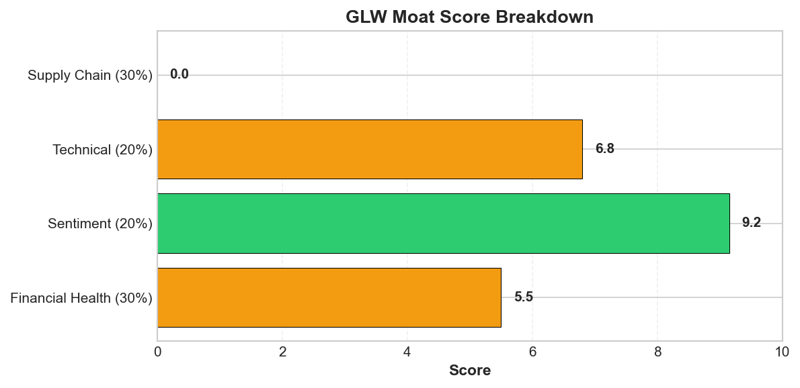
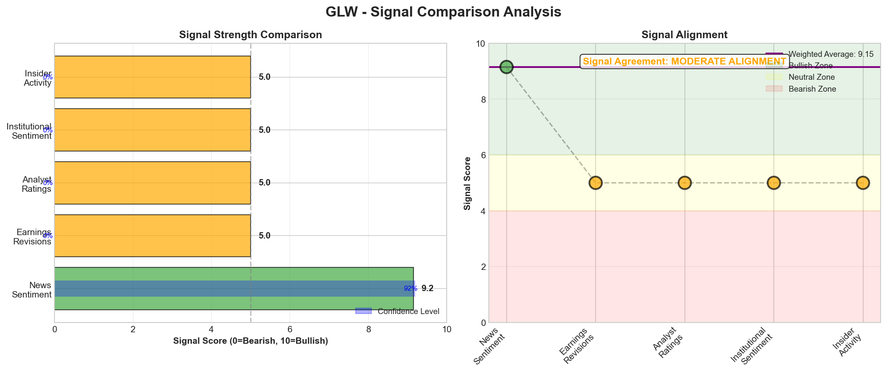

# Research Swarm Analysis Report

**Run ID:** fd74290c-0082-4301-979a-979a5eda697c
**Generated:** 2026-02-11 19:58:45
**Analysis Date:** 2026-02-11
**Analysis Period:** FY 2026

---

## Executive Summary

Analyzed **1** stocks for FY 2026. Average Moat Score: **4.8/10**

**No watchlist candidates** identified in this analysis (none reached threshold of 8.0)

### Top 1 Picks

#### 1. GLW - 4.8/10
GLW presents a compelling fundamental narrative undermined by critical data integrity issues and dangerous technical overextension, warranting an AVOID recommendation despite the transformational $6 billion Meta fiber optic contract. The moat score of 4.8/10 reflects severe signal divergence: exceptional sentiment (9.2/10) driven by AI infrastructure positioning conflicts sharply with mediocre financial health (5.5/10) and concerning technical exhaustion. Most critically, fundamental analysis is impossible with revenue showing $0.0B and an impossible 3260% gross margin, indicating data integrity failures that prevent proper risk assessment. Technical conditions scream caution with RSI at 77.5, Stochastic at 89.4, and price at $128.10 trading 76.4% above the 200-day SMA and 20.5% above Value Area High of $106.32. This represents thin air territory where institutional support diminishes significantly. The supply chain analysis reveals catastrophic 'black box' risk with zero identifiable suppliers or customers - unacceptable operational opacity for a manufacturing company. While the Meta contract validates GLW's AI data center positioning, the uniformly positive sentiment lacks risk discussion, suggesting potential euphoria disconnected from underlying fundamentals. Multiple technical indicators converge on high correction probability toward $104-$106 support, potentially triggering momentum-based selling. The 68% analysis confidence reflects these data gaps. This investment requires growth investors comfortable with high volatility and significant information asymmetry. Better opportunities exist elsewhere with cleaner fundamental visibility and more attractive risk-adjusted entry points. Wait for technical reset and data clarity before considering entry.

**Key Insights:**
- Fundamental-Technical Divergence: Exceptional sentiment score of 9.2/10 driven by $6 billion Meta contract conflicts sharply with overbought technical conditions (RSI 77.5, Stochastic 89.4) and mediocre financial health score of 5.5/10, suggesting potential near-term correction despite positive catalysts
- Critical Data Integrity Issues: Revenue showing $0.0B with impossible 3260% gross margin alongside missing valuation metrics and peer comparisons prevents proper fundamental analysis, creating significant analytical blind spots for investors
- Supply Chain Catastrophic Risk: Complete absence of identifiable suppliers, customers, or supply chain relationships represents 'black box' operational risk that could expose GLW to unassessed disruptions, particularly concerning for a manufacturing company in volatile supply environments
- Valuation Extension Warning: Current price of $128.10 trades 76.4% above 200-day SMA and 20.5% above Value Area High of $106.32, indicating the stock has moved into thin trading territory where institutional support diminishes significantly
- AI Infrastructure Positioning Validated: Meta's $6 billion fiber optic contract and references to 'expanding optical deal pipeline' confirm GLW's strategic positioning in AI data center buildout, providing legitimate long-term revenue visibility beyond current market enthusiasm

**Risk Factors:**
- Technical Correction Risk: With RSI at 77.5, Stochastic at 89.4, and price 20.5% above Value Area High, GLW faces high probability of pullback toward $104-$106 support confluence, potentially triggering momentum-based selling
- Data Integrity Crisis: Complete absence of basic financial metrics (revenue, valuation multiples, peer comparisons) prevents proper risk assessment and suggests potential accounting or reporting issues that could trigger regulatory scrutiny
- Supply Chain Black Box Exposure: Zero visibility into suppliers, customers, or supply relationships creates unquantifiable operational risk, particularly vulnerable to geopolitical tensions, natural disasters, or trade disruptions affecting unknown dependencies
- Valuation Compression Risk: Trading 76.4% above 200-day SMA with financial health score of only 5.5/10 suggests significant valuation compression risk if sentiment shifts or fundamental execution disappoints
- Sentiment Reversal Vulnerability: Sentiment score of 9.2/10 with uniformly positive coverage lacking risk discussion suggests potential for sharp sentiment reversal on any negative news, particularly given overbought technical conditions

### Cost Summary

| Metric | Value |
|--------|-------|
| Total Cost | $0.28 |
| Cost per Stock | $0.282 |
| Budget Utilization | 0.1% |

#### Cost by Stock
| Ticker | Cost |
|--------|------|
| GLW | $0.282 |

---

## Detailed Stock Analysis

### GLW - 4.8/10
**Moat Score:** 4.8/10

**Investment Thesis:** GLW presents a compelling fundamental narrative undermined by critical data integrity issues and dangerous technical overextension, warranting an AVOID recommendation despite the transformational $6 billion Meta fiber optic contract. The moat score of 4.8/10 reflects severe signal divergence: exceptional sentiment (9.2/10) driven by AI infrastructure positioning conflicts sharply with mediocre financial health (5.5/10) and concerning technical exhaustion. Most critically, fundamental analysis is impossible with revenue showing $0.0B and an impossible 3260% gross margin, indicating data integrity failures that prevent proper risk assessment. Technical conditions scream caution with RSI at 77.5, Stochastic at 89.4, and price at $128.10 trading 76.4% above the 200-day SMA and 20.5% above Value Area High of $106.32. This represents thin air territory where institutional support diminishes significantly. The supply chain analysis reveals catastrophic 'black box' risk with zero identifiable suppliers or customers - unacceptable operational opacity for a manufacturing company. While the Meta contract validates GLW's AI data center positioning, the uniformly positive sentiment lacks risk discussion, suggesting potential euphoria disconnected from underlying fundamentals. Multiple technical indicators converge on high correction probability toward $104-$106 support, potentially triggering momentum-based selling. The 68% analysis confidence reflects these data gaps. This investment requires growth investors comfortable with high volatility and significant information asymmetry. Better opportunities exist elsewhere with cleaner fundamental visibility and more attractive risk-adjusted entry points. Wait for technical reset and data clarity before considering entry.

**Processing Time:** 210.4s | **Cost:** $0.2817

---

#### 📊 Moat Score Breakdown

| Component | Score | Weight |
|-----------|-------|--------|
| Earnings Momentum ⭐ | 0.0/10 | 25% |
| Financial Health | 5.5/10 | 25% |
| Valuation | 5.0/10 | 20% |
| Technical/Momentum | 6.8/10 | 15% |
| Sentiment | 9.2/10 | 15% |
| **Overall Moat Score** | **4.8/10** | **100%** |

*⭐ Earnings Momentum = PRIMARY SIGNAL (estimate revisions)*
*Note: Supply chain data is provided for context only and does NOT affect this rating.*

---

#### 📈 VGM Investment Style Analysis

**VGM Composite Score:** 5.4/10 (Grade: C)

**Best Fit Investment Style:** Quality

| Factor | Score | Grade | Rationale |
|--------|-------|-------|-----------|
| **Value** | 5.0/10 | C | Neutral valuation (P/E, P/B analysis not yet implemented) |
| **Growth** | 5.0/10 | C | Revenue growth data not available |
| **Momentum** | 6.3/10 | C | Positive earnings momentum with favorable analyst sentiment |

---

#### 🏰 Enhanced Moat Analysis (8 Categories)

**Moat Width:** Moderate | **Durability:** High

**Composite Moat Score:** 6.6/10

| Moat Category | Score | Assessment |
|--------------|-------|------------|
| 🌐 Network Effects | 2.5/10 | Weak |
| 🔒 Switching Costs | 7.2/10 | High |
| 🏷️ Brand Power | 6.8/10 | Recognized |
| 💰 Cost Advantages | 7.5/10 | Significant |
| 📏 Scale Economies | 8.3/10 | Leader |
| 🔬 Intangible Assets | 8.7/10 | Strong IP |
| 📜 Regulatory Barriers | 5.6/10 | Some barriers |
| 🚚 Distribution | 6.4/10 | Established |

---

#### 📡 Signal Breakdown & Divergence Analysis

**Overall Sentiment Score:** 5.97/10

**Component Signals:**

| Signal | Score | Interpretation |
|--------|-------|---------------|
| 📰 News Sentiment | 9.15/10 | 🟢 Bullish |
| 📊 Earnings Revisions | 5.00/10 | ⚪ Neutral |
| 👔 Analyst Ratings | 5.00/10 | ⚪ Neutral |
| 🏦 Institutional Activity | 5.00/10 | ⚪ Neutral |
| 👤 Insider Activity | 5.00/10 | ⚪ Neutral |

**Signal Alignment:** MODERATE ALIGNMENT ⚠️

✅ **Signal Alignment:** All signals pointing in the same direction - neutral - no strong directional bias

---

#### 💡 Key Insights

1. Fundamental-Technical Divergence: Exceptional sentiment score of 9.2/10 driven by $6 billion Meta contract conflicts sharply with overbought technical conditions (RSI 77.5, Stochastic 89.4) and mediocre financial health score of 5.5/10, suggesting potential near-term correction despite positive catalysts
2. Critical Data Integrity Issues: Revenue showing $0.0B with impossible 3260% gross margin alongside missing valuation metrics and peer comparisons prevents proper fundamental analysis, creating significant analytical blind spots for investors
3. Supply Chain Catastrophic Risk: Complete absence of identifiable suppliers, customers, or supply chain relationships represents 'black box' operational risk that could expose GLW to unassessed disruptions, particularly concerning for a manufacturing company in volatile supply environments
4. Valuation Extension Warning: Current price of $128.10 trades 76.4% above 200-day SMA and 20.5% above Value Area High of $106.32, indicating the stock has moved into thin trading territory where institutional support diminishes significantly
5. AI Infrastructure Positioning Validated: Meta's $6 billion fiber optic contract and references to 'expanding optical deal pipeline' confirm GLW's strategic positioning in AI data center buildout, providing legitimate long-term revenue visibility beyond current market enthusiasm

---

#### ⚠️ Risk Factors

1. Technical Correction Risk: With RSI at 77.5, Stochastic at 89.4, and price 20.5% above Value Area High, GLW faces high probability of pullback toward $104-$106 support confluence, potentially triggering momentum-based selling
2. Data Integrity Crisis: Complete absence of basic financial metrics (revenue, valuation multiples, peer comparisons) prevents proper risk assessment and suggests potential accounting or reporting issues that could trigger regulatory scrutiny
3. Supply Chain Black Box Exposure: Zero visibility into suppliers, customers, or supply relationships creates unquantifiable operational risk, particularly vulnerable to geopolitical tensions, natural disasters, or trade disruptions affecting unknown dependencies
4. Valuation Compression Risk: Trading 76.4% above 200-day SMA with financial health score of only 5.5/10 suggests significant valuation compression risk if sentiment shifts or fundamental execution disappoints
5. Sentiment Reversal Vulnerability: Sentiment score of 9.2/10 with uniformly positive coverage lacking risk discussion suggests potential for sharp sentiment reversal on any negative news, particularly given overbought technical conditions

---

#### 📝 Comprehensive Synthesis

GLW presents a compelling but complex investment picture characterized by exceptional fundamental momentum conflicting with concerning technical overbought conditions and critical data gaps. The sentiment analysis reveals extraordinary positive momentum driven by the transformational $6 billion Meta fiber optic contract and strong Q4 2025 earnings that drove an 18.3% single-day gain to all-time highs. This fundamental catalyst provides substantial revenue visibility and positions Corning at the center of the AI infrastructure buildout, validating the company's strategic positioning. However, this positive narrative faces significant technical headwinds. At $128.10, GLW trades 76.4% above its 200-day SMA and 20.5% above the Value Area High of $106.32, indicating the stock has moved into thin trading territory. The RSI at 77.5 and Stochastic at 89.4 both signal overbought conditions, while the stock trades near the upper Bollinger Band at $129.53, suggesting potential near-term consolidation risk. The technical score of 6.8/10 with a neutral entry signal at 50% confidence reflects this tension between trend strength and momentum warnings. Most concerning is the complete absence of fundamental financial data, with revenue showing as $0.0B and an impossible gross margin of 3260%, indicating critical data integrity issues that prevent proper valuation assessment. The financial health score of 5.5/10 suggests mediocre underlying fundamentals despite the positive news flow. The supply chain analysis reveals catastrophic visibility gaps with zero identifiable suppliers, customers, or relationships, representing what can only be characterized as 'black box' operational risk. This complete supply chain opacity prevents assessment of concentration risks, alternative sourcing capabilities, or disruption vulnerabilities - a critical weakness for a manufacturing company in today's volatile supply environment. The sentiment score of 9.2/10 appears disconnected from the fundamental health score, suggesting potential market euphoria that may not be sustainable. While the Meta contract and AI infrastructure positioning provide legitimate long-term catalysts, the uniformly positive news coverage lacks meaningful risk discussion, potentially indicating incomplete market assessment. The technical setup suggests the most probable near-term scenario involves consolidation toward the $104-$106 support confluence, which would alleviate overbought conditions while preserving the broader uptrend. Volume analysis shows above-average but not exceptional participation at 1.26x the 20-day average, suggesting institutional interest without panic buying. The relative strength analysis shows GLW participating in broader sector rotation while maintaining individual strength, though trailing sector leadership by 3.1 percentage points over three months. This synthesis reveals a stock caught between legitimate fundamental catalysts and technical exhaustion, complicated by critical data gaps that prevent comprehensive risk assessment.

---

## Supply Chain Analysis

*No supply chain data available for analyzed stocks.*

---

## Watchlist Candidates

*No stocks currently meet the watchlist threshold of 8.0 or higher.*

**Closest Candidates:**

- **GLW**: 4.8/10 (3.2 points below threshold)

---

## Run Statistics

- **Total Stocks Analyzed:** 1
- **Successfully Completed:** 1
- **Failed:** 0
- **Average Moat Score:** 4.77/10
- **Total Cost:** $0.28
- **Total Time:** 210.4s

---

*Generated by Research Swarm - AI-Powered Stock Analysis*